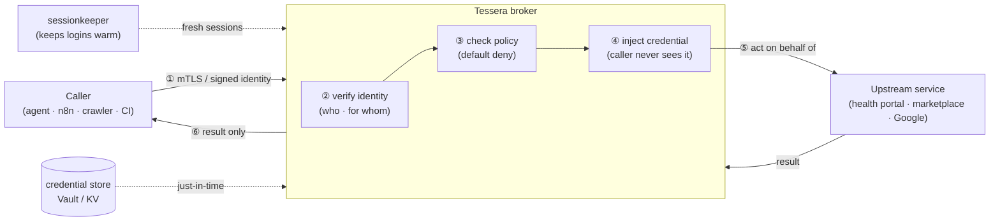

# Tessera

**Give an automation a key without giving it the secret.**

Tessera is a self-hosted **credential broker**. It lets your agents, scripts, and
workflows act *as a specific person* against the services that person uses —
without the calling code ever holding the password, cookie, or token. The secret
stays inside Tessera; the caller only ever gets the result.

[](LICENSE)
&nbsp;Status: **v0.0.1 — identity & policy core (P1).** The serving/injection
plane is on the [roadmap](docs/roadmap.md).

---

## In plain terms

Imagine you have a helpful robot assistant. You want it to check your medical
results, watch a price on a marketplace, or add something to your calendar. To do
that it needs to *log in as you*. The dangerous way is to hand the robot your
password and hope it never leaks it, gets tricked, or wanders off.

**Tessera is the trusted doorkeeper that stands between the robot and your
accounts.** The robot asks Tessera — "let me read Dragoș's results" — and proves
who *it* is. Tessera checks the rulebook, and if it's allowed, *Tessera* does the
logging-in and hands back only the answer. The robot never sees your password.
Take a key from a robot that's been tricked, and you've taken nothing — it never
had the key, only a door Tessera opened for it.

That's the whole idea: **verify who's asking, check the rules, act on their
behalf, never expose the secret.**

---

## Why it exists (the problem)

AI agents and automations are suddenly everywhere — chat assistants, n8n flows,
crawlers, CI jobs. To be useful they need to *act on real accounts*. Today people
do that by pasting long-lived API keys and passwords into tool configs, which is
exactly the [top](https://owasp.org/www-project-non-human-identities-top-10/)
class of non-human-identity security risk: secrets leak, they're over-privileged,
they never expire, and a prompt-injected agent can quietly misuse them.

The polished tools that solve this (Arcade, Composio) are **hosted SaaS** and
assume every service already speaks OAuth. But the services real people care
about — a health portal, a regional marketplace, a utility account — often have
**no OAuth and no API at all**, just a normal human login.

**Tessera is the self-hosted, open-source answer**: a broker that gives every
caller its own verifiable identity, enforces least-privilege rules, and injects
the right credential at call time — including for the un-API'd web, via its
session-harvesting arm, [`sessionkeeper`](https://github.com/dragoshont/sessionkeeper).

---

## What it is — and isn't (scope)

**Tessera is:**

- an **identity-aware credential broker** for non-human identities (agents, bots,
  workflows, pipelines);
- a **policy decision point** — every call is checked against explicit,
  least-privilege grants, and **denied by default**;
- a **credential *injector*** — it authenticates to the upstream *on your
  caller's behalf*; the caller never receives the secret;
- **self-hosted and dependency-light** (stdlib-only runtime), so the
  secret-handling surface is small and auditable.

**Tessera is *not*:**

- a secrets vault — it *uses* one (Vault/OpenBao/your KV) as the store of record;
- an identity provider — it *consumes* identities (SPIFFE/SVID, OIDC);
- a general API gateway — it's specifically about *acting as someone, safely*;
- a passthrough — it **never forwards a caller's token to an upstream**
  (per the MCP authorization spec).

---

## How it works



1. **Identify** — the caller proves *who it is* (a workload) and, if it's acting
   for a human, *for whom* (a signed end-user assertion). No plaintext "trust me"
   headers.
2. **Authorize** — the request is matched against explicit grants. No match → deny.
3. **Inject** — Tessera pulls the right credential just-in-time and authenticates
   to the upstream itself.
4. **Return** — the caller gets the result, never the secret.

---

## Quick start

Requires Python 3.11+.

```bash
git clone https://github.com/dragoshont/tessera.git
cd tessera
python3 -m venv .venv && source .venv/bin/activate
pip install -e ".[test]"

# author your config from the examples
cp tessera.example.toml tessera.toml
cp grants.example.toml grants.toml

# get immediate, specific feedback on your config + grants
tessera validate
```

```text
config:  tessera.toml
  identity mode : mtls
  listen        : 127.0.0.1:8080
  policy default: deny
grants:  grants.toml  (3 grant(s))

OK — configuration is valid and fail-closed.
```

`tessera validate` is honest about the current state: it checks your config and
grants against the security invariants (e.g. it refuses a fail-open policy, and
refuses to run unverified callers on a non-loopback address). The serving command
arrives with [P2](docs/roadmap.md).

---

## Configuration

Two small TOML files, each with a worked example and safe defaults:

- **[`tessera.example.toml`](tessera.example.toml)** — how callers prove identity
  (`mtls` / `oidc` / `dev`), where the broker listens, the default policy, audit.
- **[`grants.example.toml`](grants.example.toml)** — the entire authorization
  model. A *grant* says: this **caller**, optionally **on behalf of** this human,
  may perform these **actions** on this **target**. Everything else is denied.

```toml
# grants.toml — the chatbot may READ Alice's patient-portal data, nothing more.
[[grant]]
caller = "spiffe://tessera.local/chatbot"
on_behalf_of = "alice@example.com"        # omit for a pure automation
target = "health-portal"
actions = ["read:*"]                      # globs; read:* grants no writes
```

Containers can override the common values with `TESSERA_SERVER_HOST`,
`TESSERA_SERVER_PORT`, `TESSERA_POLICY_DEFAULT`.

---

## Built for many kinds of caller

Every consumer is a first-class, authenticated **workload**, and identity is
two-dimensional — *who* is calling and (optionally) *for whom*:

| Caller | Identity (*who*) | On behalf of (*for whom*) |
|---|---|---|
| Chat agent (LibreChat, etc.) | workload SVID / mTLS | the signed-in human |
| n8n / workflow | per-workflow identity | the human who triggered it (or none) |
| Crawler / scraper | per-deployment identity | usually none (acts as itself) |
| CI / pipeline job | ephemeral per-job identity | none |

Pure automation never borrows a human's identity — it acts as *itself* with its
own least-privilege grants, so every action is attributable. (That's
[OWASP NHI #10](https://owasp.org/www-project-non-human-identities-top-10/),
handled by design.)

---

## Architecture & security

- **[docs/architecture.md](docs/architecture.md)** — the full design: the two
  identities, the decision pipeline, credential *injection* vs *brokering*, the
  harvester, the threat model (mapped to OWASP NHI + the MCP spec), and how
  Tessera sits next to SPIFFE, Vault, Secretless Broker, Boundary, Ory, Arcade,
  Composio and the MCP gateways.
- **[docs/roadmap.md](docs/roadmap.md)** — the phased plan (P1 → P2 → P3) and the
  honest answer to "does it need a UI?".
- **[SECURITY.md](SECURITY.md)** — invariants and how to report a vulnerability.

---

## The name

A *tessera hospitalis* was a token in the ancient world, broken in two between
host and guest. Fitting the halves back together proved the bond and granted the
bearer trusted hospitality and safe passage. Tessera does exactly that for
software: it matches a caller's proven identity against a trusted grant, and only
then opens the door.

## License

[MIT](LICENSE) © 2026 Dragoș Hont
