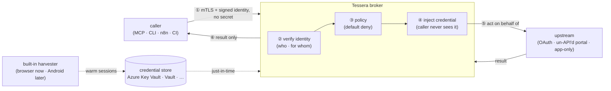

# Tessera

**Give an automation a key without giving it the secret.**

Tessera is a self-hosted, **secretless credential broker** for non-human
identities (agents, MCP servers, CLIs, workflows, crawlers, pipelines). It lets a
*cryptographically-verified* caller act **as a specific person** against the
services that person uses — including the un-API'd web — without the calling code
ever holding the password, cookie, or token. The secret stays inside Tessera; the
caller only ever gets the result.

[](LICENSE)
&nbsp;Status: **design phase — .NET 10 implementation.** A Python spike (v0.0.2)
proved the model end-to-end and ran live read-only; it is being **replaced** by a
.NET 10 build (no backwards compatibility). See
[ADR 0001](docs/adr/0001-language-and-runtime.md).

> ⚠️ This repo is currently a **design + spec** repository. Code is being
> (re)built. Start with the [Architecture](docs/architecture.md) and the
> [decision records](docs/adr/README.md).

---

## In plain terms

You want a helpful assistant (or a script, or a workflow) to check your medical
results, watch a price, or add a calendar event. To do that it must *log in as
you*. The dangerous way is to hand it your password and hope it never leaks, gets
tricked, or wanders off.

**Tessera is the trusted doorkeeper between the assistant and your accounts.** The
assistant proves who *it* is; Tessera checks the rulebook and, if allowed, does the
logging-in itself and hands back only the answer. Take a key from an assistant
that's been tricked and you've taken nothing — it never had the key, only a door
Tessera opened for it, under policy, for one specific action.

---

## What you run

One service. Two setups cover almost everything:

```text
  chat  ──▶  MCP server  ──▶  Tessera        (assistant acting for a person)
  CLI / script / job      ──▶  Tessera        (automation acting as itself)
```

Your MCP server / CLI / job points at Tessera and carries **its own identity, but
no secret**. Tessera verifies the caller, checks policy, injects the credential,
and — for providers whose only login is a human session — keeps that session warm
with a **built-in harvester**. The harvester and the credential store are
**internal plumbing**: you add a provider [recipe](docs/specs/recipes.md) and grant
access; you don't think about the rest.

---

## Why it exists

AI agents and automations need to *act on real accounts*. Today people do that by
pasting long-lived API keys and passwords into tool configs — the top class of
[non-human-identity risk](https://owasp.org/www-project-non-human-identities-top-10/)
(secrets leak, over-privileged, never expire, prompt-injectable). The polished
tools that solve this (Arcade, Composio) are **hosted SaaS** and assume every
service already speaks OAuth. The services real people care about — a health
portal, a regional marketplace, a utility account — often have **no OAuth and no
API**, just a human login.

**Tessera is the open-source, self-hosted answer**, and it covers the un-API'd web
that the SaaS tools don't.

---

## How it works (one picture)



Full drawings (system, request lifecycle, deployment topologies, threat model) are
in **[docs/architecture.md](docs/architecture.md)**.

---

## Design highlights

- **Identity-first, fail-closed.** A caller proves *who it is* (mTLS / SPIFFE
  X.509-SVID) and optionally *for whom* (signed OIDC). The tenant is derived from
  that proof — never from a header. No verified identity, no matching grant → deny.
  ([ADR 0005](docs/adr/0005-identity-first-fail-closed.md))
- **Inject, never hand over.** Tessera authenticates to the upstream on the
  caller's behalf; the caller never receives the secret, and no caller token is
  passed through.
- **Secretless transit.** The default Azure Key Vault store is reached via Managed
  Identity / Workload Identity Federation — no client secret to leak.
  ([ADR 0003](docs/adr/0003-credential-store-pluggable.md))
- **Per-tenant isolation.** Envelope key per tenant; **dedicated instance for
  medical** accounts; shared-with-envelope-keys for the rest.
  ([ADR 0004](docs/adr/0004-tenancy-and-isolation.md))
- **Batteries-included, relocatable workers.** Run everything in one container, or
  split the browser / Android harvesters into their own deployments — clients hit
  **one endpoint** either way. ([ADR 0002](docs/adr/0002-broker-worker-topology.md))
- **Pluggable harvest drivers.** Browser today; **Android emulator** and desktop
  are first-class future drivers behind the same contract.
  ([ADR 0006](docs/adr/0006-harvest-drivers.md))

---

## Built for many kinds of caller

| Caller | Identity (*who*) | On behalf of (*for whom*) |
|---|---|---|
| Chat agent / MCP server | workload SVID / mTLS | the signed-in human |
| n8n / workflow | per-workflow identity | the human who triggered it (or none) |
| Crawler / scraper | per-deployment identity | usually none (acts as itself) |
| CI / pipeline job | ephemeral per-job identity | none |

Pure automation never borrows a human's identity — it acts as *itself* with its own
least-privilege grants, so every action is attributable
([OWASP NHI #10](https://owasp.org/www-project-non-human-identities-top-10/),
by design).

---

## Documentation

- **[Architecture](docs/architecture.md)** — the complete system: diagrams,
  request lifecycle, deployment topologies, components, threat model, OSS landscape.
- **[Decision records](docs/adr/README.md)** — *why* the load-bearing choices were
  made (stack, topology, store, tenancy, identity, drivers).
- **Specs** — [recipes](docs/specs/recipes.md) · [harvest drivers](docs/specs/harvest-drivers.md).
- **[Roadmap](docs/roadmap.md)** — the phased plan and the UI question.
- **[Security policy](SECURITY.md)** — invariants and how to report a vulnerability.
- Archived Python spike: [README](README.python-spike.md) ·
  [architecture](docs/architecture.python-spike.md) ·
  [adversarial review](docs/adversarial-p2.python-spike.md).

---

## The name

A *tessera hospitalis* was a token in the ancient world, broken in two between host
and guest. Fitting the halves back together proved the bond and granted the bearer
trusted hospitality and safe passage. Tessera does exactly that for software: it
matches a caller's *proven* identity against a trusted grant, and only then opens
the door.

## License

[MIT](LICENSE) © 2026 Dragoș Hont
