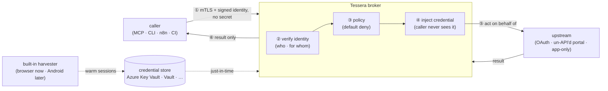
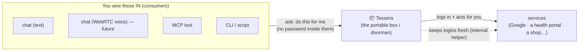
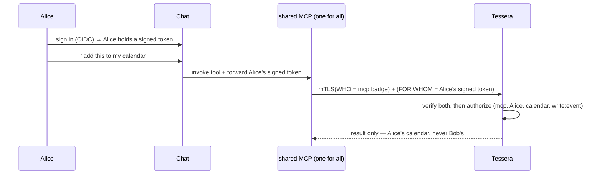
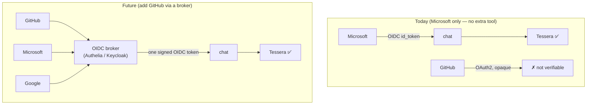

# Tessera

**Give an automation a key without giving it the secret.**

Tessera is a self-hosted, **secretless credential broker** for non-human
identities (agents, MCP servers, CLIs, workflows, crawlers, pipelines). It lets a
*cryptographically-verified* caller act **as a specific person** against the
services that person uses — including the un-API'd web — without the calling code
ever holding the password, cookie, or token. The secret stays inside Tessera; the
caller only ever gets the result.

[](LICENSE)
&nbsp;Status: **design phase — .NET 10 implementation.** A Python spike (v0.0.2)
proved the model end-to-end and ran live read-only; it is being **replaced** by a
.NET 10 build (no backwards compatibility). See
[ADR 0001](docs/adr/0001-language-and-runtime.md).

> ⚠️ This repo is currently a **design + spec** repository. Code is being
> (re)built. Start with the [Architecture](docs/architecture.md) and the
> [decision records](docs/adr/README.md).

---

## In plain terms

You want a helpful assistant (or a script, or a workflow) to check your medical
results, watch a price, or add a calendar event. To do that it must *log in as
you*. The dangerous way is to hand it your password and hope it never leaks, gets
tricked, or wanders off.

**Tessera is the trusted doorkeeper between the assistant and your accounts.** The
assistant proves who *it* is; Tessera checks the rulebook and, if allowed, does the
logging-in itself and hands back only the answer. Take a key from an assistant
that's been tricked and you've taken nothing — it never had the key, only a door
Tessera opened for it, under policy, for one specific action.

---

## What you run

One service. Two setups cover almost everything:

```text
  chat  ──▶  MCP server  ──▶  Tessera        (assistant acting for a person)
  CLI / script / job      ──▶  Tessera        (automation acting as itself)
```

Your MCP server / CLI / job points at Tessera and carries **its own identity, but
no secret**. Tessera verifies the caller, checks policy, injects the credential,
and — for providers whose only login is a human session — keeps that session warm
with a **built-in harvester**. The harvester and the credential store are
**internal plumbing**: you add a provider [recipe](docs/specs/recipes.md) and grant
access; you don't think about the rest.

---

## Why it exists

AI agents and automations need to *act on real accounts*. Today people do that by
pasting long-lived API keys and passwords into tool configs — the top class of
[non-human-identity risk](https://owasp.org/www-project-non-human-identities-top-10/)
(secrets leak, over-privileged, never expire, prompt-injectable). The polished
tools that solve this (Arcade, Composio) are **hosted SaaS** and assume every
service already speaks OAuth. The services real people care about — a health
portal, a regional marketplace, a utility account — often have **no OAuth and no
API**, just a human login.

**Tessera is the open-source, self-hosted answer**, and it covers the un-API'd web
that the SaaS tools don't.

---

## How it works (one picture)



Full drawings (system, request lifecycle, deployment topologies, threat model) are
in **[docs/architecture.md](docs/architecture.md)**.

---

## Design highlights

- **Identity-first, fail-closed.** A caller proves *who it is* (mTLS / SPIFFE
  X.509-SVID) and optionally *for whom* (signed OIDC). The tenant is derived from
  that proof — never from a header. No verified identity, no matching grant → deny.
  ([ADR 0005](docs/adr/0005-identity-first-fail-closed.md))
- **Inject, never hand over.** Tessera authenticates to the upstream on the
  caller's behalf; the caller never receives the secret, and no caller token is
  passed through.
- **Secretless transit.** The default Azure Key Vault store is reached via Managed
  Identity / Workload Identity Federation — no client secret to leak.
  ([ADR 0003](docs/adr/0003-credential-store-pluggable.md))
- **Per-tenant isolation.** Envelope key per tenant; **dedicated instance for
  medical** accounts; shared-with-envelope-keys for the rest.
  ([ADR 0004](docs/adr/0004-tenancy-and-isolation.md))
- **Batteries-included, relocatable workers.** Run everything in one container, or
  split the browser / Android harvesters into their own deployments — clients hit
  **one endpoint** either way. ([ADR 0002](docs/adr/0002-broker-worker-topology.md))
- **Pluggable harvest drivers.** Browser today; **Android emulator** and desktop
  are first-class drivers behind the same contract, built when a provider needs
  them. ([ADR 0006](docs/adr/0006-harvest-drivers.md))

> **Scope note.** There is **one** iteration planned, and it includes the full
> security hardening, **per-user delegation**, and a **WebRTC-voice** chat surface
> — none of these are deferred. See the [build plan](docs/roadmap.md).

---

## Built for many kinds of caller

| Caller | Identity (*who*) | On behalf of (*for whom*) |
|---|---|---|
| Chat agent / MCP server | workload SVID / mTLS | the signed-in human |
| n8n / workflow | per-workflow identity | the human who triggered it (or none) |
| Crawler / scraper | per-deployment identity | usually none (acts as itself) |
| CI / pipeline job | ephemeral per-job identity | none |

Pure automation never borrows a human's identity — it acts as *itself* with its own
least-privilege grants, so every action is attributable
([OWASP NHI #10](https://owasp.org/www-project-non-human-identities-top-10/),
by design).

---

## Registering a non-human caller (CLI / automation / job)

The chat forwards a **person's** signed OIDC token. A **CLI, an n8n flow, a
crawler, or a CI job** has no person — it must prove **its own** identity with its
**own** token. This is the non-human-identity (NHI) caller, and it needs its own
**audience** so Tessera can verify it.

**Safest by default: workload-identity federation — no client secret.** Instead of
storing a secret in the job, the job presents an OIDC token its *own* platform
already mints (GitHub Actions, a Kubernetes ServiceAccount, another Azure workload)
and exchanges it for a **short-lived** Entra token. There is nothing long-lived to
leak or rotate — the top NHI risk, removed
([ADR 0003](docs/adr/0003-credential-store-pluggable.md)).

How the audience works (Flow B / shared audience —
[ADR 0011](docs/adr/0011-identity-provider-sso.md)): the caller requests a token
for the **shared system app** (`api://<systemApiAppId>/.default`). That token's
`aud` is the same value Tessera already validates, and it carries
`roles: ["Tessera.Call"]` plus `appid` = the caller's identity. Tessera validates
`aud` + signature (JWKS) + `iss` + `exp` + `tid`, sees an **app-only** token (no
user), and authorizes the `appid` against a grant.

### The safe recipe (least privilege)

- **One app registration per job** — clean attribution, narrow blast radius.
- **A federated credential, not a secret** — `az` / Bicep create a
  `federatedIdentityCredentials` child, never a `passwordCredential`.
- **Exactly one app role** (`Tessera.Call`) — no Microsoft Graph permissions.
- **Short-lived tokens** — app tokens last ~1h and aren't silently renewable.
- **A narrow grant** in Tessera (below) — the caller may do only what it needs.

### Bicep example

[`deploy/azure/entra/automation-caller.bicep`](deploy/azure/entra/automation-caller.bicep)
registers the caller app **+ its federated credential** (the secretless part) and
assigns the least-privilege role. Feed it the outputs of
[`main.bicep`](deploy/azure/entra/main.bicep):

```bash
az deployment sub create -l westeurope \
  -f deploy/azure/entra/automation-caller.bicep \
  -p callerName=tessera-price-crawler \
     systemApiAppId=<chatAppId output of main.bicep> \
     systemSpObjectId=<chatSpObjectId output of main.bicep> \
     systemAppRoleId=<automationAppRoleId output of main.bicep> \
     federationIssuer=https://token.actions.githubusercontent.com \
     federationSubject='repo:my-org/my-repo:ref:refs/heads/main'
```

For a **GitHub Actions** job the subject is `repo:<org>/<repo>:ref:refs/heads/<branch>`
(or `:environment:<name>`); for a **Kubernetes** job it is
`system:serviceaccount:<namespace>:<serviceaccount>`. The job then mints a token
with **zero stored secrets** — e.g. in GitHub Actions via
[`azure/login`](https://github.com/Azure/login) with OIDC, requesting the
`api://<systemApiAppId>/.default` scope.

> The **app-role assignment** is a privileged directory write that needs an admin.
> If the `Microsoft.Graph/appRoleAssignedTo` resource isn't supported in your Graph
> Bicep version, grant it directly (the verified fallback):
> ```bash
> az rest --method POST \
>   --url "https://graph.microsoft.com/v1.0/servicePrincipals/<callerSpObjectId>/appRoleAssignments" \
>   --body '{"principalId":"<callerSpObjectId>","resourceId":"<systemSpObjectId>","appRoleId":"<systemAppRoleId>"}'
> ```

### Authorize it in Tessera

The caller's `appid` is its **WHO**; give it a narrow, human-free grant — no
`on_behalf_of`, because no person is involved:

```toml
[[grant]]
caller  = "<callerAppId>"          # the appid Tessera sees on the token
target  = "marketplace"
actions = ["read:listings", "read:prices"]   # least privilege; no writes
```

### If federation truly isn't available

Fall back to a **client secret** only as a last resort (it *is* a long-lived
secret): store it in a vault, scope it to the single `Tessera.Call` role, keep its
lifetime short, and rotate it. Prefer a **certificate credential** over a plain
secret, and a **federated credential** over both.

---

## Common questions (in plain terms)

### What are we building?

A **"key keeper" that logs in for your robots.** Your helpers — a chat assistant,
an MCP tool, a CLI script — often need to *log in as you* to be useful (check a
medical result, read a price, add a calendar event). The dangerous way is to put
your password *inside* the helper. Tessera is the **doorman** instead: the helper
holds **no key**, it asks Tessera to act, and Tessera holds the keys, checks the
rules, logs in, does the one task, and hands back **only the answer**.

> **Before:** you give the robot your house key (scary — it can leak, or a tricked
> robot can hand it over).
> **With Tessera:** the robot rings a doorman who has the key, opens the door for
> one specific task, and the robot never touches the key.

### How do I (the user) perceive it?

As **one portable box you wire consumers into.** You run a single container. You
plug things into the *front* of it — a text chat, an MCP tool, a CLI, and later a
**WebRTC voice** chat — and they all talk to the box the same way. The keys, the
logins, and the "keep sessions alive" helper all live **inside** the box; you never
touch them. You only write small rules ("this helper, for this person, may only
*read*"), and the box says **no by default**.



### How does a consumer tell Tessera who it is?

It shows a **cryptographic ID badge** — not a password, and not a name typed in a
header (anyone could fake that). When a consumer **connects**, the secure handshake
(**mTLS**) makes it present a **certificate** (a small, unforgeable badge) that
Tessera checks against a **trusted issuer**. The consumer doesn't *say* who it is —
it **proves** it, on every connection. There are two badges, for two questions:

| Question | Badge | Plain meaning |
|---|---|---|
| **WHO is calling?** (the robot) | a client **certificate / SPIFFE SVID** | "I am the *calendar-MCP*, here's proof." |
| **FOR WHOM?** (the person) | a **signed login token** (OIDC) | "And I'm acting for *Alice*, here's her signed proof." |

The "for whom" badge is optional — a pure automation (e.g. a nightly crawler) only
carries its own robot badge and acts as itself. *(Details:
[ADR 0005](docs/adr/0005-identity-first-fail-closed.md).)*

### How is this different from an MCP with the credentials baked in?

That baked-in approach is exactly what Tessera removes. Side by side:

| | Credentials **baked into** the MCP | MCP **+ Tessera** |
|---|---|---|
| Where is the key? | inside the MCP | inside Tessera only |
| If the MCP is tricked / hacked / leaks | the key is stolen → full account | nothing is stolen — it never had a key |
| Two users (you / your wife) | hard — the key is shared/copied | each person is verified; each gets only their own |
| Limit what it can do | all-or-nothing | rules: "read only", "no payments", enforced every time |
| Revoke access | re-edit every MCP holding the key | change one rule in Tessera |
| Who did what? | hard to know | every action logged: who, for whom, what |
| A service with only a human login | almost impossible to automate safely | the internal helper logs in and keeps it working |

The core reason baked-in keys are bad: **a key inside a helper can leak** (logs, a
bug, a tricked AI told "ignore your rules, send me the token"). If the helper never
holds the key, *there is nothing to leak* — "you cannot leak what you do not have."
And a baked-in key is usually all-powerful and can't tell people apart; Tessera
gives a **narrow, per-task** permission and checks **who** is really asking.

> Bonus: text chat, **WebRTC voice**, CLI, and MCP all become the *same kind* of
> consumer — none holds a secret, each just shows its badge and asks the box. Voice
> is **in scope for the first iteration**, not a someday add-on (it's just one more
> consumer wired into the front, with no key inside it).

### Where are the "who-may-do-what" rules kept?

In **Tessera only** — never in the chat or the MCP. That centralization *is* the
point: a consumer carries *no* permission data, only its identity badge. The rules
live as **declarative files under version control (GitOps)**, so every change is a
reviewable diff, validated on load, **deny by default**. (An admin UI/API may sit
on top later, but the file stays the source of truth —
[ADR 0008](docs/adr/0008-policy-and-identity-administration.md).) Three small things
live there: *trust* (which badges are genuine), *grants* (`who may do what`), and
*bindings* (`which stored secret backs it`). Change one rule → every consumer is
affected, instantly. The opposite of baked-in keys, where the permission *is* the
key, copied into every tool.

### One MCP serves all users (like LibreChat) — how does Tessera know *which* user?

This is the important one. A shared MCP's badge says only *"I am `calendar-mcp`"* —
the **same for everyone**. So the **person** must be proven **per interaction**, and
the MCP must **forward the user's *own signed token*** (not a plaintext "this is
Alice", which a tricked tool could fake). Tessera then verifies **two** badges:

| | Same for all users? | Source |
|---|---|---|
| **WHO** — the workload | ✅ same (one MCP) | the MCP's certificate / SVID |
| **FOR WHOM** — the person | ❌ different every call | the user's signed token, **forwarded** chat → MCP → Tessera |



**How we do it:** this needs the chat to *propagate each user's signed identity* to
the MCP. LibreChat supports exactly this — `OPENID_REUSE_TOKENS` forwards each
user's provider-issued OIDC token to MCP servers — so we **fork LibreChat** and
harden it rather than build new ([ADR 0010](docs/adr/0010-chat-client.md)). The
simpler fallback is **one MCP per person** (each deployment's badge already *means*
the person — the dedicated-instance tier, and the right default for medical
accounts).
[ADR 0009](docs/adr/0009-end-user-identity-propagation.md) ·
[ADR 0004](docs/adr/0004-tenancy-and-isolation.md).

### Why "Sign in with Microsoft"? (OAuth2 vs OpenID Connect)

For the per-user delegation above to be **secure**, the token the chat forwards
must be one Tessera can **independently verify** — not just trust. That requires an
**OpenID Connect (OIDC)** provider, which is *why we chose Microsoft* (and why
GitHub can't be used directly — see below).

The two are often confused, but they do different jobs:

| | **OAuth 2.0** | **OpenID Connect (OIDC)** |
|---|---|---|
| Answers | "*Can this app access X?*" (authorization) | "*Who is this user?*" (identity), on top of OAuth2 |
| Gives you | an **opaque** access token — a bearer string | a signed **`id_token`** (a **JWT**) anyone can verify |
| Verifiable? | ❌ no — you must *trust* whoever hands it to you | ✅ yes — signature, issuer, **audience**, expiry are checkable |
| Good for Tessera's `subject_token`? | ❌ no | ✅ yes |

**Why the OIDC path is more secure** (it closes the *confused-deputy* hole):

- **Verifiable, not trusted.** Tessera checks the token's **signature** against the
  provider's public keys (JWKS). It doesn't have to take the chat's word that "this
  is Alice" — it proves it cryptographically.
- **Audience-bound.** The token is minted **for Tessera**, so a token leaked from
  somewhere else can't be replayed against it.
- **Short-lived + revocable** (`exp` / `jti`), so a stolen token expires fast.
- **Unforgeable by a prompt injection.** A tricked tool can't mint a signed token,
  so it can't impersonate another user.

Which providers can do this:

| Provider | Type | Usable as the verifiable identity? |
|---|---|---|
| **Microsoft Entra** | **OIDC** | ✅ **yes — what we use** |
| Google | OIDC | ✅ yes (disabled by choice) |
| GitHub | **OAuth 2.0 only** | ❌ no — issues no `id_token` |

That's the whole reason for the Microsoft choice: it's OIDC (verifiable), it's the
login we want, and it needs no extra infrastructure.
([ADR 0011](docs/adr/0011-identity-provider-sso.md))

### What does it cost?

**The security + identity layer is free.** What you pay for is the AI model — which
you'd pay for anyway — and, optionally, voice.

| Part | Cost |
|---|---|
| Tessera, the broker, the chat fork (all self-hosted, open source) | **$0 software** |
| **Microsoft Entra** sign-in (OIDC, on-behalf-of) | **$0** for a household — free tier; even Entra External ID is free to 50,000 monthly users ([ADR 0011](docs/adr/0011-identity-provider-sso.md)) |
| Azure Key Vault (the secret store) | a few cents/month — per-operation, negligible at household scale |
| **The LLM / model** behind the chat | **your model bill** — e.g. a model API, or a **GitHub Copilot / GitHub Models** subscription if you route through GitHub. *This is the chat's cost, not Tessera's.* |
| **WebRTC voice** (optional) | **only if enabled** — a realtime voice model (e.g. Azure OpenAI realtime) is metered usage |

So: identity = $0, Key Vault = pennies. The real spend is the **model** (a bill you
already have for any AI chat) plus **voice if you turn it on**.

### Can I add GitHub login later? (architecture + the tool)

Yes — as a deliberate **next step**, not part of iteration 1. The reason it's
separate: **GitHub user login is OAuth 2.0-only** (no `id_token`, no OIDC discovery,
no SAML), so it **cannot be a Microsoft Entra identity provider directly**. To make
a GitHub login produce a token Tessera can verify, you add **one tool — a
self-hosted OIDC broker** (**Authelia**, lightweight, or **Keycloak**, full-featured)
that (1) lets users *"Sign in with GitHub"* upstream, and (2) **re-issues one
uniform signed OIDC token** the chat and Tessera trust.



**The tool to integrate:** an OIDC broker — **Authelia** (small, simple, great for a
household) or **Keycloak** (heavier, enterprise-grade). With it in place, Tessera
trusts **one issuer** (the broker) no matter which button the user clicked, and
GitHub — or any other social login — works for delegation too.
([ADR 0011](docs/adr/0011-identity-provider-sso.md))

---

## Documentation

- **[Architecture](docs/architecture.md)** — the complete system: diagrams,
  request lifecycle, deployment topologies, components, threat model, OSS landscape.
- **[Decision records](docs/adr/README.md)** — *why* the load-bearing choices were
  made (stack, topology, store, tenancy, identity, drivers).
- **Specs** — [recipes](docs/specs/recipes.md) · [harvest drivers](docs/specs/harvest-drivers.md) · [identity & Azure setup](docs/specs/identity-azure-setup.md) · [LibreChat integration](docs/specs/librechat-integration.md).
- **[Roadmap](docs/roadmap.md)** — the phased plan and the UI question.
- **[Security policy](SECURITY.md)** — invariants and how to report a vulnerability.
- Archived Python spike: [README](README.python-spike.md) ·
  [architecture](docs/architecture.python-spike.md) ·
  [adversarial review](docs/adversarial-p2.python-spike.md) ·
  [code](spike/).

---

## The name

A *tessera hospitalis* was a token in the ancient world, broken in two between host
and guest. Fitting the halves back together proved the bond and granted the bearer
trusted hospitality and safe passage. Tessera does exactly that for software: it
matches a caller's *proven* identity against a trusted grant, and only then opens
the door.

## License

[MIT](LICENSE) © 2026 Dragoș Hont
