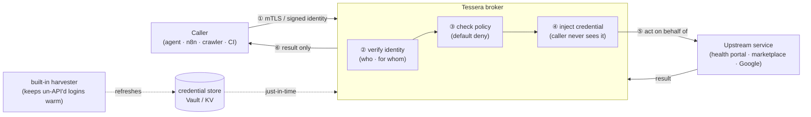

# Tessera

**Give an automation a key without giving it the secret.**

Tessera is a self-hosted **credential broker**. It lets your agents, scripts, and
workflows act *as a specific person* against the services that person uses —
without the calling code ever holding the password, cookie, or token. The secret
stays inside Tessera; the caller only ever gets the result.

[](LICENSE)
&nbsp;Status: **v0.0.2 — broker core (identity, policy, store, serving).** The
injection egress + bundled harvester image are on the [roadmap](docs/roadmap.md).

---

## In plain terms

Imagine you have a helpful robot assistant. You want it to check your medical
results, watch a price on a marketplace, or add something to your calendar. To do
that it needs to *log in as you*. The dangerous way is to hand the robot your
password and hope it never leaks it, gets tricked, or wanders off.

**Tessera is the trusted doorkeeper that stands between the robot and your
accounts.** The robot asks Tessera — "let me read Dragoș's results" — and proves
who *it* is. Tessera checks the rulebook, and if it's allowed, *Tessera* does the
logging-in and hands back only the answer. The robot never sees your password.
Take a key from a robot that's been tricked, and you've taken nothing — it never
had the key, only a door Tessera opened for it.

That's the whole idea: **verify who's asking, check the rules, act on their
behalf, never expose the secret.**

---

## Why it exists (the problem)

AI agents and automations are suddenly everywhere — chat assistants, n8n flows,
crawlers, CI jobs. To be useful they need to *act on real accounts*. Today people
do that by pasting long-lived API keys and passwords into tool configs, which is
exactly the [top](https://owasp.org/www-project-non-human-identities-top-10/)
class of non-human-identity security risk: secrets leak, they're over-privileged,
they never expire, and a prompt-injected agent can quietly misuse them.

The polished tools that solve this (Arcade, Composio) are **hosted SaaS** and
assume every service already speaks OAuth. But the services real people care
about — a health portal, a regional marketplace, a utility account — often have
**no OAuth and no API at all**, just a normal human login.

**Tessera is the self-hosted, open-source answer — and it's *batteries-included*.**
You run **one** service. It gives every caller its own verifiable identity,
enforces least-privilege rules, and injects the right credential at call time. For
the un-API'd web (a portal whose only login is a human session), Tessera keeps
that session warm with its **built-in harvester** — you don't deploy or wire
anything extra. You connect a new provider by dropping in a **recipe**
(see [Recipes](#recipes)). The harvester and the credential store are internal
plumbing; what you think about is *chat + MCP + Tessera*, or *CLI + Tessera*.

---

## What it is — and isn't (scope)

**Tessera is:**

- an **identity-aware credential broker** for non-human identities (agents, bots,
  workflows, pipelines);
- a **policy decision point** — every call is checked against explicit,
  least-privilege grants, and **denied by default**;
- a **credential *injector*** — it authenticates to the upstream *on your
  caller's behalf*; the caller never receives the secret;
- **batteries-included** — broker, the session **harvester**, and provider
  **recipes** in one self-hosted, stdlib-only service (small, auditable
  secret-handling surface).

**Tessera is *not*:**

- a secrets vault — it *uses* one (Vault/OpenBao/your KV) as the store of record;
- an identity provider — it *consumes* identities (SPIFFE/SVID, OIDC);
- a general API gateway — it's specifically about *acting as someone, safely*;
- a passthrough — it **never forwards a caller's token to an upstream**
  (per the MCP authorization spec).

---

## How it works



1. **Identify** — the caller proves *who it is* (a workload) and, if it's acting
   for a human, *for whom* (a signed end-user assertion). No plaintext "trust me"
   headers.
2. **Authorize** — the request is matched against explicit grants. No match → deny.
3. **Inject** — Tessera pulls the right credential just-in-time and authenticates
   to the upstream itself.
4. **Return** — the caller gets the result, never the secret.

---

## What you run

One service. The two setups that cover almost everything:

```text
  chat  ──▶  MCP server  ──▶  Tessera        (assistant acting for a person)
  CLI / script / job      ──▶  Tessera        (automation acting as itself)
```

Your chat's MCP server (or your CLI/job) points at Tessera and carries **its own
identity, but no secret**. Tessera does the rest: verifies the caller, checks
policy, injects the credential, and — for providers whose only login is a human
session — keeps that session warm with its **built-in harvester**. The harvester
and the credential store are **internal plumbing**: you don't deploy or think
about them, you just add a provider [recipe](#recipes) and grant access.

Requires Python 3.11+.

```bash
git clone https://github.com/dragoshont/tessera.git
cd tessera
python3 -m venv .venv && source .venv/bin/activate
pip install -e ".[test]"

# author your config from the examples
cp tessera.example.toml tessera.toml
cp grants.example.toml grants.toml

# get immediate, specific feedback on your config + grants
tessera validate
```

```text
config:  tessera.toml
  identity mode : mtls
  listen        : 127.0.0.1:8080
  policy default: deny
grants:  grants.toml  (3 grant(s), 2 binding(s))

OK — configuration is valid and fail-closed.
```

`tessera validate` is honest about the current state: it checks your config and
grants against the security invariants (e.g. it refuses a fail-open policy, and
refuses to run unverified callers on a non-loopback address). When it's happy,
start the broker with `tessera serve`.

---

## Run with Docker

The published image is `ghcr.io/dragoshont/tessera`. It runs `tessera serve`,
reads its config from `/config`, and is non-root / read-only-rootfs / stdlib-only.

```bash
# 1. author config (see the two example files in this repo)
cp tessera.example.toml tessera.toml
cp grants.example.toml grants.toml

# 2. run the broker, mounting your config
docker run --rm \
  -v "$PWD/tessera.toml:/config/tessera.toml:ro" \
  -v "$PWD/grants.toml:/config/grants.toml:ro" \
  -p 127.0.0.1:8080:8080 \
  ghcr.io/dragoshont/tessera:latest
```

To back it with a real credential store (Azure Key Vault), add the store URL and
the Service-Principal env — Tessera reads bundles **read-only**:

```bash
docker run --rm \
  -v "$PWD/tessera.toml:/config/tessera.toml:ro" \
  -v "$PWD/grants.toml:/config/grants.toml:ro" \
  -e TESSERA_VAULT_URL="https://YOUR-VAULT.vault.azure.net" \
  -e AZURE_TENANT_ID="..." -e AZURE_CLIENT_ID="..." -e AZURE_CLIENT_SECRET="..." \
  -p 127.0.0.1:8080:8080 \
  ghcr.io/dragoshont/tessera:latest
```

Probe it (the broker endpoint itself is **fail-closed** by design — see below):

```bash
curl -s localhost:8080/healthz   # {"status":"ok"}
curl -s localhost:8080/status    # store, readiness, broker-endpoint state
```

---

## The easy-setup pattern: point your MCP/CLI at Tessera

This is the whole point. Today your tool is configured with **an endpoint and a
secret**:

```bash
# ❌ before — the secret lives inside your MCP / CLI / job
HEALTH_PORTAL_URL=https://portal.example.com
HEALTH_PORTAL_TOKEN=eyJhbGciOi...        # leaks if the tool is popped or prompt-injected
```

With Tessera, you give your tool **the broker's endpoint and its own identity —
but no secret**. Tessera holds the credential and acts under policy:

```bash
# ✅ after — no secret in your tool; Tessera injects it per call
TESSERA_URL=http://tessera:8080
TESSERA_CALLER=spiffe://tessera.local/my-mcp   # who your tool is
# (no HEALTH_PORTAL_TOKEN anywhere in your app)
```

Your tool then asks Tessera to act, instead of calling the upstream directly:

```bash
curl -s -XPOST "$TESSERA_URL/v1/broker" \
  -H "X-Tessera-Caller: $TESSERA_CALLER" \
  -d '{"target":"health-portal","action":"read:record","on_behalf_of":"alice@example.com"}'
# → {"effect":"allow","reason":"granted: ...","credential_status":"present","ok":true}
```

A runnable two-container demo (the broker + a sample caller) is in
[`docker-compose.example.yml`](docker-compose.example.yml):

```bash
docker compose -f docker-compose.example.yml up
# the `caller` service prints Tessera's decision: an allow for read,
# a deny for write, plus the credential status. (Status is "absent" until
# you wire a store — add the Azure env from the Docker section to get "present".)
```

> **Security note — fail-closed by design.** The `/v1/broker` endpoint refuses
> (`503`) unless a caller-authentication plane is configured, because exposing an
> unauthenticated credential path is the *confused-deputy* vulnerability this
> project exists to prevent. The demo uses `identity.mode = "dev"` on **loopback**
> (the sample caller shares the broker's network namespace) so you can try it
> safely on your machine. In production, callers prove identity with **mTLS /
> SPIFFE SVID** and the human with a **signed OIDC assertion** — see
> [docs/roadmap.md](docs/roadmap.md). Today Tessera verifies the caller, applies
> policy, and resolves the credential under that policy; performing the upstream
> call on the caller's behalf (the *injection egress*) is the next milestone.

---

## Do I need the harvester?

**Only for providers whose sole credential is a human-login session** (a portal
with no API and no OAuth — many health, utility, and regional sites). For those,
Tessera's **built-in** harvester logs in once and keeps the session fresh in the
store; you never run it separately.

For everything with a normal machine credential, **no harvester is involved** —
you just place the credential in the store and Tessera brokers it:

| Provider type | Example | Harvester? |
|---|---|---|
| OAuth 2.0 / OIDC | Google, GitHub, Microsoft | No |
| API key / token | Stripe, an internal API | No |
| Human-login session (cookie) | a health/utility portal | **Yes (built in)** |

Under the hood the harvester is the
[`sessionkeeper`](https://github.com/dragoshont/sessionkeeper) engine, bundled as
internal plumbing. Swapping in a different harvester is possible but deliberately
a *later-stage* concern — batteries-included comes first.

---

## Recipes

You connect a new provider by dropping in a **recipe** — a small declarative file
that says how that provider's credential is obtained and where it lives. Recipes
are the easy-setup surface: "how do I connect Google / a health portal / a
marketplace?"

- Browse and copy from **[`recipes/`](recipes/)** — see
  [`recipes/README.md`](recipes/README.md) for the format and the rule that
  **secrets never go in a recipe** (they live in the store).
- Ships with `google` (OAuth) and generic `oauth` / `api-key` / `cookie-session`
  templates. The cookie-session template is the pattern for un-API'd portals —
  the kind the built-in harvester keeps warm.
- Provider recipes that reveal a specific person's accounts (e.g. a particular
  health provider) belong in your **private** deployment overlay, not here.

---

## Configuration

Two small TOML files, each with a worked example and safe defaults:

- **[`tessera.example.toml`](tessera.example.toml)** — how callers prove identity
  (`mtls` / `oidc` / `dev`), where the broker listens, the default policy, audit.
- **[`grants.example.toml`](grants.example.toml)** — the entire authorization
  model. A *grant* says: this **caller**, optionally **on behalf of** this human,
  may perform these **actions** on this **target**. Everything else is denied.

```toml
# grants.toml — the chatbot may READ Alice's patient-portal data, nothing more.
[[grant]]
caller = "spiffe://tessera.local/chatbot"
on_behalf_of = "alice@example.com"        # omit for a pure automation
target = "health-portal"
actions = ["read:*"]                      # globs; read:* grants no writes
```

Containers can override the common values with `TESSERA_SERVER_HOST`,
`TESSERA_SERVER_PORT`, `TESSERA_POLICY_DEFAULT`.

---

## Built for many kinds of caller

Every consumer is a first-class, authenticated **workload**, and identity is
two-dimensional — *who* is calling and (optionally) *for whom*:

| Caller | Identity (*who*) | On behalf of (*for whom*) |
|---|---|---|
| Chat agent (LibreChat, etc.) | workload SVID / mTLS | the signed-in human |
| n8n / workflow | per-workflow identity | the human who triggered it (or none) |
| Crawler / scraper | per-deployment identity | usually none (acts as itself) |
| CI / pipeline job | ephemeral per-job identity | none |

Pure automation never borrows a human's identity — it acts as *itself* with its
own least-privilege grants, so every action is attributable. (That's
[OWASP NHI #10](https://owasp.org/www-project-non-human-identities-top-10/),
handled by design.)

---

## Architecture & security

- **[docs/architecture.md](docs/architecture.md)** — the full design: the two
  identities, the decision pipeline, credential *injection* vs *brokering*, the
  harvester, the threat model (mapped to OWASP NHI + the MCP spec), and how
  Tessera sits next to SPIFFE, Vault, Secretless Broker, Boundary, Ory, Arcade,
  Composio and the MCP gateways.
- **[docs/roadmap.md](docs/roadmap.md)** — the phased plan (P1 → P2 → P3) and the
  honest answer to "does it need a UI?".
- **[SECURITY.md](SECURITY.md)** — invariants and how to report a vulnerability.

---

## The name

A *tessera hospitalis* was a token in the ancient world, broken in two between
host and guest. Fitting the halves back together proved the bond and granted the
bearer trusted hospitality and safe passage. Tessera does exactly that for
software: it matches a caller's proven identity against a trusted grant, and only
then opens the door.

## License

[MIT](LICENSE) © 2026 Dragoș Hont
