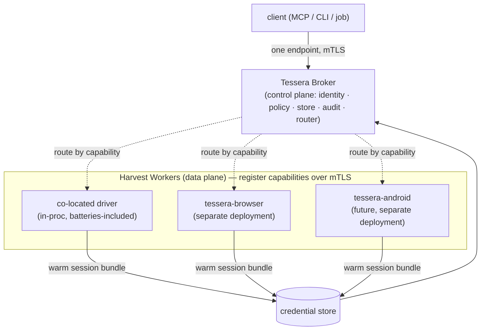

# ADR 0002 — Broker + capability-registered harvest workers

- **Status:** Accepted (2026-06-13)
- **Deciders:** maintainer (Dragoș)

## Context

A credential broker needs to obtain credentials for services that have **no API
and no OAuth** — their only login is an interactive human session. Obtaining and
keeping those sessions warm requires *driving real software*: a browser today, and
plausibly an **Android emulator** or a **desktop app** in future (apps with
cert-pinning / attestation that can't be replayed over HTTP).

That automation is heavy, messy, and security-sensitive in a *different* way than
the broker: big dependencies, headful processes, fingerprintable runtimes. We must
**not** put a browser or emulator inside the broker — that would balloon the very
secret-handling surface ADR 0001 works to keep small.

At the same time, the maintainer wants deployment flexibility:

> "We may spin up a different Tessera — one for Android, one for browser. Clients
> need to be able to run these seamlessly. Or both inside the same Tessera if we
> want."

So harvest capability must be **relocatable** (co-located *or* a separate
deployment) without clients caring.

## Decision

Adopt a **control-plane / data-plane split** modeled on two proven patterns:

- **Selenium Grid** — a *Router* is the single client entry point; a *Distributor*
  registers *Nodes* by their **capabilities** and routes work to a matching node;
  nodes "execute commands, make no judgments."
- **HashiCorp go-plugin** (Vault/Boundary/Terraform) — drivers run **out of
  process** over gRPC + mTLS; "a panic in a plugin doesn't crash the host; the
  plugin only sees the interfaces handed to it."

In Tessera terms:

- The **Broker** is the control plane and single client endpoint: identity,
  policy, store access, audit, and request routing. Always present.
- A **Harvest Worker** is a data-plane process that advertises **capabilities**
  (e.g. `browser:chromium`, `android:emulator`) and registers with the broker over
  **mTLS**. It harvests sessions and, when an upstream can only be driven (not
  replayed), performs the *browser/app egress* on the broker's scoped instruction.
- A worker may be **in-process** (co-located in the broker for the simple,
  batteries-included case) or **out-of-process** (a separate `tessera-browser` /
  `tessera-android` deployment). The broker routes by capability either way.

Clients always talk to **one** broker endpoint and never know or care where a
driver runs. That is the "seamless" requirement, satisfied by capability routing.

## Consequences

- **Positive:** the broker stays small/auditable (no browser inside it); harvest
  capacity scales/relocates independently; a crashing or compromised driver is
  isolated from the security boundary; the same client contract works for every
  topology.
- **Positive:** new drivers (Android, desktop) are added without touching the
  broker — they just register a new capability.
- **Negative:** an out-of-process worker adds a registration/transport protocol
  (mTLS-secured) and a routing layer to build and operate.
- **Mitigation:** the in-process (co-located) mode is the default so a first-time
  user runs exactly one container; the separate-deployment mode is opt-in for
  scale or stronger isolation.

## Rejected alternatives

- **Browser embedded in the broker** — rejected: explodes the secret surface,
  couples release cadence, and a browser crash would take down the broker.
- **Workers as in-process shared libraries only** — rejected: can't be relocated
  to a separate deployment, and a native crash takes the broker with it (the exact
  thing go-plugin's out-of-process model avoids).
