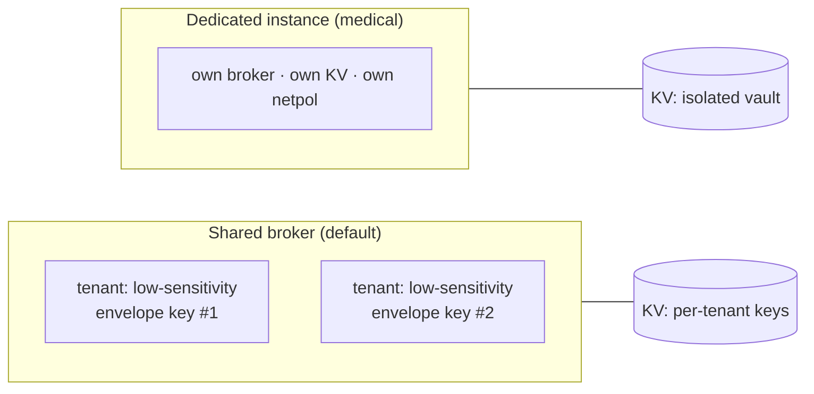

# ADR 0004 — Tenancy & isolation: multitenant by default, optional dedicated instance

- **Status:** Accepted (2026-06-13)
- **Deciders:** maintainer (Dragoș)

## Context

Tessera will serve multiple **end-users** (e.g. a person and their spouse), at
least one of whom has **medical** accounts. The maintainer's requirement:

> "Multitenant by default, but other users may want dedicated instances per user.
> It needs perfect isolation between end-users."

Microsoft's multitenancy guidance frames isolation as a **spectrum** from "shared
everything" to "shared nothing," and is explicit that for **few tenants (≤5)** or
**high-isolation / regulated** needs, dedicated single-tenant infrastructure is
appropriate even though it costs more. It also recommends **one Key Vault per
tenant** for data isolation in multitenant solutions.

## Decision

Support a **vertically-partitioned** tenancy model — most tenants share, sensitive
tenants are isolated:

1. **Default — shared multitenant broker.** One broker serves all tenants, but the
   **tenant is derived *only* from the cryptographically verified caller identity**
   (see [ADR 0005](0005-identity-first-fail-closed.md)). Tenant is an *ambient,
   server-set* value — **never** read from a request body or header. Per-tenant:
   - separate stored secret(s) per tenant;
   - a **per-tenant envelope key** (a Key Vault key per tenant) so the bundle is
     encrypted such that holding the store while acting as tenant A cannot read
     tenant B's secret;
   - a server-side caller→tenant mapping.

2. **Optional — dedicated instance per tenant** ("automated single-tenant
   deployment" / deployment stamp): separate compute + Key Vault + network policy.
   Shared-nothing, strongest boundary.

**Medical accounts default to the dedicated-instance tier.** Low-sensitivity
tenants may use the shared tier with envelope keys. This is exactly the per-account
isolation already proven in the maintainer's homelab (separate MCP per spouse).

## Consequences

- **Positive:** cheap/simple for the common case; shared-nothing for the sensitive
  case; isolation level is a per-tenant choice, not a global one.
- **Positive:** envelope keys mean even a store compromise doesn't cross tenants.
- **Negative:** two code paths (shared vs dedicated) and key lifecycle management.
- **Mitigation:** the shared path is the default; dedicated is provisioned by the
  same automation with a per-tenant deployment stamp.

## Rejected alternatives

- **Single shared bundle / table-per-tenant isolation** — rejected: weak isolation;
  an authz bug leaks across tenants. (Azure explicitly lists table-per-tenant as an
  antipattern.)
- **Always dedicated instance for everyone** — rejected: unnecessary cost/ops for
  low-sensitivity tenants; reserve it for where it earns its keep.
