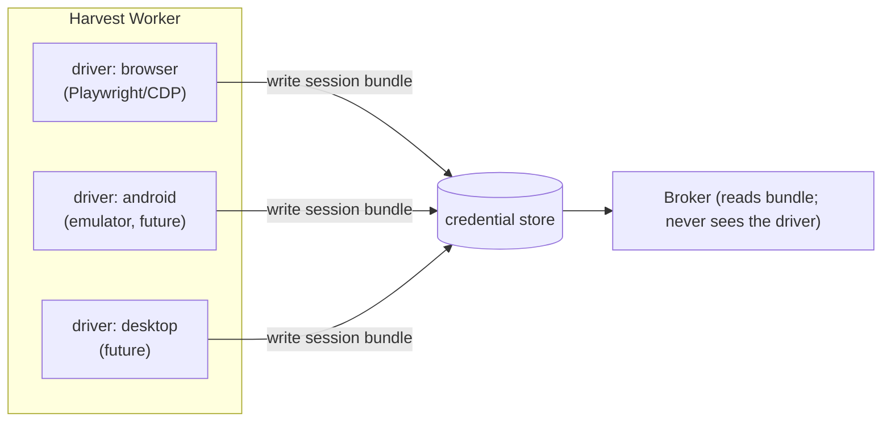

# ADR 0006 — Pluggable harvest drivers (browser now; Android & desktop later)

- **Status:** Accepted (2026-06-13)
- **Deciders:** maintainer (Dragoș)

## Context

Sessions for un-API'd providers are obtained by driving real software. Today that
is a **browser**. But some services have **no usable web surface at all** — only a
mobile app, often with certificate pinning and app attestation that defeat HTTP
replay. The maintainer asked whether the harvester could, in future, also be an
**Android emulator**. Yes — and the architecture should anticipate it as a
first-class extension rather than a special case.

## Decision

A **harvest driver** is the pluggable unit *inside* a harvest worker (ADR 0002).
All drivers share one contract and meet the broker only at the **store**:

| Driver contract | Purpose |
|---|---|
| `probe(session)` | cheap check: healthy / stale / dead |
| `refresh(session)` | silent refresh of an existing session, if the provider allows |
| `login(recipe)` | drive the real software to (re)authenticate and harvest a fresh bundle |
| `act(scoped-instruction)` *(optional)* | for "drive-only" providers, perform the upstream action using the warm session (browser/app egress) |

Drivers planned:

- **`browser`** (now): Playwright / CDP over a warm headful Chromium. Reuses the
  existing `sessionkeeper` engine.
- **`android`** (future): an Android emulator (e.g. via ADB + UI automation) for
  app-only providers; same contract, same store seam.
- **`desktop`** (future): a desktop-app driver for the same reason.

The **broker never knows which driver produced a bundle.** It reads a bundle from
the store and either injects it over HTTP (the common path) or, for drive-only
providers, dispatches a scoped `act` to the worker that holds the warm session.

A recipe (see [specs/recipes.md](../specs/recipes.md)) names the driver and the
egress mode (`http` vs `browser`/`app`), so adding a provider — or a whole new
driver — never changes the broker.

## Consequences

- **Positive:** new automation surfaces (Android, desktop) are additive; the broker
  is untouched; each driver is sandboxed in the worker tier.
- **Positive:** drive-only providers (cert-pinned apps) become reachable without
  weakening the broker.
- **Negative:** each driver is a real engineering effort (an emulator farm is
  heavier than a browser); attestation/anti-bot defenses are an arms race.
- **Mitigation:** ship `browser` first; treat `android`/`desktop` as roadmap
  drivers behind the same contract, deployed as their own workers (ADR 0002) so
  their weight never lands on the broker.
