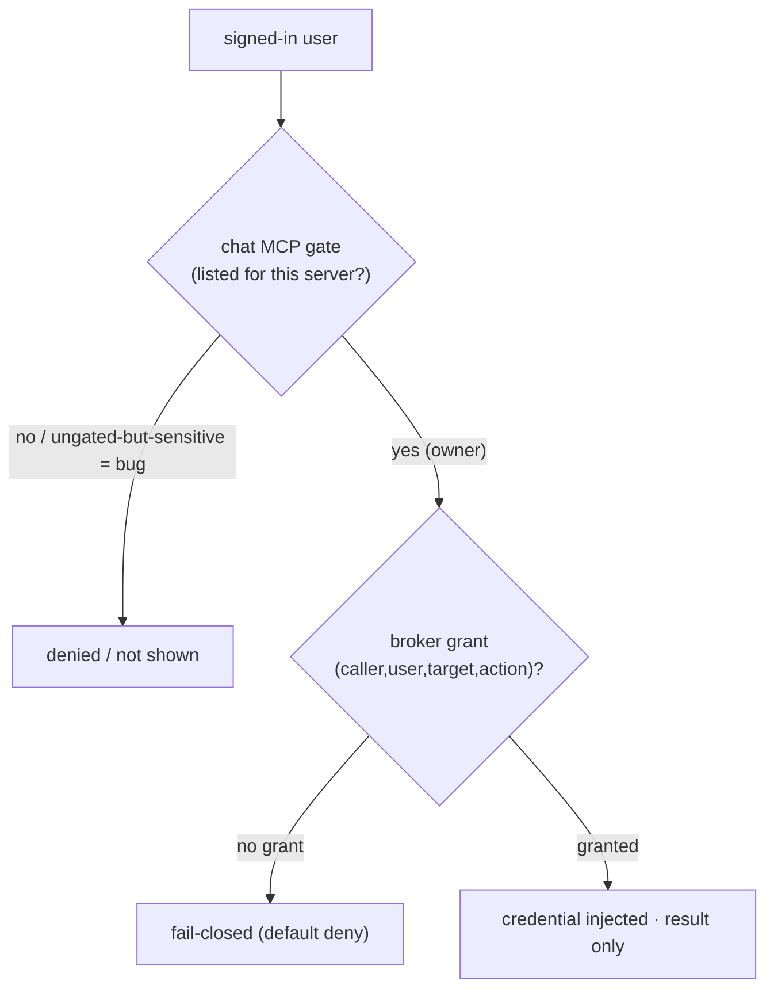

# ADR 0013 — Per-user access tiers: default-deny for sensitive tools (defense in depth)

- **Status:** Accepted (2026-06-13)
- **Deciders:** maintainer (Dragoș)
- **Relates to:** [ADR 0005](0005-identity-first-fail-closed.md) (fail-closed),
  [ADR 0008](0008-policy-and-identity-administration.md) (grants),
  [ADR 0009](0009-end-user-identity-propagation.md) (per-user delegation),
  [ADR 0004](0004-tenancy-and-isolation.md) (per-user isolation)

## Context

A shared chat can serve several kinds of person at once: the **owner(s)** who may
reach sensitive capabilities (a medical portal, cluster control, private data), and
**other/new users** who must reach **none** of those. The dangerous default is the
*open* one: a tool that any signed-in user can invoke. On a surface that mixes a
**medical** account with general chat, "globally available unless someone remembers
to restrict it" is exactly backwards — a new user, or a prompt-injected agent acting
for them, would inherit every ungated capability.

This came up concretely: the medical (patient-portal) MCP servers must be usable by
the **specific family members they belong to** and **disabled for everyone else**;
and when cluster-control / private-data tools are added, they must **not** silently
become available to all users.

## Decision

**Sensitive capability is opt-in per identity; the safe state is deny.** Two
enforcement layers, independent, so a gap in one does not open access:

1. **At the chat (tool gate).** Each MCP server is either **gated** — usable only by
   an explicit allow-list of end-user identities — or **ungated/global**. The rule
   is written down and treated as load-bearing:
   - A **gated** server is restricted to its listed identities; **a non-owner
     cannot see *or* call it** (filtered from the tool list **and** hard-denied at
     call time, so a tool that leaks into a list is still refused).
   - An **ungated** server is **global to every signed-in user**.
   - Therefore **every sensitive/personal MCP MUST be gated.** Only
     **shared-safe** tools (e.g. public web search) may stay ungated. "Forgot to
     gate it" must never be the thing that exposes a sensitive tool — reviews and
     defaults treat an ungated sensitive server as a bug.
2. **At the broker (grants).** Independently, Tessera authorizes the triple
   `(caller, end-user, target, action)` **default-deny**
   ([ADR 0005](0005-identity-first-fail-closed.md) / [0008](0008-policy-and-identity-administration.md)).
   Even if a gate were misconfigured, the broker has **no grant** for a
   non-owner → the credentialed action still fails closed. The chat gate and the
   broker grants are **defense in depth**, keyed on the same verified identity.

### Access tiers

| Tier | Who | Sees / can call |
|---|---|---|
| **Owner of a sensitive resource** | the specific person it belongs to | that resource's gated MCP **and** has a matching broker grant |
| **Other existing user** | another household member | only ungated shared-safe tools; **no** sensitive resource |
| **New user** | anyone newly registered | only ungated shared-safe tools; default reaches **nothing** sensitive |

A per-resource owner list is the unit of access (e.g. one medical server per
person). Adding a new owner is an explicit change in **both** layers — add the
identity to the server's gate **and** add the broker grant/binding — never just one.

### Closing the surface

Where the membership is fixed (a household), **self-registration should be turned
off once the known users exist**, so the set of identities that can reach the chat
at all is closed — narrowing the population *before* the per-tool gates even apply.
This is sequenced **after** the known users have signed in once, so it never locks
them out.

## Consequences

- **Positive:** a new or other user reaches **nothing sensitive** by default;
  exposure requires an explicit, reviewable opt-in in two places; a single
  misconfiguration doesn't leak a credentialed action.
- **Positive:** the model is the same for medical, cluster-control, or any future
  private tool — gate it, grant it, to named identities.
- **Negative:** onboarding an owner is two coordinated edits (gate + grant), not
  one; an ungated-sensitive server is a latent risk if reviews miss it.
- **Mitigation:** treat "ungated sensitive MCP" as a review failure; keep the gate
  rule beside the configuration; the broker's default-deny is the backstop.

## Rejected alternatives

- **Ungated-by-default, restrict as needed** — rejected: the failure mode is
  silent over-exposure; the default must be deny for sensitive capability.
- **Chat gate only (no broker grant)** — rejected: one layer; a gate bug would
  expose real credentials. The broker's independent default-deny is required.
- **Broker grant only (no chat gate)** — rejected: a non-owner would still *see* a
  tool and could trigger attempts/leak metadata; hide and deny at the surface too.
