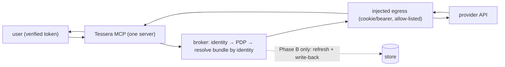

# ADR 0014 — HTTP-injectable provider egress + single session-owner

- **Status:** Accepted (2026-06-13)
- **Deciders:** maintainer (Dragoș)
- **Relates to:** [ADR 0002](0002-broker-worker-topology.md) (workers),
  [ADR 0003](0003-credential-store-pluggable.md) (store),
  [ADR 0006](0006-harvest-drivers.md) (drivers),
  [ADR 0009](0009-end-user-identity-propagation.md) (per-user delegation)

## Context

The point of the broker is **one** MCP surface where the *credential is injected by
verified identity* — not N per-person MCP servers each with a baked-in credential
(the instance-per-user fallback in [ADR 0009](0009-end-user-identity-propagation.md)).
Baked-in-per-user is what we are removing: it leaks a per-person server name into the
tool list, copies the secret into each deployment, and can't tell users apart by
token.

To collapse those into a single Tessera MCP, the broker must actually **perform the
upstream call** for an **HTTP-injectable** provider (a service whose only auth is a
session **cookie** / **bearer** token — the un-API'd long tail). Iteration 1
deliberately stopped at *reporting credential status*; this ADR adds the egress that
turns status into a real, per-identity result.

Two hazards make this non-trivial for such providers:

1. **Rotation contention.** Many session providers issue **single-use** refresh
   tokens — *two* components refreshing the same session corrupt each other. So
   exactly **one** component may own refresh for a given session.
2. **Reverse-engineered, fragile surfaces.** The provider API may be reconstructed
   from a mobile app; the integration must be narrow, allow-listed, and read-first.

## Decision

### 1. HTTP-injectable provider egress (recipe-driven, generic)

Tessera performs the upstream call itself: **resolve the bundle by verified identity
→ inject the credential → call an allow-listed endpoint → return the result.** The
caller never sees the credential ("inject, never hand over").

- A **recipe** ([ADR 0006](0006-harvest-drivers.md)) defines the provider
  generically: `baseUrl`, the **injection kind** (`cookie` / `bearer`), and a list of
  **tools** — each a `(name, method, path, description)`. The Tessera MCP exposes
  one tool per recipe tool; provider-specific endpoints live in **operator config**,
  **never** hardcoded in the broker. (Keeps the open-source broker provider-agnostic
  and free of any operator's private API shapes.)
- **Read and write are both in scope.** A tool is read or write; **write/booking/pay
  tools are `stepUp`** — the broker returns a `step-up` decision and the action is
  performed only after an explicit **human confirmation** that echoes the exact
  request (e.g. doctor + date + time before booking). The agent can never write
  autonomously ([ADR 0013](0013-per-user-access-tiers.md) / architecture
  threat-model D). This is mandatory on sensitive (e.g. medical) providers.
- The egress is gated by the **SSRF allow-list** (only the recipe's host),
  read-methods-first, content-size limited; the bundle's cookie/bearer is injected
  as a header and the inbound caller token is stripped (MCP no-passthrough).
- The transport is **injectable**, so the whole path is **unit-tested offline** with
  a fake transport — no live provider call in tests.

### 2. Single session-owner (rotation)

For any session with single-use refresh, **exactly one component owns refresh +
write-back** to the store. Migration is phased so the live session is never
double-refreshed:

- **Phase A — read-only, current token.** Tessera reads the bundle and calls the
  provider with the **current** access token only; it does **not** refresh. The
  existing harvester/MCP remains the sole refresher. Safe to run alongside.
- **Phase B — Tessera becomes sole owner.** Tessera takes over refresh + write-back
  for the session, and the old per-user MCP is retired. Only then does Tessera
  refresh; there is never a window with two refreshers.

This makes the collapse to a single Tessera MCP safe on a live (e.g. medical)
session.

## Consequences

- **Positive:** one MCP server, credential by verified identity; no per-person server
  name leaks; the secret lives only in the store; the broker stays provider-agnostic
  (recipes carry the specifics); offline-testable.
- **Positive:** the single-owner rule + phasing removes the double-refresh failure
  mode, so a live session is migrated without breakage.
- **Negative:** the broker now contains an outbound HTTP egress (a bigger surface
  than status-only); provider recipes must be written and kept current for
  reverse-engineered APIs.
- **Mitigation:** allow-list + read-first + content limits + size caps; recipes are
  operator config (reviewable, private); writes/bookings stay step-up-gated
  ([ADR 0013](0013-per-user-access-tiers.md) / architecture threat-model D).

## Rejected alternatives

- **Keep N per-user MCPs with baked-in credentials** — rejected: the exact
  anti-pattern Tessera removes (leaks server names, copies secrets, no per-token
  identity).
- **Hand the credential to the caller and let it call the provider** — rejected:
  violates inject-never-hand-over; the caller could leak it.
- **Hardcode provider endpoints in the broker** — rejected: couples the open-source
  broker to private/reverse-engineered API shapes; recipes (operator config) keep it
  generic and PII-free.
- **Two components refreshing the same single-use session** — rejected: corrupts the
  session; exactly one owner, with a phased handover.
