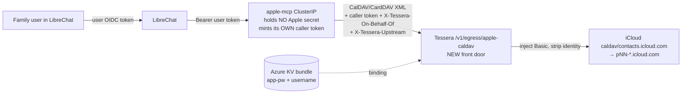

# ADR 0022 — Apple iCloud (Calendar/Reminders/Contacts) via a credential-free `apple-mcp` brokered through Tessera

> **ADR number correction:** the prompt says "~0019," but tessera ADRs already run through **0021** (`0019-app-integrations`, `0020-credential-ownership`, `0021-caller-authentication-plane` are taken). **The next free number is 0022.**

## 1. Recommendation

Build a **credential-free `apple-mcp`** that owns the CalDAV/CardDAV protocol (adopting `python-caldav`) and routes **every** iCloud request through a **new, identity-validating Tessera proxy front door** (`EgressMode.Proxy`) that injects HTTP Basic (Apple ID + app-specific password) via the already-built `InjectionKind.Basic` — the MCP never holds the secret. This is sound **only after** three CRITICAL fixes land on Tessera's currently-inert YARP egress path: it has **no front door**, **no IP-pin** (DNS-rebind-bypassable), and **leaks identity headers** — all proven in source below.

---

## 2. Request flow, components, and exact Tessera changes

### Components



### Flow (read "my calendar")

1. LibreChat forwards the user's Authentik token to `apple-mcp` as `Bearer` (`{{LIBRECHAT_OPENID_ACCESS_TOKEN}}`), gated by `MCP_USER_GATE` — exactly the health-portal precedent.
2. `apple-mcp` runs **`python-caldav`** to build the CalDAV request (PROPFIND/REPORT/GET…), but points the client's base at **Tessera**, with **auto-redirect disabled**. It attaches: its **own app-only caller token** (Authentik `client_credentials`, like the refactored health-portal MCP), `X-Tessera-On-Behalf-Of: <user token>`, and `X-Tessera-Upstream: https://caldav.icloud.com` (the host for this hop).
3. Tessera's new endpoint authenticates **caller + on-behalf-of** (reusing `CallerBrokerService.AuthenticateAsync`), maps the **HTTP method → action verb** (GET/PROPFIND/REPORT = `read:`; PUT/POST/DELETE/MKCALENDAR/MOVE = `use:`/`manage:` + step-up), runs the **PDP** (grant `{caller, onBehalfOf, target=apple-caldav, action}`), resolves the **binding** `(apple-caldav, onBehalfOf) → KV bundle`, **validates `X-Tessera-Upstream`** against the recipe allow-list, injects **Basic**, strips all caller/identity headers, and **forwards** the raw method+path+XML body.
4. iCloud redirects `caldav.icloud.com → pNN-caldav.icloud.com` (RFC 6764 discovery). Tessera (`AllowAutoRedirect=false`) returns the **3xx to the MCP**. The MCP extracts the `Location` host, confirms it matches the Apple partition pattern, and **re-issues the hop** through Tessera with `X-Tessera-Upstream: https://pNN-caldav.icloud.com`. Each hop is brokered, allow-listed, and audited.
5. Tessera returns only the CalDAV response. The app-password never leaves Tessera; the user's token never reaches Apple.

### Exact Tessera changes (building on `InjectionKind.Basic`, already merged)

| # | Change | File / anchor |
|---|---|---|
| C1 | **New `EgressMode.Proxy`** (raw passthrough, distinct from `Http` = recipe-tools) | [Recipe.cs](../../src/Tessera.Core/Recipes/Recipe.cs) `enum EgressMode` |
| C2 | **New front door** `POST/PROPFIND/REPORT/PUT/DELETE/… /v1/egress/{target}` (catch-all method) → authenticate → PDP → resolve → `InjectionEgress.ForwardAsync` | new `EgressProxyEndpoint.cs`; map in [BrokerHost.cs](../../src/Tessera.Broker/BrokerHost.cs) next to `MapCallerBroker()` |
| C3 | **Wire `AddressGuard` into `InjectionEgress`** (`ConnectCallback` on its `SocketsHttpHandler`) + public-IP-only for apple | [InjectionEgress.cs](../../src/Tessera.Broker/Egress/InjectionEgress.cs) ctor — copy [HttpClientTransport.cs](../../src/Tessera.Broker/Egress/HttpClientTransport.cs#L33) |
| C4 | **`SsrfGuard` anchored-pattern entry** for `pNN` hosts + validate caller-supplied `X-Tessera-Upstream` | [SsrfGuard.cs](../../src/Tessera.Core/Egress/SsrfGuard.cs) |
| C5 | **Strip all identity headers** in `InjectingTransformer` (add `X-Tessera-*`, the upstream header) | [InjectionEgress.cs](../../src/Tessera.Broker/Egress/InjectionEgress.cs) `InjectingTransformer` |
| C6 | **Method→action map + step-up** on write methods (echo-back confirm) | new mapping in C2 + `Decision.Effect=StepUp` |
| C7 | **Audit** each proxied hop (method, target, onBehalfOf, host, status — secret-free) | existing audit sink |

`InjectionKind.Basic` itself needs **no change** — it already reads `bundle.AccessToken` (password) + `bundle.Extra["username"]` (Apple ID) and is wired in both injectors.

---

## 3. Security-boundary design (the crux)

**Proxy-path identity (the critical question).** The front door uses the **`/v1/broker` dual-token model**, *not* the `/mcp` model: the `apple-mcp` presents its **own app-only caller token** (Authentik `client_credentials`, `idtyp=app` — HL-14) and forwards the user token in `X-Tessera-On-Behalf-Of`. **`onBehalfOf` is derived only from the cryptographically-verified token** (`oid ?? preferred_username` = email, per the live option-B mapping), **never** from a header/arg the MCP controls. The binding `(apple-caldav, onBehalfOf) → credential` is the *only* selector of whose password is injected — so a prompt-injected MCP acting for user A **cannot** address user B's calendar (HL-2/HL-3; MCP confused-deputy). Contrast the health-portal's `/mcp` path (caller = `chat://librechat`); here the caller is the MCP's own `azp`. Both validate against Tessera's single OIDC (librechat issuer/aud, per the current deployment).

**SSRF allow-list incl. discovery hosts.** `SsrfGuard` is exact-match today. Add a **tightly anchored regex** entry `^p\d{1,3}-(caldav|contacts)\.icloud\.com$` alongside exact `caldav.icloud.com` / `contacts.icloud.com`. **Reject a bare `*.icloud.com`** (covers far more than DAV). The caller-supplied `X-Tessera-Upstream` is validated against this set *before* injection; combined with the C3 IP-pin (resolve-once, reject link-local/metadata, and reject RFC1918 for this public-only provider). Tessera keeps `AllowAutoRedirect=false`; the **MCP** follows redirects and re-targets Tessera per hop — so discovery works **without** Tessera ever chasing a redirect off the allow-list (HL-4).

**Fail-closed.** Two independent gates already exist and are reused: 503 until `identity.mode=oidc`+audience, and no upstream until `egress.enabled` (HL-1). `policy.default=deny`; an unmatched method/host/grant denies.

**Step-up on writes.** Read methods default-allow (per grant); `PUT/POST/DELETE/MKCALENDAR/MOVE` are `manage`-plane, **default-deny + step-up** (mirroring health-portal booking, ADR 0019/0020). Phase 1 grants **read only** — no write grant exists to abuse. **Honest caveat (HL-18, adversarial review):** the Phase-0 `X-Tessera-Confirm` echo-back is a guard against an *accidental* unconfirmed write only — it is **not** a security control against the prompt-injection-exposed MCP, which can set the header itself (the caller *is* the agent we distrust). It is harmless in Phase 0/1 because the PDP denies writes outright with no `manage:` grant. **Hard gate:** before any `manage:` write grant ships (Phase 3), the confirmation **must** become a Tessera-issued, single-use challenge delivered to the human **out-of-band** (a chat/approval surface the agent cannot forge), never a header the MCP supplies.

**Token-stripping.** `InjectingTransformer` must strip `Authorization`, `Cookie`, **and** `X-Tessera-On-Behalf-Of` + `X-Tessera-Upstream` before forwarding, so neither the user's Authentik token nor any identity header leaks to Apple.

---

## 4. `apple-mcp` shape + tool surface + build-vs-adopt + config

**Shape.** A small stateless MCP (mirror the **credential-free health-portal MCP** refactor): holds **no Apple secret**, only its **own** caller `client_credentials`; forwards the user token; routes all CalDAV/CardDAV through Tessera. Streamable-HTTP, per-user gated.

**Tool surface (NO Notes):**
- **Calendar:** `list_calendars`, `list_events(range)`, `search_events`, `create_event*`, `update_event*`, `delete_event*`
- **Reminders (VTODO):** `list_reminder_lists`, `list_reminders`, `create_reminder*`, `complete_reminder*`, `delete_reminder*`
- **Contacts (CardDAV):** `list_address_books`, `search_contacts`, `get_contact`, `create_contact*`, `update_contact*`, `delete_contact*`
- `*` = step-up + echo-back. Apply **result-classes / least-disclosure** (search → metadata + handle; full VEVENT/vCard by handle) so a search can't drain a whole calendar/address book into the LLM.

**Build-vs-adopt verdict.**
- **ADOPT `python-caldav`** (RFC 4791 + RFC 6764 discovery; v3.2.1, 3 weeks ago; 75 contributors; Apache-2.0/GPL) for **Calendar + Reminders**. For **Contacts (CardDAV/RFC 6352)** it has **no coverage** — use **`vobject`** for vCard + raw WebDAV `PROPFIND`/`REPORT` (thinner; flag as the one place you write protocol code).
- **BUILD the MCP shell + the Tessera proxy boundary** — the differentiator (headless, credential-free, per-user-brokered). No OSS fits: every `apple-mcp*` (GodModeAI2025, hassanzouhar, jasonpaulso/apple-mcp-pro, proxynico/cider, …) is **macOS-local** (Swift/EventKit or AppleScript — needs a signed-in Mac, full ambient Apple session, no per-user isolation); **keeper.sh** (1.1k★, CalDAV-capable) **holds the credential itself = the rejected #2**.

**KV / grant / binding (consolidation confirmed).** Collapse the operator's two secrets (`apple-caldav-id` + `apple-caldav-pw`) into the **single bundle** the `Basic` injector already expects — **one per family member**, keyed by `onBehalfOf` (mirroring `health-portal-account-{a,b,c}-session`):

```jsonc
// KV secret  apple-account-a   (per user; username travels WITH the per-user secret)
{ "access_token": "<app-specific-password>", "extra": { "username": "appleid@icloud.com" } }
```
```jsonc
// homelab apps/platform/tessera/configmap.yaml  (mirror the health-portal recipe)
"bindings": [ { "target": "apple-caldav", "onBehalfOf": "<email>", "credential": "apple-account-a" } ],
"grants":   [ { "caller": "<apple-mcp-azp>", "onBehalfOf": "<email>", "target": "apple-caldav", "actions": ["read:*"] } ],
"recipes":  [ { "target": "apple-caldav", "egress": "proxy", "injection": "basic",
               "allowedHosts": ["caldav.icloud.com","contacts.icloud.com","re:^p\\d{1,3}-(caldav|contacts)\\.icloud\\.com$"] } ]
```
This is the right home for `username`: it's **per-user**, so it must live in the per-user bundle, not the shared recipe.

---

## 5. Alternatives rejected

1. **#2 — standalone MCP holds the app-password.** A *powerful, unscoped, static* secret (full iCloud mail+calendar+contacts read/write) living inside an **LLM/prompt-injection-exposed, multi-user** surface. Same Tessera egress boundary is reused for the coming **Microsoft Graph MCP** — build it once, correctly. The credential must never live in the MCP.
2. **Adopt `keeper.sh` / any `apple-mcp*` wholesale.** macOS-local (wrong deployment model — needs a Mac per user, ambient session) or **holds the credential** (= #2).
3. **ProviderEgress recipe-tools (`op=invoke`, exact-path) for CalDAV.** CalDAV object URLs are unbounded and need `PROPFIND/REPORT/MKCALENDAR`; exact-path recipe tools cannot express it. Raw passthrough proxy is the right shape.
4. **Tessera follows the `pNN` redirect server-side.** Violates HL-4 ("no redirects off the allow-list"). The MCP follows redirects and re-targets Tessera per hop — explicit, auditable, allow-list-validated.
5. **Apple "authorize with Apple Account" OAuth (support 121539).** Available only to **Apple-partner apps**, not a generic self-hosted CalDAV client. App-specific password is the only usable credential (note as a future if Apple opens it).

---

## 6. Top adversarial findings (attack the proxy boundary)

| # | Sev | Finding + evidence | One-line fix |
|---|-----|--------------------|--------------|
| **F1** | **CRITICAL** | **Proxy path has no IP-pin → DNS rebind.** `InjectionEgress`'s `SocketsHttpHandler` has **no `ConnectCallback`/`AddressGuard`** ([InjectionEgress.cs](../../src/Tessera.Broker/Egress/InjectionEgress.cs) ctor) — only `HttpClientTransport` pins ([HttpClientTransport.cs#L33](../../src/Tessera.Broker/Egress/HttpClientTransport.cs#L33)). Hostname-only allow-list is HL-4-bypassable. | Wire `AddressGuard` into `InjectionEgress.ConnectCallback`; reject RFC1918/loopback for apple (public-only). |
| **F2** | **CRITICAL** | **Confused-deputy / on-behalf-of spoof.** If `onBehalfOf` came from a header/arg the MCP sets, a prompt-injected MCP acting for A could read B's calendar (MCP confused-deputy; HL-2/HL-3). | Derive `onBehalfOf` **only** from the verified forwarded token (`CallerBrokerService.AuthenticateAsync`); binding is the sole selector. |
| **F3** | **CRITICAL** | **Caller-supplied upstream host = SSRF pivot.** The MCP supplies the `pNN` host post-discovery; `SsrfGuard` is exact-match with no validation of that input today. | Validate `X-Tessera-Upstream` against exact `caldav/contacts.icloud.com` + anchored `^p\d{1,3}-(caldav|contacts)\.icloud\.com$`; never `*.icloud.com`; combine with F1. |
| **F4** | **MINOR→CRIT** | **Identity-header leak to Apple.** `InjectingTransformer` strips only `Authorization`+`Cookie`, not `X-Tessera-On-Behalf-Of`/upstream header — would forward the user's Authentik token to Apple. | Strip **all** `X-Tessera-*` + the upstream header in the transformer before forward. |
| **F5** | **MINOR** | **Over-broad credential + write blast radius.** The app-password grants full mail+calendar+contacts read/write (Apple 102654); a prompt-injected `delete_event`/`delete_contact` is destructive. | Phase 1 = read-only grant; writes default-deny. **Phase 3 (HL-18):** writes require a Tessera-issued single-use challenge confirmed by the human **out-of-band** — the agent-set `X-Tessera-Confirm` echo-back is NOT a security control. Recommend a dedicated family **automation Apple ID**; document auto-revoke-on-password-change. |

---

## 7. Phased plan + GitOps re-entry

- **Phase 0 — Tessera only, no deploy risk (default OFF) — ✅ IMPLEMENTED:** C1–C7 (proxy mode, front door, AddressGuard wiring, SsrfGuard pattern, header-strip, method→action+step-up, audit) + tests. Commit → CI image. *(This is where F1–F4 are fixed.)*

  **Phase 0 review dispositions (independent Judge — PASS, no dimension < 4; clean-context adversarial pass — could not break it as shipped).** Fixed: the new `InjectionEgress` connect-pin gained its own end-to-end test (forward to a metadata + RFC1918 literal **and a `localhost` name → loopback via the DNS branch** → refused); the front door now authenticates **before** the target/input checks (no unauthenticated target enumeration); the proxy now rejects a **non-default upstream port** (OWASP SSRF — restrict the port, not just the host); SsrfGuard docs recommend `[0-9]` over `\d`. **CRITICAL (latent, not live): the agent-set `X-Tessera-Confirm` echo-back is not a human gate** — corrected here (§3, §6-F5) and gated (HL-18): it is unreachable in read-only Phase 0/1 (PDP denies writes), and **before any `manage:` write grant ships it must become a Tessera-issued single-use out-of-band challenge**. **Deferred, with reason** (both confirmed non-security by the Judge): (i) **per-hop audit granularity** — the hop's *authorization decision* is audited per request via the broker spine (caller, target, action, onBehalfOf, effect), but the exact upstream host (`caldav` vs `pNN-`) + the HTTP response status are not yet recorded; that is forensic enrichment of the shared `AuditEntry` schema (affects every egress path), best done as a deliberate audit-schema change in Phase 1, and audit is OFF this phase. (ii) **double credential-store read on the Allow path** — `BrokerCore.HandleAsync` resolves status, then the endpoint resolves the bundle; both key off the same request tuple, so it can never select a *different* user's credential (the PDP decision is bundle-independent). It is one extra Key Vault round-trip per allowed hop; reusing the tested `HandleAsync` spine + its audit fidelity is preferred over a hand-rolled PDP+audit for a low-frequency family-calendar path. Revisit if CalDAV hop volume makes it matter.
- **Phase 1 — READ one user's calendar end-to-end (the RC-15 user-capability gate):** `apple-mcp` read-only (`list_calendars`, `list_events`, adopting `python-caldav`); **one** consolidated KV bundle (`apple-account-a`); homelab configmap recipe + binding + **read** grant (the grant action must cover what `MapMethodToAction` emits — `read:dav`; a `read:*` glob covers it, but a mismatched verb silently 403s); `allow-mcp-to-tessera` + `allow-tessera-to-icloud` netpols; **`egress.enabled` with `audit.enabled=true`** (precondition: the credential-injecting egress must record every hop once live) and the apple hosts; LibreChat `mcpServers.apple` → the MCP (forwards user token). **Proof:** the user asks "what's on my calendar?" → real events; **credential never seen by the MCP** (verify via audit + the MCP holding no Apple secret).
- **Phase 2:** Reminders (VTODO) + Contacts (CardDAV via `vobject`); least-disclosure result classes.
- **Phase 3:** writes behind step-up + echo-back; per-tool write grants; **second family member** → the **concurrent A/B confused-deputy acceptance test** (F2).
- **Phase 4:** reuse the same proxy boundary for the **Microsoft Graph MCP**.

**Where durable changes re-enter Homelab GitOps (HL-6):** `apps/platform/tessera/{configmap,deployment,ingressroute}.yaml` (recipe/grants/bindings + image bump + egress hosts + netpols) and a new `apps/<category>/apple-mcp/` mirroring an existing sibling (HL-8), all reconciled by Flux; **ADR 0022** in the tessera repo. **No Authentik change** — reuse the librechat provider + the live **email-as-`preferred_username`** mapping so `onBehalfOf=<email>` matches (HL-13/option-B). The **live egress flip is operator-gated** (HL-11): personal-data-adjacent, and per-user routing can only be verified with the user's **real chat login**, never reconciled unattended.

**Durable lessons for the knowledge base** (`repo-memory`): F1 (the YARP egress path silently lacks the IP-pin the transport path has) and the proxy-front-door identity pattern belong in `vault/knowledge/rules.md`/`patterns.md` — they're reusable beyond Apple (they recur for the Graph MCP).

---

## 8. Sources

**Primary specs (read, cited):**
- CalDAV/CardDAV **service discovery** — RFC 6764 (Apple-authored): SRV `_caldavs._tcp` → TXT `path=` → `/.well-known/caldav` redirect → `PROPFIND DAV:current-user-principal`; *clients MUST handle redirects*. <https://datatracker.ietf.org/doc/html/rfc6764>
- CalDAV — RFC 4791 <https://datatracker.ietf.org/doc/html/rfc4791> · CardDAV — RFC 6352 <https://datatracker.ietf.org/doc/html/rfc6352> · WebDAV — RFC 4918 <https://datatracker.ietf.org/doc/html/rfc4918>
- **MCP Authorization (2025-06-18, current released revision):** "MCP servers **MUST NOT** pass through the token"; audience validation (RFC 8707); confused-deputy. <https://modelcontextprotocol.io/specification/2025-06-18/basic/authorization>
- OWASP **SSRF** Prevention <https://cheatsheetseries.owasp.org/cheatsheets/Server_Side_Request_Forgery_Prevention_Cheat_Sheet.html> · OWASP **LLM Top-10** (LLM06 Excessive Agency) <https://genai.owasp.org/llm-top-10/> · OWASP **NHI** Top-10 <https://owasp.org/www-project-non-human-identities-top-10/>

**Vendor guidance:**
- Apple app-specific passwords (Published **Oct 8 2025**): require 2FA; ≤25; individually revocable; **auto-revoked when the Apple Account password changes**; grant mail+calendar+contacts. <https://support.apple.com/en-us/102654>

**OSS landscape (build-vs-adopt):**
- `python-caldav` v3.2.1 — RFC 4791 + RFC 6764, Apache-2.0/GPL, healthy. <https://github.com/python-caldav/caldav>
- Existing MCPs: `keeper.sh` (CalDAV, holds the credential = #2) <https://github.com/ridafkih/keeper.sh>; the `apple-mcp*` cluster — all macOS-local (e.g. <https://github.com/GodModeAI2025/AppleMCP>, <https://github.com/hassanzouhar/apple-mcp-server>).

**Unverified / flagged:**
- **iCloud endpoint hostnames** (`caldav.icloud.com`, `contacts.icloud.com`, `pNN-caldav.icloud.com`) are **vendor-undocumented, community-verified** — Apple publishes no formal CalDAV endpoint spec. The design **discovers them at runtime via RFC 6764** rather than hardcoding `pNN`, which converts the uncertainty into robustness (no brittle partition map).
- **`InjectionKind.Basic`** is described as merged + green in the prompt/memory; confirmed present in [CredentialInjector.cs](../../src/Tessera.Broker/Egress/CredentialInjector.cs) and `Recipe.cs`, but I did not re-run the test suite this session.
- The newer MCP spec **draft (post-2025-06-18)** is in progress; 2025-06-18 is the current pinned revision in `standards.md`.

**Next step:** if you accept this, the smallest first move is **Phase 0** (the four CRITICAL Tessera fixes, default-OFF, with tests) — entirely within the tessera repo, no live blast radius — then hand the Phase-1 cutover back to the **Homelab** agent for the GitOps wiring and the operator-gated flip.