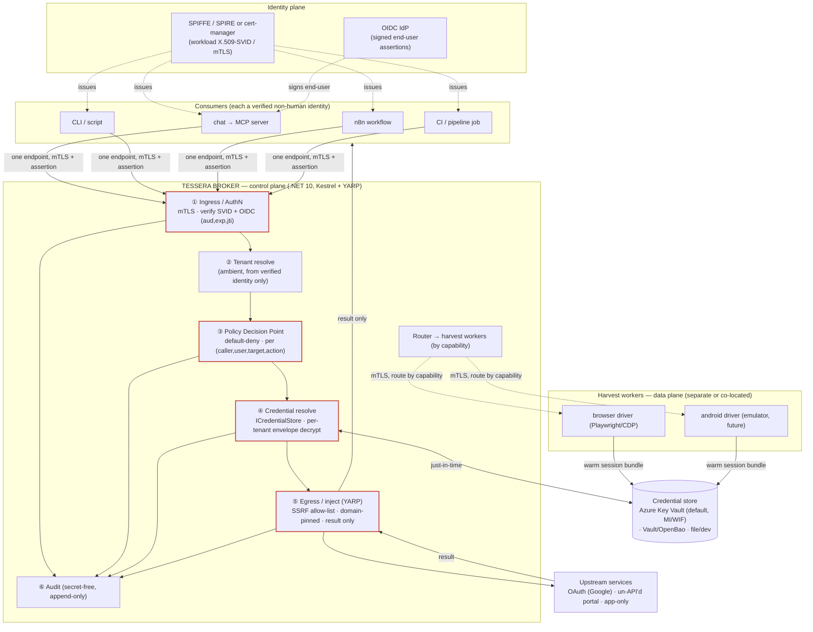
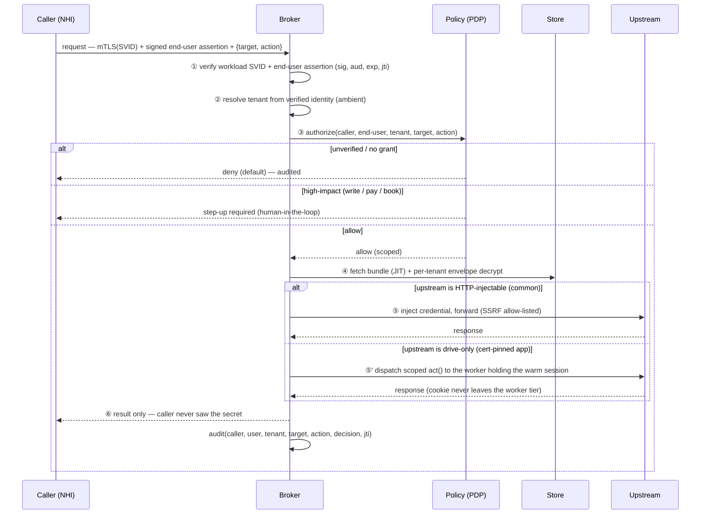
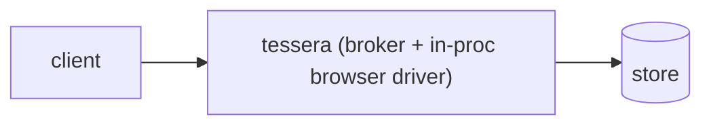
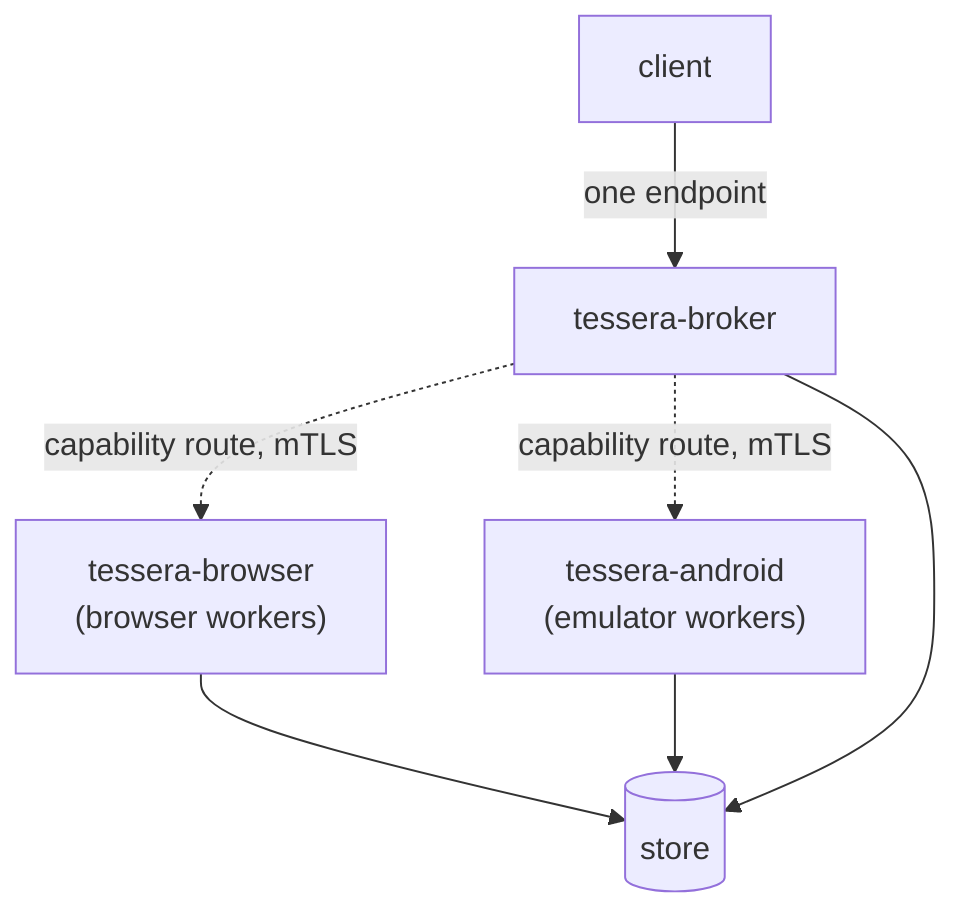
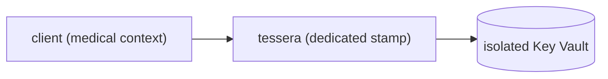

# Tessera — System Architecture

> A secretless, identity-aware **credential broker** for non-human identities
> (agents, automations, workflows, crawlers, pipelines). It lets a
> cryptographically-verified caller act *as a specific person* against any
> service — including the un-API'd web and (in future) app-only services — without
> the calling code ever holding the password, cookie, or token.

This is the design of record for the **.NET 10** implementation. The Python v0.0.2
was a spike that proved the model; it is being replaced, not extended
([ADR 0001](adr/0001-language-and-runtime.md)). Decisions live in
[docs/adr/](adr/README.md); this document draws the whole system. The archived
spike design is at [architecture.python-spike.md](architecture.python-spike.md).

---

## 1. One-paragraph mental model

A caller (an MCP server, a CLI, an n8n flow, a CI job) connects to **one** Tessera
endpoint over mTLS, carrying **its own identity but no secret**. Tessera verifies
*who* is calling and *for whom*, checks policy, fetches the right credential from a
pluggable store just-in-time, and performs the upstream call on the caller's
behalf — returning only the result. Credentials for services with no API are kept
warm by a separate **harvest-worker** tier (browser today, Android/desktop later)
that the broker reaches only through the store. The broker is small and auditable;
the messy automation is isolated behind it.

---

## 2. The whole system

**Trust boundaries:** the red path (ingress → policy → resolve → egress) is the
security boundary and stays small. The harvest workers are a *separate* trust zone
(heavy, sandboxed) that never shares the broker's process and meets it only at the
store.

---

## 3. The request lifecycle (a single brokered call)

---

## 4. Deployment topologies (the "seamless" requirement)

Harvest capability is **relocatable**: co-located for simplicity, or a separate
deployment for scale/isolation — and the **client contract is identical** either
way ([ADR 0002](adr/0002-broker-worker-topology.md)).

### 4a. Batteries-included (one container)

A first-time user runs exactly one thing. Good for a household / small setup.

### 4b. Split workers (scale or stronger isolation)

The client still sees one endpoint. `tessera-android` and `tessera-browser` are
independent deployments that **register their capabilities** with the broker
(Selenium-Grid-style), so the broker routes a harvest/act job to whichever worker
can do it. Add an Android farm without touching the broker or any client.

### 4c. Dedicated instance (medical / high isolation)

Shared-nothing per [ADR 0004](adr/0004-tenancy-and-isolation.md): own broker, own
vault, own network policy. The default tier for medical accounts.

---

## 5. Components (.NET 10 solution layout — planned)

| Project | Responsibility |
|---|---|
| `Tessera.Core` | identity & decision model, tenancy, policy (PDP), recipe model — no I/O |
| `Tessera.Broker` | Kestrel (mTLS), YARP egress, ingress authN, audit, worker router — the host |
| `Tessera.Identity` | SVID/mTLS + OIDC/JWT validation; RFC 8693 token exchange |
| `Tessera.Stores.Abstractions` | `ICredentialStore` + envelope-encryption interfaces |
| `Tessera.Stores.AzureKeyVault` | default store; `DefaultAzureCredential` (MI/WIF); per-tenant keys |
| `Tessera.Stores.Vault` | HashiCorp Vault / OpenBao (opt-in) |
| `Tessera.Workers.Abstractions` | harvest-driver contract + worker registration protocol |
| `Tessera.Workers.Browser` | browser-driver worker (may shell to the Python harvester) |
| `Tessera.Cli` | `tessera validate` / `serve` / recipe + identity tooling |
| `Tessera.*.Tests` | xUnit; transports injectable so the security core is offline-tested |

The **harvest engine** (browser/Android automation) stays a separate process — the
existing Python [`sessionkeeper`](https://github.com/dragoshont/sessionkeeper) is
the first browser-driver implementation; `Tessera.Workers.Browser` wraps/dispatches
it. The broker carries no browser/emulator dependency.

---

## 6. Security model (summary; full threat model below)

Five invariants carry the design:

1. **Verified identity or denied.** mTLS/SVID for the workload ⊕ signed OIDC for
   the human; tenant is derived from that, never from request content
   ([ADR 0005](adr/0005-identity-first-fail-closed.md)).
2. **Fail closed.** Default-deny policy; brokering endpoint refuses until the auth
   plane is wired.
3. **Inject, never hand over.** The caller never receives the secret; no caller
   token is ever passed through to an upstream (MCP spec).
4. **Secretless transit.** Store access via Managed Identity / Workload Identity
   Federation — no client secret to leak
   ([ADR 0003](adr/0003-credential-store-pluggable.md)).
5. **Per-tenant isolation.** Envelope key per tenant; dedicated instance for
   medical ([ADR 0004](adr/0004-tenancy-and-isolation.md)).

### Threat model (OWASP NHI Top 10 + MCP authorization spec)

| # | Threat | Mitigation |
|---|---|---|
| A | Confused deputy / identity spoof at the boundary | cryptographically verified caller + end-user; tenant from identity; never trust headers |
| B | Blast radius (one broker, many secrets) | per-tenant envelope keys; server-side caller→tenant map; dedicated instance + isolated vault for medical |
| C | Token passthrough / long-lived secret leak | injection not brokering; RFC 8693 downscoping for OAuth; MI/WIF (no client secret) |
| D | Prompt-injection / tool poisoning / excessive agency | least-privilege per-(caller,user,target,action); step-up for write/pay/book |
| E | Replay / session fixation | short-lived single-use assertions (jti+nonce); prefer X.509-SVID; rotate harvested sessions |
| F | Harvest abuse / seed-credential theft | seed creds in vault; refresh-over-relogin; circuit breaker; workers isolated from broker |
| G | Stale grants / supply chain | TTL + revoke-on-offboard; pinned/sandboxed worker images |
| H | Non-repudiation gap | secret-free append-only audit of every decision (caller,user,tenant,target,action,jti) |

Secure-by-default switches: require `exp`+`jti`, **egress SSRF allow-list**
(critical for an egress proxy), content-size limits, rate limits, OpenTelemetry
audit, sandboxed workers.

---

## 7. Where Tessera sits (OSS landscape)

| Project | Category | Self-hosted | Un-API'd? | Per-end-user | Relationship |
|---|---|---|---|---|---|
| CyberArk Secretless Broker | secretless proxy | yes | no | no | nearest ancestor (injection) |
| HashiCorp Boundary | access broker | yes | no | no | broker/inject vocabulary |
| Vault / OpenBao | secrets engine | yes | n/a | n/a | a *store* backend |
| SPIFFE / SPIRE | workload identity | yes | n/a | n/a | issues the caller identity Tessera consumes |
| Ory Oathkeeper / Pomerium | identity-aware proxy | yes | no | no | decision-pipeline reference |
| Selenium Grid | browser worker grid | yes | n/a | n/a | the worker-routing model (ADR 0002) |
| HashiCorp go-plugin | out-of-proc plugins | yes | n/a | n/a | the driver-isolation model (ADR 0002) |
| Arcade.dev / Composio | auth-for-agents (SaaS) | no | no (assumes OAuth) | yes | closest twins, but hosted |
| **→ Tessera** | **secretless NHI credential broker** | **yes** | **yes** | **yes** | OSS · self-hosted · un-API'd · per-end-user |

The white space Tessera owns: **open-source + self-hosted + handles services with
no OAuth (and eventually no web) + per-end-user identity.**

---

## 8. Open questions (tracked for build phase)

- **Worker registration protocol**: gRPC + mTLS (go-plugin-style) vs a lightweight
  HTTP/2 capability-registration (Selenium-Grid-style). Lean gRPC for typed
  bidirectional streaming; confirm during the workers phase.
- **Envelope-key rotation**: per-tenant key rotation cadence and re-wrap strategy.
- **Browser-egress channel**: how the broker hands a scoped `act()` to a worker
  without the cookie crossing into the broker (capability handle vs delegated call).
- **Vaultwarden viability** as a real store (vs test-only) — validate empirically.

See [roadmap.md](roadmap.md) for the phased plan.
