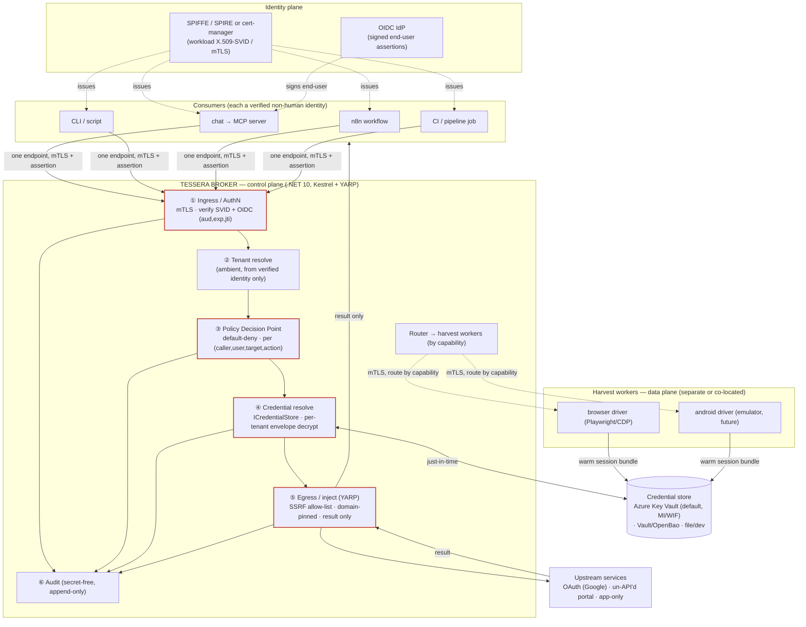
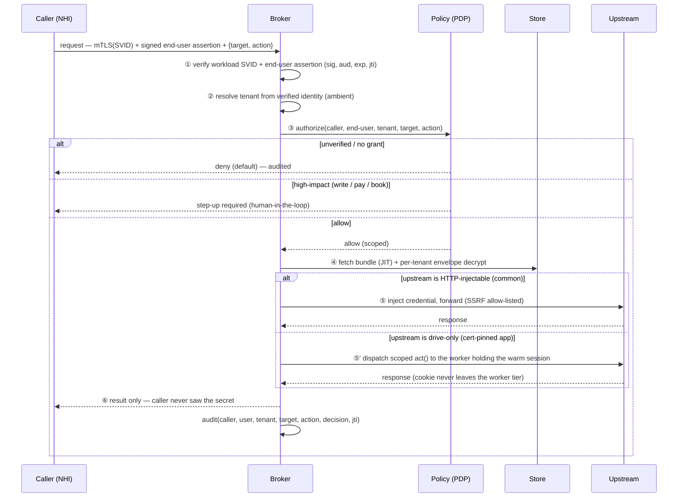
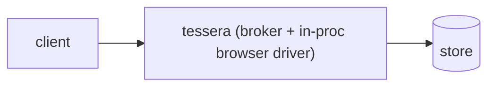
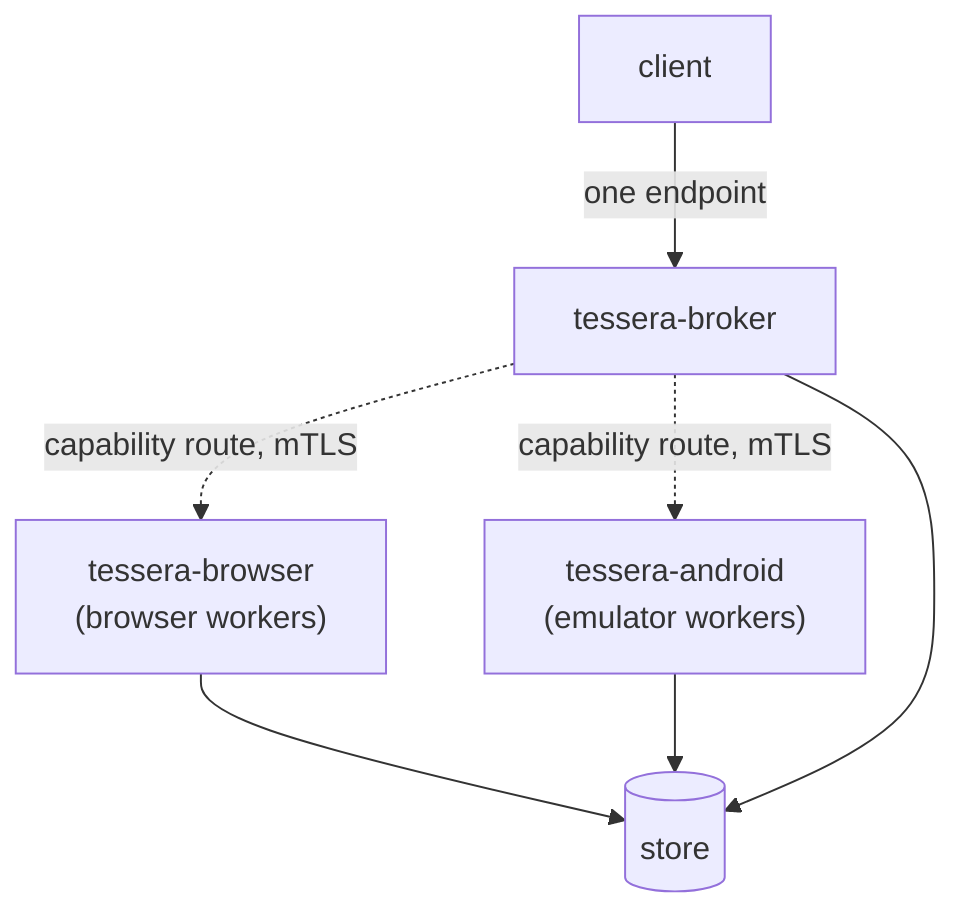
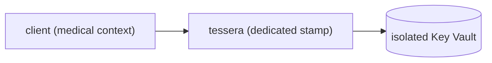

# Tessera — System Architecture

> A secretless, identity-aware **credential broker** for non-human identities
> (agents, automations, workflows, crawlers, pipelines). It lets a
> cryptographically-verified caller act *as a specific person* against any
> service — including the un-API'd web and (in future) app-only services — without
> the calling code ever holding the password, cookie, or token.

This is the design of record for the **.NET 10** implementation. The Python v0.0.2
was a spike that proved the model; it is being replaced, not extended
([ADR 0001](adr/0001-language-and-runtime.md)). Decisions live in
[docs/adr/](adr/README.md); this document draws the whole system. The archived
spike design is at [architecture.python-spike.md](architecture.python-spike.md).

---

## 1. One-paragraph mental model

A caller (an MCP server, a CLI, an n8n flow, a CI job) connects to **one** Tessera
endpoint over mTLS, carrying **its own identity but no secret**. Tessera verifies
*who* is calling and *for whom*, checks policy, fetches the right credential from a
pluggable store just-in-time, and performs the upstream call on the caller's
behalf — returning only the result. Credentials for services with no API are kept
warm by a separate **harvest-worker** tier (browser today, Android/desktop later)
that the broker reaches only through the store. The broker is small and auditable;
the messy automation is isolated behind it.

---

## 2. The whole system

**Trust boundaries:** the red path (ingress → policy → resolve → egress) is the
security boundary and stays small. The harvest workers are a *separate* trust zone
(heavy, sandboxed) that never shares the broker's process and meets it only at the
store.

---

## 3. The request lifecycle (a single brokered call)

---

## 4. Deployment topologies (the "seamless" requirement)

Harvest capability is **relocatable**: co-located for simplicity, or a separate
deployment for scale/isolation — and the **client contract is identical** either
way ([ADR 0002](adr/0002-broker-worker-topology.md)).

### 4a. Batteries-included (one container)

A first-time user runs exactly one thing. Good for a household / small setup.

### 4b. Split workers (scale or stronger isolation)

The client still sees one endpoint. `tessera-android` and `tessera-browser` are
independent deployments that **register their capabilities** with the broker
(Selenium-Grid-style), so the broker routes a harvest/act job to whichever worker
can do it. Add an Android farm without touching the broker or any client.

### 4c. Dedicated instance (medical / high isolation)

Shared-nothing per [ADR 0004](adr/0004-tenancy-and-isolation.md): own broker, own
vault, own network policy. The default tier for medical accounts.

---

## 5. Components (.NET 10 solution layout — planned)

| Project | Responsibility |
|---|---|
| `Tessera.Core` | identity & decision model, tenancy, policy (PDP), recipe model — no I/O |
| `Tessera.Broker` | Kestrel (mTLS), YARP egress, ingress authN, audit, worker router — the host |
| `Tessera.Identity` | SVID/mTLS + OIDC/JWT validation; RFC 8693 token exchange |
| `Tessera.Stores.Abstractions` | `ICredentialStore` + envelope-encryption interfaces |
| `Tessera.Stores.AzureKeyVault` | default store; `DefaultAzureCredential` (MI/WIF); per-tenant keys |
| `Tessera.Stores.Vault` | HashiCorp Vault / OpenBao (opt-in) |
| `Tessera.Workers.Abstractions` | harvest-driver contract + worker registration protocol |
| `Tessera.Workers.Browser` | browser-driver worker (may shell to the Python harvester) |
| `Tessera.Cli` | `tessera validate` / `serve` / recipe + identity tooling |
| `Tessera.*.Tests` | xUnit; transports injectable so the security core is offline-tested |

The **harvest engine** (browser/Android automation) stays a separate process — the
existing Python [`sessionkeeper`](https://github.com/dragoshont/sessionkeeper) is
the first browser-driver implementation; `Tessera.Workers.Browser` wraps/dispatches
it. The broker carries no browser/emulator dependency.

---

## 6. Security model (summary; full threat model below)

Five invariants carry the design:

1. **Verified identity or denied.** mTLS/SVID for the workload ⊕ signed OIDC for
   the human; tenant is derived from that, never from request content
   ([ADR 0005](adr/0005-identity-first-fail-closed.md)). For the **chat→Tessera
   hop**, the workload "WHO" is enforced by **NetworkPolicy** (LibreChat connects
   over streamable-HTTP, not mTLS), and the per-user "FOR WHOM" is the **verified
   OIDC access token** (below).
2. **Fail closed.** Default-deny policy; brokering endpoint refuses until the auth
   plane is wired.
3. **Inject, never hand over.** The caller never receives the secret; no caller
   token is ever passed through to an upstream (MCP spec).
4. **Secretless transit.** Store access via Managed Identity / Workload Identity
   Federation — no client secret to leak
   ([ADR 0003](adr/0003-credential-store-pluggable.md)).
5. **Per-tenant isolation.** Per-user separate stored secret + RBAC (envelope key
   per tenant is a follow-on); dedicated instance for medical
   ([ADR 0004](adr/0004-tenancy-and-isolation.md)).
6. **Per-user access tiers — default-deny for sensitive tools.** A sensitive
   capability (medical portal, cluster control, private data) is **opt-in per
   identity**, enforced in two independent layers: the **chat tool-gate**
   (a sensitive MCP server is shown + callable only to its allow-listed owners;
   ungated = global, so *every* sensitive server must be gated) **and** the
   **broker grants** (default-deny per `(caller, user, target, action)`). A new or
   other user reaches **nothing sensitive** by default; the two layers are defense
   in depth keyed on the same verified identity
   ([ADR 0013](adr/0013-per-user-access-tiers.md)).

### End-user token: audience & validation (the delegation crux)

The per-user "FOR WHOM" is a signed **Entra OIDC access token** the chat forwards.
Tessera trusts it only after full validation, and the token must carry an `aud`
Tessera expects — set by **which resource was requested at token time**:

- **Iteration 1 = shared audience (Flow B):** one Entra **system API app**;
  `OPENID_SCOPE` points at it; LibreChat forwards the held token; Tessera validates
  the shared `aud`. No LibreChat change; secure here because the hop is also
  NetworkPolicy-gated. (**Flow A** — a dedicated Tessera API app + On-Behalf-Of for
  a strict `aud = Tessera` — is deferred; `OPENID_REUSE_TOKENS` doesn't OBO to a
  downstream MCP, and OBO is flaky for personal Microsoft accounts.)
- **Validation (non-negotiable):** the **access token, not the `id_token`**
  (an `id_token`'s `aud` is always the login client — the classic trap); signature
  via Entra **JWKS**; `iss`; `aud`; `exp`; `tid`; user from `oid`/`preferred_username`.
- **Fail closed until verified:** until a real forwarded token's `aud` is confirmed
  against a live sign-in, delegation is off and Tessera denies.

See [ADR 0011](adr/0011-identity-provider-sso.md) and
[specs/identity-azure-setup.md](specs/identity-azure-setup.md#1a-token-audience--validation-how-tessera-trusts-the-forwarded-token).

### Threat model (OWASP NHI Top 10 + MCP authorization spec)

| # | Threat | Mitigation |
|---|---|---|
| A | Confused deputy / identity spoof at the boundary | cryptographically verified caller + end-user; tenant from identity; never trust headers |
| B | Blast radius (one broker, many secrets) | per-tenant envelope keys; server-side caller→tenant map; dedicated instance + isolated vault for medical |
| C | Token passthrough / long-lived secret leak | injection not brokering; RFC 8693 downscoping for OAuth; MI/WIF (no client secret) |
| D | Prompt-injection / tool poisoning / excessive agency | least-privilege per-(caller,user,target,action); step-up for write/pay/book |
| E | Replay / session fixation | short-lived single-use assertions (jti+nonce); prefer X.509-SVID; rotate harvested sessions |
| F | Harvest abuse / seed-credential theft | seed creds in vault; refresh-over-relogin; circuit breaker; workers isolated from broker |
| G | Stale grants / supply chain | TTL + revoke-on-offboard; pinned/sandboxed worker images |
| H | Non-repudiation gap | secret-free append-only audit of every decision (caller,user,tenant,target,action,jti) |

Secure-by-default switches: require `exp`+`jti`, **egress SSRF allow-list**
(critical for an egress proxy), content-size limits, rate limits, OpenTelemetry
audit, sandboxed workers.

---

## 7. Where Tessera sits (OSS landscape)

| Project | Category | Self-hosted | Un-API'd? | Per-end-user | Relationship |
|---|---|---|---|---|---|
| CyberArk Secretless Broker | secretless proxy | yes | no | no | nearest ancestor (injection) |
| HashiCorp Boundary | access broker | yes | no | no | broker/inject vocabulary |
| Vault / OpenBao | secrets engine | yes | n/a | n/a | a *store* backend |
| SPIFFE / SPIRE | workload identity | yes | n/a | n/a | issues the caller identity Tessera consumes |
| Ory Oathkeeper / Pomerium | identity-aware proxy | yes | no | no | decision-pipeline reference |
| Selenium Grid | browser worker grid | yes | n/a | n/a | the worker-routing model (ADR 0002) |
| HashiCorp go-plugin | out-of-proc plugins | yes | n/a | n/a | the driver-isolation model (ADR 0002) |
| Arcade.dev / Composio | auth-for-agents (SaaS) | no | no (assumes OAuth) | yes | closest twins, but hosted |
| **→ Tessera** | **secretless NHI credential broker** | **yes** | **yes** | **yes** | OSS · self-hosted · un-API'd · per-end-user |

The white space Tessera owns: **open-source + self-hosted + handles services with
no OAuth (and eventually no web) + per-end-user identity.**

---

## 8. Open questions (tracked for build phase)

- **Worker registration protocol**: **decided — gRPC + mTLS** with typed `.proto`
  contracts and bidirectional streaming ([ADR 0007](adr/0007-worker-transport.md)).
  We keep Selenium Grid's capability-*routing* model but use go-plugin-style
  gRPC transport; co-located workers use the same contract over a local channel.
- **Envelope-key rotation**: per-tenant key rotation cadence and re-wrap strategy.
- **Browser-egress channel**: how the broker hands a scoped `act()` to a worker
  without the cookie crossing into the broker (capability handle vs delegated call).
- **Vaultwarden viability** as a real store (vs test-only) — validate empirically.

---

## 9. Standards alignment (the de-facto pattern)

Tessera is a concrete implementation of what the governing standards prescribe for
a non-human caller acting with a credential it must not hold. This section maps each
**mechanism in the code** to the **authority** that mandates it — so a reviewer can
trace "is this the right shape?" to a spec, not an opinion. For the visual
positioning of these mechanisms in a stack, see [positioning.md](positioning.md).

### 9.1 No token passthrough — the load-bearing invariant

The **MCP Authorization specification** (§2.6.2, §3.7) and its Security Best
Practices forbid *token passthrough* outright: an MCP server **MUST NOT** forward
the token it received to a downstream API, and **MUST** validate that a presented
token was issued for *its own* audience. Tessera is built around this:

- `EntraTokenValidator` validates the forwarded token's signature (Entra JWKS),
  `iss`, `aud` (Tessera's configured audience), `exp`, and `tid` — and **fails
  closed** when no audience is configured. A token minted for another resource is
  rejected, not relayed.
- The upstream call uses a **separate, Tessera-owned credential** (the recipe's
  injected key/cookie/bearer), resolved just-in-time from the store. The caller's
  token is **never** placed on the upstream request.

Why it matters (the spec's own reasoning): passthrough breaks audience binding,
defeats rate-limit/validation controls, and destroys the audit trail (the upstream
sees a token from "someone else"). Tessera's injection model removes the
anti-pattern by construction — and, per the spec's "future-compatibility" note,
starting with audience separation is what lets the security model evolve.

### 9.2 Delegation, not impersonation — RFC 8693 vocabulary

Tessera keeps the **caller (WHO)** and **end-user (FOR WHOM)** as distinct,
separately-verified identities (`CallerIdentity` + `EndUserAssertion`). That is
**RFC 8693 §1.1 delegation** semantics — the actor retains its own identity while
acting for the subject — which the RFC calls out as *safer* than impersonation
(where the actor becomes indistinguishable from the subject). The secret-free audit
records the composite (`caller on behalf of user`), mirroring the RFC's `act` claim.
The deferred grant-bound `actAs` (ADR 0021) maps to the RFC's **`may_act`** claim:
policy — not the caller — decides who may act for whom.

### 9.3 Complete mediation + least privilege — OWASP LLM06 / Saltzer–Schroeder

**OWASP LLM06 (Excessive Agency)** prescribes: implement authorization in the
downstream system (not the LLM), minimize permissions, execute in the user's
context, and require human approval for high-impact actions. Tessera's
`PolicyDecisionPoint` is the *complete-mediation* point — **every** call is
re-evaluated against an explicit grant (default-deny), per
`(caller, end-user, target, action)`:

- **Action planes** (`read` / `use` / `manage`) make least privilege legible; the
  control plane is default-deny even when `use` is granted (ADR 0019).
- **Step-up** on writes/booking/pay is the human-in-the-loop gate; the agent can
  never autonomously invoke a step-up tool.
- **Result classes** (metadata-first, full body only by a target-scoped handle) are
  scope-minimization on the *read* path — a search can't drain a mailbox.

### 9.4 Non-human-identity hygiene — OWASP NHI Top 10

The caller proves its **own** workload identity (Entra app-only token / SVID /
mTLS) and holds **no** long-lived provider secret — directly countering the top NHI
risks (static secrets, over-privilege, poor offboarding). Grants are per-caller and
revocable; workload-identity federation removes the stored client secret entirely.

### 9.5 SSRF defense on egress — OWASP SSRF / MCP Security BP

The egress path is an SSRF-sensitive control point. Tessera applies the
allow-list-plus-hardening posture both specs recommend:

- `SsrfGuard`: an **explicit host allow-list** (empty ⇒ nothing allowed) and an
  **HTTPS requirement** by default — no raw IPs unless listed.
- `HttpClientTransport`: **no auto-redirect** (an upstream can't 302 the broker off
  the allow-listed host to a metadata endpoint), **no proxy**, **no ambient
  cookies** (every cookie is injected explicitly), short timeouts.
- **Hardening in progress** (from the adversarial review): pin the resolved IP for
  the connection and reject link-local/metadata ranges (`169.254.0.0/16`, private
  ranges) to close DNS-rebinding/TOCTOU — the residual gap both specs name.

### 9.6 PDP/PEP separation, per-request — NIST SP 800-207 Zero Trust

Tessera realizes the Zero-Trust **Policy Decision Point / Policy Enforcement Point**
split: `PolicyDecisionPoint` decides; the egress layer enforces; the two are
separate components and **every** request is authorized at the decision point with a
secret-free audit record. Identity is never inferred from a header — it is the
verified caller and the validated end-user token.

### 9.7 Where Tessera does *not* apply (honest scope)

Standards alignment includes knowing the boundary. Tessera brokers
**HTTP-injectable** credentials. It deliberately does **not**:

- act as your browser **SSO / access gateway** — that is Authentik / oauth2-proxy
  in front of the apps (ADR 0018); the same OIDC identity flows into Tessera.
- broker **arbitrary shell / SSH** ("run any command") — an explicit non-goal; that
  credential class stays with its tool, gated by the access plane + network policy.
- become a **secret store** — secrets rest in Key Vault / Vault; Tessera fetches
  just-in-time and never persists them.

---

See [roadmap.md](roadmap.md) for the phased plan.
