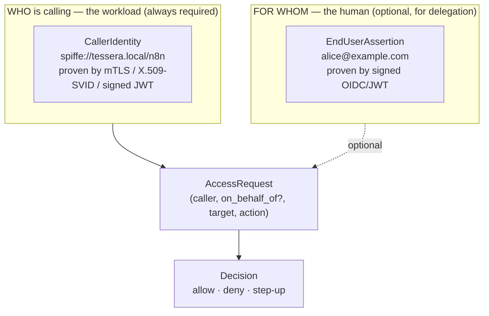
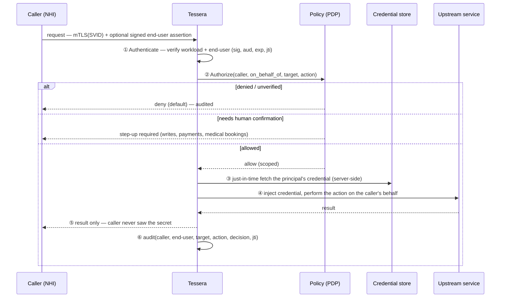
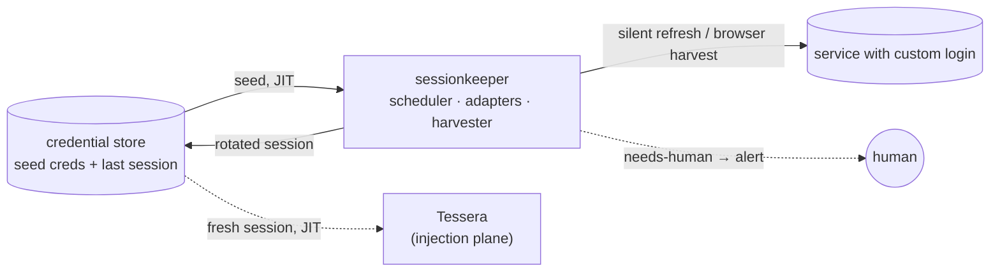
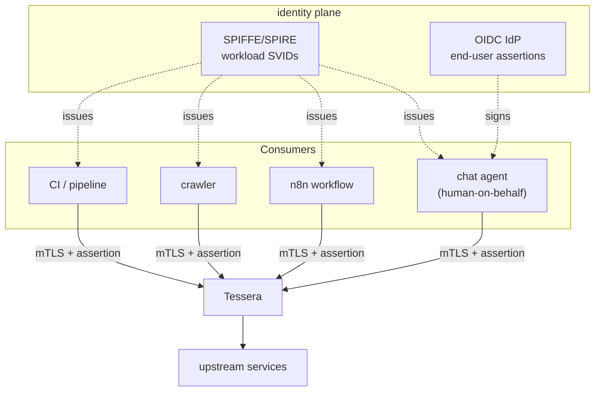
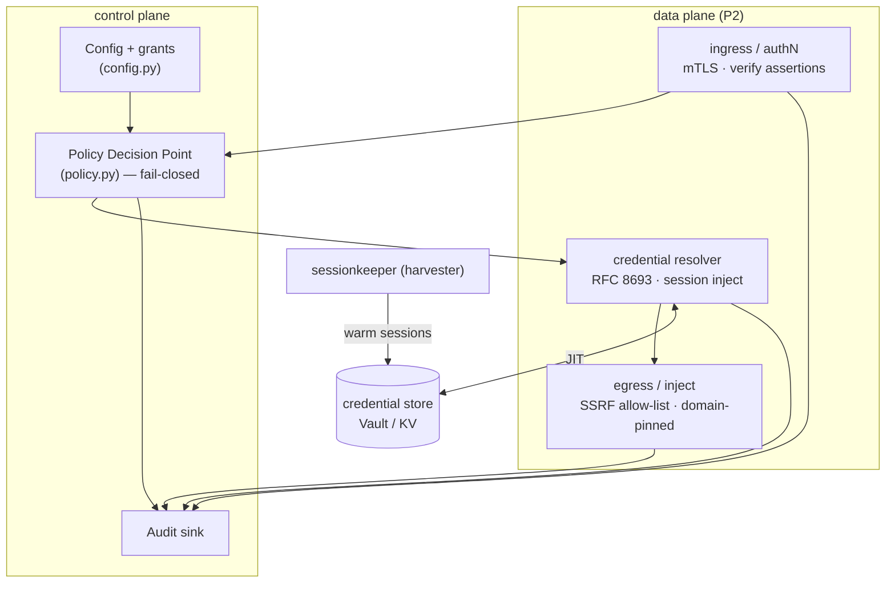

# Tessera — Architecture

> A secretless, identity-aware **credential broker** for non-human identities
> (NHIs): agents, bots, workflows, crawlers, and pipelines. It lets a verified
> caller act *as a specific person* against any service — including the un-API'd
> web — without the caller ever holding the secret.

This document is the design of record. It covers the mental model, the request
pipeline, the credential-handling contract, the threat model, and where Tessera
sits among existing open-source projects. The phased build plan is in
[roadmap.md](roadmap.md).

---

## 1. The core idea

Two problems are usually tangled together and must be kept apart:

1. **Who is calling, and for whom?** — *authentication of the caller* (a
   workload) and, optionally, *the human it acts on behalf of*.
2. **What credential lets that action happen, and how is it used without
   leaking?** — *credential resolution and injection* against the upstream.

Tessera owns the seam between them. It is the trusted intermediary that
**represents an outside caller to a protected service**: it vouches for identity,
enforces policy, and brokers sanctioned access — the modern form of the
*tessera hospitalis*.

### Two identities, never conflated

Conflating these is the root of the **confused-deputy** vulnerability: if the
broker trusts an unauthenticated *"I'm Dragoș"* hint, then anything that can reach
it — a network attacker, a **prompt-injected tool**, a **compromised n8n
workflow** — can request anyone's access. So the load-bearing rule is:

> **Identity is cryptographically verifiable, or the request is denied.**

These map to the dataclasses in [`model.py`](../src/tessera/model.py):
`CallerIdentity`, `EndUserAssertion`, `AccessRequest`, `Decision`.

---

## 2. The request pipeline

Modeled on the well-trodden Identity-Aware-Proxy decision flow (Ory Oathkeeper's
*Match → Authenticate → Authorize → Mutate*), specialized for credential
injection:

**Stage 1 — Authenticate** establishes both identities and refuses anything
unverified (outside loopback dev mode). **Stage 2 — Authorize** is the
[`PolicyDecisionPoint`](../src/tessera/policy.py): explicit grants, **default
deny**, exact delegation matching, glob-scoped actions. Stages 3–5 are the
**injection plane** (P2). Stage 6 is non-repudiable audit.

---

## 3. Credential handling: *injection*, not *brokering*

HashiCorp Boundary draws the distinction Tessera adopts as its contract:

| Mode | What happens | Does the caller see the secret? |
|---|---|---|
| Credential **brokering** | secret is fetched and *returned to the caller* | **yes** — caller handles it |
| Credential **injection** | the broker authenticates to the upstream *on the caller's behalf* | **no — never** |

**Tessera does injection.** This is the same principle as CyberArk's *Secretless
Broker*: *"applications cannot leak what they don't have."* Concretely:

- For **OAuth/OIDC upstreams** (Google, etc.): mint a short-lived, **downscoped**
  token per call via OAuth Token Exchange ([RFC 8693](https://www.rfc-editor.org/rfc/rfc8693)).
  The caller's own token is **never** passed through (per the
  [MCP authorization spec](https://modelcontextprotocol.io/specification/2025-06-18/basic/authorization)
  §3.7).
- For the **un-API'd web** (health portals, marketplaces): there is no token
  endpoint — only a human login that yields a cookie/session. Tessera injects
  that session **server-side**, egress-pinned to the upstream domain. Keeping
  those sessions alive is the job of the harvester (§4).

---

## 4. The harvester (`sessionkeeper`)

The distinctive capability. The polished commercial tools assume OAuth already
exists; the services real people care about often don't have it. The harvester —
the existing [`sessionkeeper`](https://github.com/dragoshont/sessionkeeper)
project — keeps human-login sessions **warm** so the broker always has a fresh
credential to inject:

Two arms, split by cost: a cheap, frequent **silent token refresh** (≈99% of
keep-alive), and a rare, expensive **automated browser cold-login** (a warm
headful browser driven over CDP) for cold starts or fully-lapsed chains, bounded
by a circuit breaker so a re-login storm can't trip bot-detection. Only a genuine
dead-end pages a human. Tessera consumes the sessions it keeps warm; the two meet
**only at the credential store**.

---

## 5. Multi-consumer model

Because identity is two-dimensional, the same broker serves every kind of caller
without special cases:

- **Agents** act for the signed-in human (delegated).
- **n8n flows** get a per-workflow identity; a user-triggered flow can carry that
  user's assertion, a scheduled one carries none.
- **Crawlers / pipelines** act purely as themselves with their own scoped grants;
  pipeline jobs get **ephemeral per-run** identities (SPIRE attestation).

No automation borrows a human's identity — directly answering
[OWASP NHI #10](https://owasp.org/www-project-non-human-identities-top-10/).

---

## 6. Threat model

Mapped to the [OWASP Non-Human Identities Top 10 (2025)](https://owasp.org/www-project-non-human-identities-top-10/)
and the MCP authorization spec.

| # | Threat | Mitigation in Tessera |
|---|---|---|
| **A** | **Identity spoofing at the boundary** (confused deputy) — a forged/poisoned caller claims to be someone else | Caller identity is **cryptographically verified** (mTLS / X.509-SVID for the workload; signed OIDC for the end-user); validate sig + `aud` + `exp` + `jti`; **never trust a header**. Prefer X.509-SVID over JWT (replay). |
| **B** | **Blast radius** — one broker holds many sensitive sessions | Caller→principal mapping enforced **server-side** (a caller can only ever trigger *its own* principal); JIT fetch + zeroize; per-tenant keys; **separate trust domains** for high- vs low-sensitivity (medical vs marketplace). |
| **C** | **Token passthrough / long-lived secret leak** (NHI2, NHI7) | **Injection, not brokering**; downscope via RFC 8693; sessions egress-pinned and server-side only; **no passthrough** of caller tokens. |
| **D** | **Prompt-injection / tool poisoning / excessive agency** | Least-privilege **per-(caller, end-user, target, action)** grants, default deny; **step-up / human-in-the-loop** for writes, payments, bookings; treat tool descriptions as untrusted; rate-limit + anomaly-detect. |
| **E** | **Replay / session fixation** | Short-lived single-use assertions (`jti` + nonce); mTLS channel binding; rotate harvested sessions. |
| **F** | **Harvester abuse / seed-credential theft** (NHI7) | Seed creds in Vault/HSM with tight access; prefer refresh-rotation over re-login; per-service circuit breaker; alert on any forced interactive login. |
| **G** | **Stale grants & supply chain** (NHI1, NHI3) | TTL on every identity↔session mapping; revoke-on-offboard; pin/scan/sign tool images; **sandbox** untrusted tool servers. |
| **H** | **Non-repudiation gap** (NHI10) | Structured, append-only audit at the decision point: `(workload, end-user, target, action, decision, jti)`. |

**Secure-by-default switches** (borrowed from the MCP-gateway state of the art):
require `exp` + `jti` (revocation), **fail closed**, an **egress allow-list**
(critical for an egress broker — SSRF defense), content-size limits, rate limits,
and OpenTelemetry audit.

---

## 7. Where Tessera sits (OSS landscape)

| Project | Category | Caller identity | Cred handling | Harvests human logins? | Relationship |
|---|---|---|---|---|---|
| **CyberArk Secretless Broker** | secretless proxy | mTLS / k8s SA | inject | no | nearest ancestor (same *injection* idea) |
| **HashiCorp Boundary** | access broker | Boundary authN | broker **or** inject | no | source of the broker/inject vocabulary |
| **Vault / OpenBao** | secrets engine | AppRole / JWT / k8s | dynamic + static secrets | no | **use as the credential store** |
| **SPIFFE / SPIRE** | workload identity | X.509/JWT-SVID + attestation | issues identity, not creds | no | **issues the caller identity Tessera consumes** |
| **Ory Oathkeeper / Pomerium** | identity-aware proxy | bearer / JWT / device | forwards identity | no | decision-pipeline reference |
| **IBM ContextForge / Docker MCP Gateway** | MCP/AI gateway | JWT + RBAC / profile | injects creds, sandboxes servers | no | front-door + hardening reference |
| **Arcade.dev / Composio** | auth-for-agents (SaaS) | IdP / per-user sessions | OAuth/keys, "act on behalf of user" | no (assumes OAuth) | closest twins — but hosted, no un-API'd |
| **→ Tessera** | **secretless NHI credential broker** | **mTLS/SVID ⊕ signed end-user** | **inject; downscope; harvest** | **yes** | **OSS · self-hosted · un-API'd · per-end-user** |

The white space Tessera owns: **open-source + self-hosted + covers services with
no OAuth + per-end-user identity.** Complementary to (not competing with) SPIFFE
(identity issuance) and Vault (secret storage).

---

## 8. Component boundaries

**Implemented today (P1):** the control-plane core — `model`, `config`, `policy`
(fail-closed PDP), and the `tessera validate` CLI. **Next (P2):** the data
plane — ingress authN, resolver, and the injection egress. See
[roadmap.md](roadmap.md).
