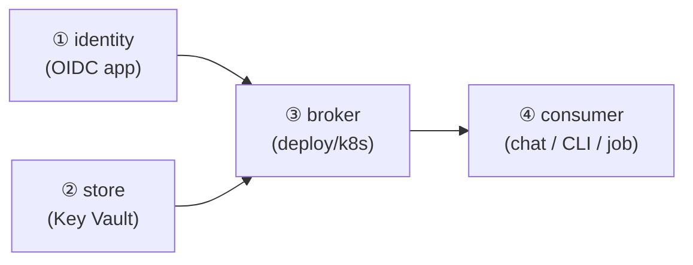

# Getting started

Stand up Tessera and wire your first consumer. This is the **operator onboarding**:
the manual steps (the parts only a human can do) and exactly **which YAML to change**.

> Tessera is a credential **broker**: a verified caller asks it to act *as a
> person*, and it injects that person's credential without the caller ever holding
> it. So setup has three parts — **identity** (who's allowed), **store** (where the
> secrets live), and the **broker** itself — then you point a consumer at it.



---

## 0. Prerequisites

- A Kubernetes cluster with a **default-deny-ingress** NetworkPolicy in the target
  namespace (a broker should never be openly reachable).
- A secret **store** — the default is **Azure Key Vault** (others are pluggable).
- An **OIDC** identity provider for end-user delegation — the default is **Microsoft
  Entra** (see [ADR 0011](adr/0011-identity-provider-sso.md)). Pure-automation
  callers don't need a human IdP.
- `kubectl`, and (for the identity step) the Azure CLI with Bicep.

---

## 1. Identity — create the OIDC app *(manual: one command + one click)*

Delegation needs an OIDC **app registration** whose token your consumers forward and
Tessera validates. The IaC is in [`deploy/azure/entra/`](../deploy/azure/entra/):

```bash
az deployment sub create -l westeurope \
  -f deploy/azure/entra/main.bicep \
  -p chatDomain=chat.example.com         # your chat's public hostname
# (add clusterOidcIssuer=... ONLY for a publicly-reachable cluster; omit it for a
#  private/homelab cluster — the broker then uses its service-principal credential)
```

Then grant consent (a human gate — it cannot be scripted):

```bash
az ad app permission admin-consent --id <chatAppId from the output>
```

Note the outputs — you need **`chatAppId`** (the audience) and **`oidcIssuer`**.
A confidential web consumer (LibreChat) also needs a **client secret**:

```bash
az ad app credential reset --id <chatAppId> --display-name oidc --years 2
# store the returned password in your vault / SOPS — NEVER in git
```

> Personal Microsoft accounts (e.g. gmail-backed) work with **zero** Azure
> onboarding via `signInAudience=AzureADandPersonalMicrosoftAccount`; they sign in
> through `/common`. Tessera's `/common` validator accepts both workforce and
> personal accounts.

---

## 2. Store — put a credential where the broker can read it

Create the K8s secret the broker uses to authenticate to the vault, then store a
provider credential **bundle** in the vault under a name your binding references.

**a) How the broker reaches the vault.** Two options:

| Option | How | Trade-off |
|---|---|---|
| **Workload Identity / MI** *(preferred)* | annotate the broker ServiceAccount; **delete** the `envFrom` in `deployment.yaml` | no secret to leak |
| **Service-principal secret** | a K8s secret `tessera-store-credentials` with `AZURE_TENANT_ID` / `AZURE_CLIENT_ID` / `AZURE_CLIENT_SECRET` | simple; a long-lived secret |

**b) A credential bundle** is the JSON your harvester writes and Tessera reads:

```json
{ "access_token": "…", "refresh_token": "…", "cookies": { "session": "…" } }
```

Store it in the vault under the name your binding points at (e.g.
`health-portal-alice-session`). Tessera only ever **reads** it and reports a
*status* — it never returns or logs the value.

---

## 3. Broker — deploy it *(the YAML you change)*

Copy [`deploy/k8s/`](../deploy/k8s/) and change **four things** in
[`deployment.yaml`](../deploy/k8s/deployment.yaml):

| # | Field | Set to |
|---|---|---|
| 1 | `image` | a real release tag / `sha-<commit>` |
| 2 | `TESSERA_VAULT_URL` | your Key Vault URL |
| 3 | `TESSERA_OIDC_AUDIENCE` | your **`chatAppId`** (this turns delegation **on**) |
| 4 | `envFrom` *or* the ServiceAccount | your store auth (step 2a) |

Then author your rules in [`configmap.yaml`](../deploy/k8s/configmap.yaml) —
`grants` (who may do what), `bindings` (which stored secret backs each), `recipes`
(per-provider tools). And set your chat's label in
[`networkpolicy.yaml`](../deploy/k8s/networkpolicy.yaml).

```bash
kubectl apply -k deploy/k8s
```

> **Fail-closed by design.** Leave `TESSERA_OIDC_AUDIENCE` **empty** until you've
> verified a real token (step 5). The broker comes up, serves health, runs its
> read-only self-test, and **denies** every delegated call until the audience is
> set. You can deploy safely before identity is fully proven.

---

## 4. Consumer — point something at the broker

- **Chat (LibreChat):** add Tessera as a **YAML-defined** MCP server that forwards
  the user's OIDC token. This is mandatory — UI/DB-defined servers can't forward the
  token. Full steps: [specs/librechat-integration.md](specs/librechat-integration.md).
- **CLI / automation / job:** register a non-human caller with its **own** audience
  (prefer workload-identity federation over a secret). Steps + Bicep:
  the [non-human caller section of the README](../README.md#registering-a-non-human-caller-cli--automation--job).

---

## 5. Verify — fail-closed → enabled *(the second human gate)*

```bash
kubectl -n default port-forward deploy/tessera 8080:8080 &
curl -s localhost:8080/status | jq      # store kind, delegation = fail-closed, self-test
```

1. **Before delegation:** `delegation` reads `fail-closed`; the self-test resolves a
   credential **status** (never its value).
2. **Capture a real token:** have one user sign in once, capture the forwarded
   access token, and confirm its `aud == chatAppId`, `iss`, `exp`.
3. **Enable:** set `TESSERA_OIDC_AUDIENCE=<chatAppId>`, re-apply, and `/status` now
   reads `delegation: enabled`. Delegated calls authorize against your grants.

---

## 6. The admin portal *(optional, but the friendly way in)*

Tessera ships a small web **admin portal** ([ADR 0016](adr/0016-admin-portal.md))
so a human can see what's connected and add a person without hand-editing YAML. It
is a thin, OIDC-authenticated layer over the same model — **files stay the source
of truth, and it never shows a secret value.** Three surfaces: **My accounts**
(your connections' health), **Users** (operator view of everyone), and a **connect
wizard** (pick provider → name the person → seed → done).

The SPA is **baked into the broker image** and served at `/` — there is nothing
extra to deploy. Turn it on with two settings:

1. **Name the operators** — the only portal authorization datum is an allow-list
   (config, not a database):

   ```jsonc
   // in tessera.json
   "portal": { "admins": ["you@example.com"] }   // verified principals who get the operator view
   ```

2. **Register the portal's sign-in redirect** — the portal signs in as a **public
   SPA client** reusing the chat app (so its token's `aud` is what the broker
   validates). Add a SPA redirect URI to that app (additive; no re-consent):

   ```bash
   # for kubectl port-forward access (the default):
   az rest --method PATCH \
     --uri "https://graph.microsoft.com/v1.0/applications/<chat-app-object-id>" \
     --body '{"spa":{"redirectUris":["http://localhost:8080/auth/callback"]}}'
   # …or set portalDomain in main.bicep to also register https://<portal-host>/auth/callback
   ```

**Reach it** (cluster-internal by default — a credential broker is not put on the
public edge):

```bash
kubectl -n default port-forward deploy/tessera 8080:8080
# open http://localhost:8080 → "Sign in with Microsoft" → you're the operator
```

**Add a person** in the UI: *Connect account* → pick a provider → enter the
person's principal (e.g. `them@example.com`) and the **store secret name** that
will hold their session (e.g. `health-portal-them-session`) → Finish. They now
appear with their connection's health.

> **Two honest limits of the portal today.**
> - **Seeding the session (the captcha step) is not yet wired into the portal** —
>   the *Re-seed / live hand-off* button returns a calm "not configured" until a
>   browser worker is attached ([spec R1](specs/admin-portal.md#7a-known-risks--open-questions-self-review)).
>   Until then a connection is created in the portal but its session is seeded by
>   your harvester / the documented browser flow, after which it shows green.
> - **A connection added in the portal persists for the pod's lifetime; a durable
>   add is a git commit** to the ConfigMap (the file stays the source of truth —
>   [ADR 0008](adr/0008-policy-and-identity-administration.md)). The portal is a
>   convenience, not a second source of truth.

**Dev / local run** (no Azure, no cluster): bind to loopback in `dev` mode and the
portal shows a local "developer sign-in" card instead of Microsoft — handy for a
demo. The broker refuses `dev` mode on any non-loopback bind, so it can't leak.
For the fuller no-Azure inner loop, including a local Key Vault-compatible
endpoint, see [the local Azure dev-loop spec](specs/local-azure-devloop.md).

---

## What each file is for

| File | Purpose | You change |
|---|---|---|
| [`deploy/k8s/deployment.yaml`](../deploy/k8s/deployment.yaml) | the broker + Service | image, vault URL, OIDC, store auth |
| [`deploy/k8s/configmap.yaml`](../deploy/k8s/configmap.yaml) | config + grants/bindings/recipes | your rules |
| [`deploy/k8s/networkpolicy.yaml`](../deploy/k8s/networkpolicy.yaml) | only the chat may reach :8080 | your chat's label |
| [`deploy/azure/entra/main.bicep`](../deploy/azure/entra/main.bicep) | the OIDC app(s) | `chatDomain` |

## Manual steps, collected (the human gates)

1. **Run the Entra deploy** + **admin-consent** click (step 1).
2. **Mint + vault** the client secret (step 1) — never in git.
3. **Seed a credential bundle** in the vault (step 2b).
4. **Sign in once** to capture + verify a real token, then set the audience (step 5).
5. **(Portal, optional)** name the operators in `portal.admins` + add the SPA
   redirect URI to the chat app (step 6).

Everything else is declarative YAML you apply with `kubectl`.
