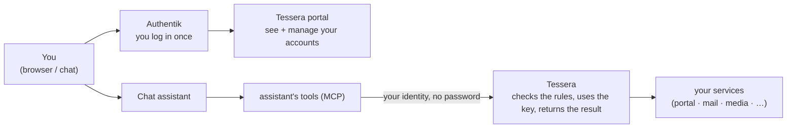

# Onboarding — using Tessera with Authentik

> A first-run guide for a **person** who will use Tessera through a chat assistant
> and the admin portal, with **Authentik** as the sign-in. No prior knowledge
> needed. If you operate the cluster, jump to [For the operator](#for-the-operator).

---

## 1. What you're actually signing into

Two things work together, and they do **different** jobs:

- **Authentik is your front door.** It is where you *log in* — once — with your
  identity (it can federate Microsoft / Google / passkeys). It proves **who you
  are** and lets you open the web apps you're allowed to open.
- **Tessera is the doorkeeper for your accounts.** It holds the *keys* to the
  services you use (a health portal, mail, a media request app) and decides whether
  a specific **action** may run — without ever handing the key to the assistant.



The golden rule: **the assistant never holds your password.** It asks Tessera to
act; Tessera holds the key, checks the rulebook, does the action, and hands back
only the answer. Trick the assistant and you've taken nothing — it never had a key.

---

## 2. Your first sign-in

1. Open the portal (your operator gives you the link, e.g. `https://tessera.<your-domain>`).
2. You're sent to **Authentik**. Sign in the way your operator set up — most often
   **"Sign in with Microsoft"** (Authentik federates it), then approve any MFA /
   passkey prompt.
3. Authentik sends you back to Tessera, already signed in. You'll land on **My
   accounts**. You never typed a password *into* Tessera — it only received a signed
   proof of who you are from Authentik.

You won't be asked to log in again for a while: the same single sign-in is what the
chat assistant uses when it acts for you.

---

## 3. A tour of the portal

**My accounts** — every service connected on your behalf, each with a health badge:

| Badge | Means |
|---|---|
| **Live** | The session works; actions can run. |
| **Expiring soon** | Still works, but re-seed it soon. |
| **Absent** | No session yet — connect/seed it. |
| **Error** | The last check failed — re-seed to fix. |

Open a connection to see its **session contents** (just *which* kinds of material
exist — "has cookies ✓" — never the value), when it was last used, and **who owns
the credential**:

- **personal login** — Tessera holds *your own* login for this service. You know the
  secret; it is **never revealed** to an assistant or to another person.
- **household key** — a shared key (e.g. a media app) that *nobody* personally holds;
  Tessera uses it on your behalf but never shows it to anyone.
- **dependent** — a credential a guardian seeded for someone they look after.

**Activity & access** — the transparency view:

- **Who can act as you** — every assistant/automation granted to act on your behalf,
  *on what*, and which actions need your confirmation. Each row shows the action
  **planes** it touches and whether it uses **your login** or **a household key**.
- **Loaded modules** — the connectors available and what each can do.
- **Activity** — a secret-free log of what happened (allow / deny / step-up), newest
  first.

---

## 4. Connect your first account

1. **My accounts → Connect account**, pick the provider, confirm it's *for you*.
2. For a service whose only login is a human web session, Tessera opens a **Live
   hand-off**: a small embedded browser where **you** log in and solve the captcha
   once. Watch for the **target strip** at the top — it shows the real hostname
   you're signing into (your anti-phishing anchor). The session that results is
   harvested straight into the vault; the portal never sees it.
3. Done — the connection goes **Live**. From now on Tessera keeps it usable and the
   assistant can act through it under the rules.

> Tessera **never** stores a password you can read back, and the Live hand-off URL
> is single-use and expires fast.

---

## 5. Using it from the chat

Just ask the assistant in plain language — "what appointments do I have?", "request
that film", "what's the latest from my utility account?". Under the hood every tool
call is classified by **plane**, and that decides how it behaves:

| Plane | What it does | Behaviour |
|---|---|---|
| **read** | Observe (list appointments, search mail) | Runs freely under your grant. |
| **use** | Operate within normal behaviour (book a slot, request a film) | Runs; the riskier ones ask you to **confirm** first. |
| **manage** | Reshape the service itself (change settings, add a user) | **Default-denied** for most people, and **always asks for a step-up confirmation** when allowed. |

So an assistant can be allowed to *operate* your home or mailbox but **never
reconfigure** it — that boundary is built in, not a setting you have to remember.

**Reading mail/personal data is spill-proof.** A search returns only *metadata* +
opaque **handles** (subjects, senders, ids — no bodies). The full text of one message
is fetched only by handing back its handle, so a broad search can't drain your
mailbox. A *send* returns a receipt of what was sent, never a fresh copy of your data.

**Confirmations.** When the assistant proposes something that writes or books, it
reads the exact details back to you and waits for an explicit **yes** — it can't run
a write on its own.

---

## 6. What stays private (and what doesn't)

- **Your secrets never reach an assistant.** Tessera injects the credential into the
  upstream call itself; the assistant only ever sees the *result*.
- **You're isolated from other people.** One person's connection is never visible to
  another; a household key is shared *use*, never a shared *view* of anyone's data.
- **Consent is per data class.** Letting the assistant read your *calendar* does not
  let it read your *mail* — those are separate consents, recorded with a timestamp you
  can see under **Activity & access**.
- **Everything is logged, secret-free.** Every decision (who, for whom, on what,
  allow/deny/step-up) is in the activity feed — ids and outcomes only, never a value.

---

## 7. Quick answers

- **Do I ever give Tessera my password?** Only once, *into the service's own login
  page* during the Live hand-off — never into Tessera's UI, and Tessera can't show it
  back.
- **Can I revoke access?** Yes — remove a connection in the portal, or your operator
  removes a grant. Both take effect immediately (default-deny).
- **Why Authentik *and* Tessera?** Authentik answers "who are you / may you open this
  app"; Tessera answers "may this *action* run with a hidden key". Different jobs, one
  sign-in.
- **It says "step-up required" — is something wrong?** No — that's the system asking
  you to confirm a higher-impact action. Review the details and approve.

---

## For the operator

This guide assumes the federated shape from
[ADR 0018](adr/0018-access-gateway-and-action-broker.md):

```text
Browser ─▶ Traefik ─▶ Authentik ─▶ app UI         (browse — who may open what)
User / assistant / MCP ─▶ Tessera ─▶ provider      (act — which hidden key, gated)
```

Wiring it up:

1. **Run Authentik** behind Traefik and create an **OAuth2/OIDC provider** +
   application for Tessera (note the issuer, client id, and the
   `…/application/o/<slug>/` endpoints).
2. **Point Tessera at Authentik** instead of (or in addition to) the upstream IdP:
   set `identity.mode = oidc`, `oidc.issuer = https://<authentik-host>/application/o/<slug>/`,
   and `oidc.audience` = the provider's client id. Tessera validates that token
   exactly as it does a Microsoft one — `iss`/`aud`/`exp`/signature, fail-closed.
   The chat/MCP forwards the **same** Authentik token it already has, so the human
   logs in once.
3. **Protect the web apps** (not Tessera's `/mcp`) with a Traefik **ForwardAuth**
   middleware pointing at Authentik's outpost. Do **not** put Tessera's `/mcp` or a
   media app that breaks under SSO (e.g. Plex) behind ForwardAuth.
4. **Keep Authentik federating your IdP** (e.g. Microsoft) so it stays the source of
   truth and you get one login, MFA/passkeys, and a session — Tessera never becomes
   your first SSO.

For a concrete, homelab-specific deployment (Authentik via Helm, the External-Secret
wiring, the Entra federation app, and the exact Tessera config diff), see the
operator runbook in your deployment repo (`docs/runbooks/authentik-setup.md`) and the
[operator cutover checklist](specs/operator-cutover-checklist.md).
