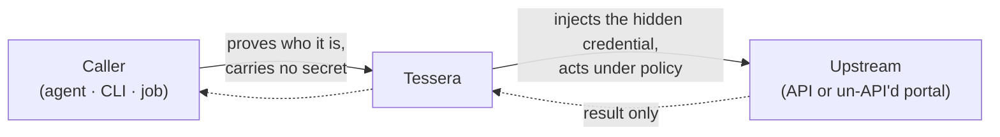
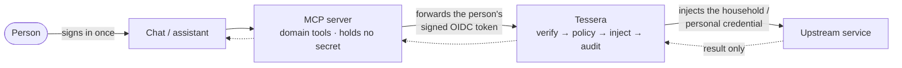
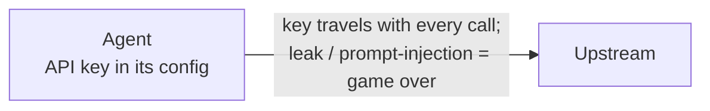
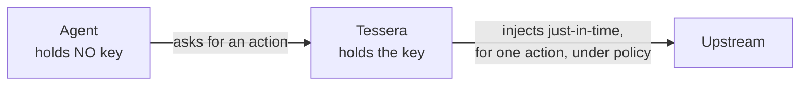
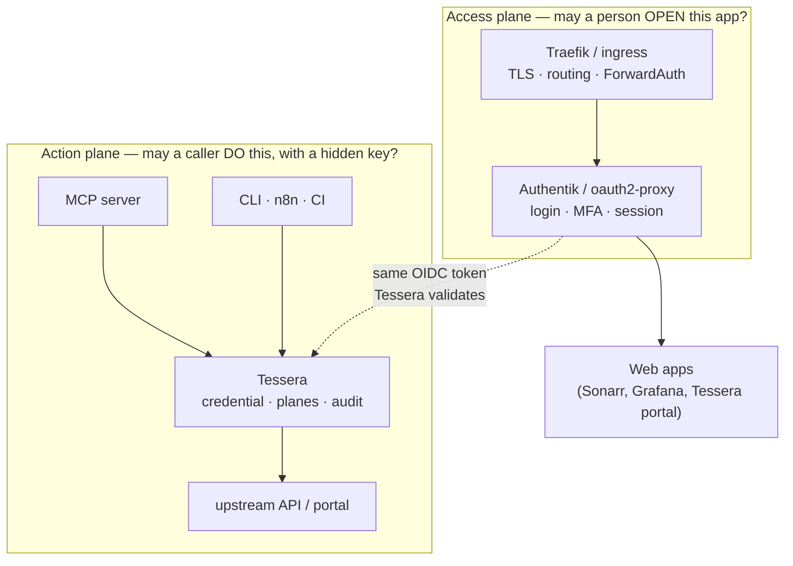
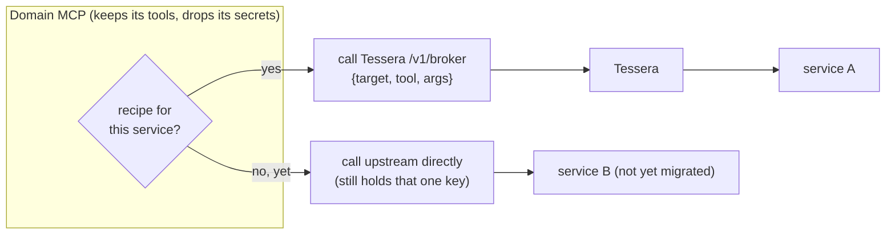
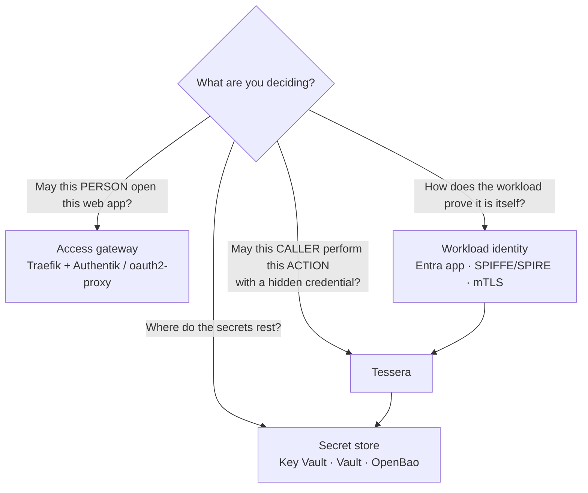

# Positioning Tessera in your architecture

> A visual, copy-ready guide to **where Tessera sits** and **why it sits there**.
> Every scenario is small on purpose: one job, one boundary, one picture. If you
> only read one page about how to slot Tessera into a real stack, read this one.

Tessera owns exactly one job: **a verified non-human caller performs a
policy-gated, audited action with a credential it never holds.** Everything below
is a different shape of that one job.

- New here? Start with [the one-paragraph model](#the-one-line-model).
- Designing a stack? Jump to [the decision guide](#decision-guide-what-belongs-where).
- Need the standards backing? See [standards alignment](#why-this-is-the-de-facto-shape-standards).

---

## The one-line model



The caller gets the **result**, never the **key**. Take the key from a tricked
agent and you have taken nothing — it never had one.

---

## Scenario 1 — An assistant acts *for a person*

The headline case: a chat assistant does something on a person's behalf (read a
medical result, approve a media request, add a calendar event).



**Why this shape:** the MCP server stays a thin *domain* layer (it knows the tools,
not the secret). Tessera validates the forwarded token **for its own audience**,
authorizes the **action**, and injects a *separate* upstream credential — it never
forwards the person's token onward. That is the MCP spec's no-token-passthrough
rule, by construction.

**Use when:** an agent/MCP must act as a *specific human* against that human's
accounts.

---

## Scenario 2 — An automation acts *as itself*

No human is involved — a CI job, an n8n flow, a crawler. It proves *its own*
workload identity and carries its own least-privilege grant.

```mermaid
flowchart LR
    JOB["CI job · n8n · crawler<br/>own workload identity · no secret"] -->|app-only token<br/>(aud = Tessera)| T["Tessera"]
    T -->|injects the service credential| UP["Upstream API"]
    UP -.->|result only| T
```

**Why this shape:** pure automation never borrows a person's identity — it is
attributable as *itself*, which is exactly the OWASP Non-Human-Identity guidance.
The grant is scoped to the caller's app id; default-deny means a new caller reaches
nothing until you say so.

**Use when:** a workload acts on a shared/service-owned resource with no person in
the loop.

---

## Scenario 3 — The custody shift (before / after)

The whole point, in two pictures.

**Before — the agent holds the key (the risk):**



**After — Tessera holds the key (the broker):**



**Why this shape:** the secret stops travelling. It rests in a store (Key Vault /
Vault), is fetched just-in-time for an authorized action, and is injected at the
egress — never returned, logged, or handed to the caller.

**Use when:** *always.* This is the invariant every other scenario is built on.

---

## Scenario 4 — Two planes in one stack (the reference architecture)

A homelab/enterprise stack has **two different questions**, and they want
**different tools**. Don't make one tool answer both.



**Why this shape:** the access gateway (Traefik + Authentik) decides *who may open
which app*. Tessera decides *which action may run with which hidden credential*.
The **same** OIDC identity flows from the edge into the action plane — the human
logs in once, and Tessera never invents identity from a header.

**Use when:** you run web apps *and* agents/automations side by side (the common
homelab and enterprise case).

---

## Scenario 5 — A domain MCP egresses *through* Tessera (the cutover)

How an existing MCP that *holds* upstream keys becomes credential-free, one service
at a time.



**Why this shape:** migration is **per service, direct-first, recipe-later**. A
service Tessera has a recipe for is brokered (the MCP holds no key for it); a
service it doesn't is still called directly (status quo). No big-bang cutover, no
"forward any URL" blind proxy — an unknown service stays direct, never blindly
piped.

**Use when:** retrofitting an existing credential-holding MCP onto Tessera
incrementally.

---

## Decision guide — what belongs where



| If you need… | Use… | Not… |
|---|---|---|
| Browser SSO, MFA, "may open this app" | Authentik / oauth2-proxy / Authelia | Tessera |
| TLS termination, routing, ForwardAuth | Traefik / nginx / Envoy | Tessera |
| To rest secrets at rest | Key Vault / Vault / OpenBao | Tessera (it *uses* one) |
| To issue the caller's identity | Entra / SPIFFE-SPIRE / cert-manager | Tessera (it *consumes* it) |
| **Action-level authz + credential injection + audit for a non-human caller** | **Tessera** | an access gateway (wrong layer) |

Tessera is **one layer of a small stack**, deliberately narrow. It leans on the
tools you already run for everything around its one job.

---

## Why this is the de-facto shape (standards)

This positioning is not a preference — it is what the governing specifications
prescribe for exactly this problem.

| The shape above… | …is mandated/recommended by |
|---|---|
| MCP server forwards the user token to Tessera, which validates it **for its own audience** and injects a **separate** upstream credential — never forwards the user token onward | **MCP Authorization spec** §2.6.2 / §3.7 — token-audience validation; **token passthrough is explicitly forbidden** |
| Caller (WHO) + end-user (FOR WHOM) kept distinct; the broker acts *for* the subject while keeping its own identity | **RFC 8693** §1.1 — *delegation* semantics; `act` / `may_act` claims |
| Authorize the **action** in the broker (default-deny, planes, step-up), not in the LLM; run in the user's context; human-in-the-loop on writes | **OWASP LLM06 Excessive Agency** — complete mediation, least privilege, require-approval |
| The caller proves its own identity and holds no long-lived secret | **OWASP Non-Human-Identity Top 10** — no static secrets, least privilege, attributable |
| Egress is allow-listed, HTTPS-pinned, no-redirect, private/metadata ranges blocked | **OWASP SSRF Prevention**; **MCP Security Best Practices** (SSRF) |
| Decision (PDP) is separate from enforcement (egress), evaluated every request | **NIST SP 800-207 Zero Trust** — PDP/PEP separation, per-request authorization |

See [the architecture doc's standards section](architecture.md#9-standards-alignment-the-de-facto-pattern)
for the mechanism-by-mechanism mapping into the code.

---

## Anti-patterns (what Tessera deliberately is **not**)

- **Not a token-passthrough proxy.** It will not forward the caller's token to an
  upstream — that is the MCP-spec anti-pattern, and it breaks audience binding,
  audit, and least privilege.
- **Not a blind URL proxy.** A service with no recipe is *not* piped through
  Tessera; it stays direct. Tessera only brokers calls it can *authorize*.
- **Not your first SSO.** It validates an OIDC token the edge already issued; it is
  not an app catalog, MFA lifecycle, or browser-session manager.
- **Not a secret store.** Secrets rest in Key Vault / Vault; Tessera fetches them
  just-in-time and never persists them itself.

---

## See also

- [Architecture](architecture.md) — the full system, request lifecycle, threat model, and [standards alignment](architecture.md#9-standards-alignment-the-de-facto-pattern).
- [How Tessera fits your stack](../README.md#how-tessera-fits-your-stack-traefik--authentik--mcp) — the README's stack overview.
- [Connect a domain MCP](connect-a-domain-mcp.md) — the caller-plane runbook for Scenario 5.
- [ADR 0018](adr/0018-access-gateway-and-action-broker.md) — access gateway vs action broker (the boundary in Scenario 4).
- [ADR 0015](adr/0015-mcp-egress-through-tessera.md) — domain MCPs egress through Tessera (Scenario 5).
