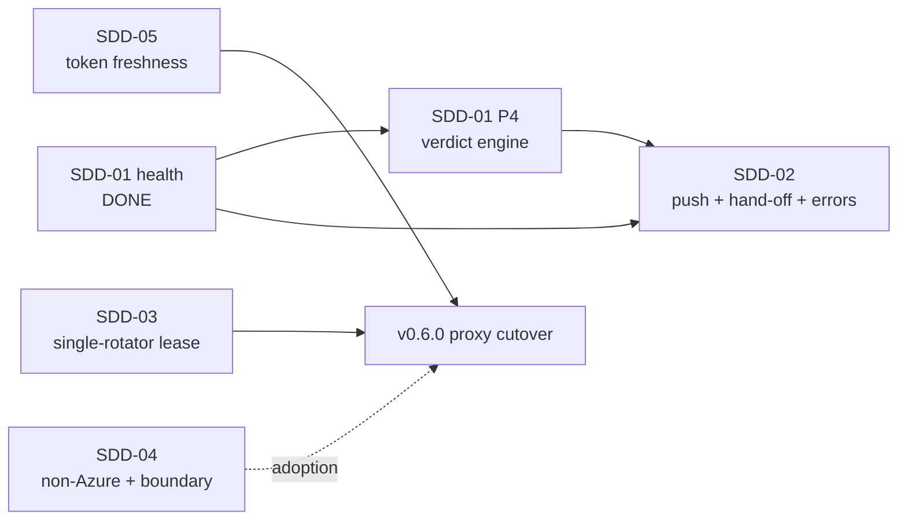

# SDD roadmap — liveness & portability

> Spec-driven delivery index. Each phase is grounded in
> [the liveness/UX/OSS gap analysis](../research/liveness-ux-oss-gap-analysis.md)
> (§V prioritized recommendations) and [ADR 0025](../adr/0025-liveness-first-class-invariant.md)
> (liveness as a first-class invariant). The throughline: *availability is a
> property you design, observe, and recover — not one you assume.*

## How to read this

Each row maps a gap-analysis recommendation to an SDD phase, names the smallest
honest deliverable, and — critically — classifies its **delivery posture**:

| Posture | Meaning |
|---|---|
| **autonomous** | Additive, reversible, well-tested, no live-upstream or infra/identity blast radius. The agent may design → implement → gate → judge → ship. |
| **sign-off** | Touches the live just-recovered RM session, the broker's interaction with real upstreams, or a credential-model cutover. The agent designs + plans + gates; a human approves before any code runs against live sessions. |
| **plan-only** | Infrastructure-as-code or identity/secret topology (KV leases, OpenBao, Authentik/Dex, SP/Entra). Per the Architrave charter the agent proposes the diff + plan/what-if/policy; a human applies. |

This classification is not bureaucracy — it is the operational-safety boundary.
The homelab proved twice that liveness changes against a live broker are
high-consequence; the gates exist so the next change is observably safe.

## Phases

| Phase | Rec | Deliverable | Posture | Status |
|---|---|---|---|---|
| [SDD-01](01-truthful-connection-health/) | #1 | Truthful, use-based per-connection health — presence never earns green; `unverified`/`live`/`dead` with provenance; fail-closed unknown. | autonomous | **Done — judge PASS.** Code on `main`; CI `test`+`hygiene` green. **Image publish blocked** (see *Deploy blocker*). |
| SDD-01 **P4** | #1 | The real verdict engine: a periodic, rate-limited use-based liveness probe promoting `unverified → live/dead`, plus a **freshness bound** so a stale `lastVerifiedAt` decays off green. | **sign-off** | **Done — judge PASS.** Passive-first (rides real data-plane calls + the keep-warm rotation pass), separate non-secret store, fail-closed, one freshness clock. Active probe + breaker + soft-200 assertion carried to SDD-05. See [cross-phase analysis](cross-phase-adversarial-analysis.md). |
| SDD-02 | #2 | **Proactive degradation push** + **family-grade re-login hand-off** + **actionable chat errors** for failed brokered calls. | split | **Backend done — gate PASS.** Verdict-transition degradation log (transition-into-`dead`, bounded, secret-free, with actionable remediation) + `/portal/degradations` self-scoped endpoint + `PortalService.RecentDegradations()` (A6). *Remaining (own cycles):* the portal degradation **feed UI** (Storybook sign-off), the actual **push transport** (webhook/email), and the **family-grade noVNC hand-off** (ADR 0016 — sign-off, touches live recovery). |
| SDD-03 | #3, #6 | Resolve worker **dispatch-vs-sidecar**; add a **KV lease/CAS** that *enforces* single-rotator (A4 by construction → by runtime). | **plan-only** | **Seam + gate done — gate PASS.** [ADR 0026](../adr/0026-single-writer-rotation-lease-and-fencing.md): `ISingleWriterLease` + fencing token; the rotator runs only while it holds the lease (`ProcessSingleWriterLease` default = single-replica-safe). *Plan-only (human applies):* the Kubernetes `Lease` RBAC ([deploy/k8s/plan-only-rotation-lease-rbac.yaml](../../deploy/k8s/plan-only-rotation-lease-rbac.yaml)) + the `KubernetesSingleWriterLease` adapter + store-side fencing enforcement (with SDD-05). |
| SDD-04 | #4 | **Non-Azure golden path** (compose + OpenBao + Authentik/Dex); clarify the **Tessera↔sessionkeeper boundary**; one reusable **reference MCP**; a **recipe-contribution path**; explicit **adopt-vs-build + ToS posture**. | split | **Docs done.** [adoption-and-portability.md](../adoption-and-portability.md) states the niche/adopt-vs-build loudly, draws the sessionkeeper boundary, documents the non-Azure path, the recipe-contribution path + reference MCP, and the libgsa/ToS fencing. *Plan-only:* the OpenBao `ICredentialStore` adapter + a packaged compose stack (new infra). |
| SDD-05 | #5 | **Token freshness** — read-through-on-401 / short-lease — the prerequisite that makes the reverted v0.6.0 proxy cutover safe to re-attempt. | **sign-off** | **Done (default-off) — gate PASS.** *Read side* (401⇒`dead`+remediation) shipped in P4/SDD-02. *Write side:* read-through-on-401 refreshes once under the SDD-03 lease + retries (`egress.readThroughOn401`, OFF by default — acts on the live call path; turning it on is part of the v0.6.0 cutover). Store-side fencing enforcement (KV ETag/CAS) is the plan-only follow-on. |
| [SDD-06](06-mode-u-rm-broker/) | — | **Mode U** — one Tessera RM broker for every consumer (read + booking); the re-attempt of the reverted v0.6.0 cutover, made safe by SDD-01..05. A new consumer app is incoming. | **sign-off** | **Proposed.** Design complete; booking is **config-only** (egress already forwards POST bodies). Awaiting operator sign-off on the booking-confirmation model (SDD-06 §4) before any live apply. reginamaria-mcp stays the **sole rotator** (no stale regression). |

## Sequencing

- **SDD-01 → P4** is the truth-then-verdict pair: SDD-01 stopped the lie (presence
  never green); P4 supplies the *earned* green. P4 is gated because the probe runs
  against live sessions.
- **SDD-05 + SDD-03 gate the cutover.** ADR 0024 closed the liveness loop; SDD-05
  (freshness) + SDD-03 (single-rotator enforcement) are the remaining two locks on
  the v0.6.0 proxy cutover that was reverted when "RM went stale" (ca148ee).
- **SDD-02** is the operator/family-facing payoff of SDD-01 and is mostly additive.
- **SDD-04** is independent (adoption/portability) and unblocks contributors.

## Deploy blocker (SDD-01 — needs a human action)

SDD-01 is merged and CI-green for `test` + `hygiene`, but the **container image
cannot publish**. Root cause (verified via `gh api`):

- The GHCR package `ghcr.io/dragoshont/tessera` is **`visibility: private`** and
  **not linked to a repository** (`repository: None`). The package has 55 versions
  and last updated 2026-06-22 — publishing worked, then the repo link was lost.
- With no repo link, the workflow's `GITHUB_TOKEN` lacks package-write, so every
  push to `main` fails the `image` job with
  `403 Forbidden` on `HEAD .../blobs/...` while pushing `tessera:latest`.
- This affects **all recent pushes**, not this change (the prior docs-only commit
  failed identically).

**Fix (human, GitHub UI — one time):** Package → **tessera** →
*Package settings* → **Manage Actions access** → add repository `dragoshont/tessera`
with the **Write** role (and enable *Inherit access from repository*). Re-run the
failed CI run; the `image` job will publish `ghcr.io/dragoshont/tessera:latest` +
`:sha-<7>`. Then bump
[`apps/platform/tessera/deployment.yaml`](../../../homelab/apps/platform/tessera/deployment.yaml)
from `sha-3acf8ad` to the new sha (2 occurrences) and Flux applies.

> Note: the homelab still pins Tessera by **sha** (`sha-3acf8ad`). The standing
> preference is **semantic version tags**. Establishing a `vX.Y.Z` tag scheme for
> Tessera (the CI already builds multi-arch on `v*` tags) is a small, separate
> follow-up worth doing when the package link is restored.
