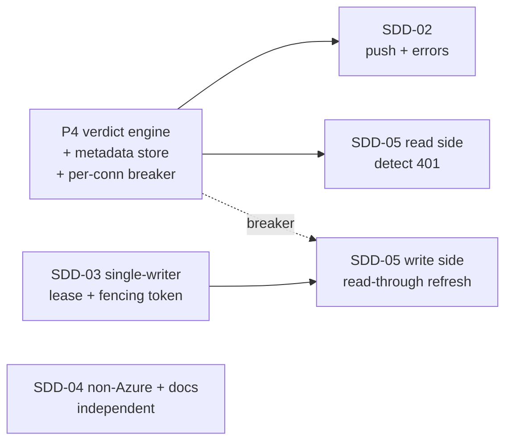

# Cross-phase adversarial analysis — liveness & portability roadmap

> Status: analysis (pre-implementation). Read with [the roadmap](README.md),
> [ADR 0025](../adr/0025-liveness-first-class-invariant.md), and
> [the gap analysis](../research/liveness-ux-oss-gap-analysis.md).
> Method: attack the *seams between phases*, not each phase alone — the failures
> that only appear when two phases meet. Grounded in three external sources and a
> read of the live broker seams.

## Grounding (the three sources that decide the architecture)

1. **Fencing tokens — Kleppmann, *How to do distributed locking* (2016).** A lease
   alone is *unsafe* for correctness: a GC pause, clock jump, or delayed packet can
   let a client act *after* its lease expired while a second client also holds it.
   The only safe fix is a **monotonically increasing fencing token** carried on every
   write, with the **resource rejecting any write whose token went backwards**. For
   correctness (not mere efficiency) use a real consensus store (etcd/ZooKeeper) —
   and the Kubernetes `Lease` API is etcd/Raft-backed.
2. **Circuit Breaker — Azure Architecture Center.** A failing dependency is guarded
   by a `Closed → Open → Half-Open` state machine: fail fast when Open; in Half-Open
   admit only a **limited** number of trial calls so a *recovering* upstream is not
   **flooded**. State changes should raise events for observability.
3. **Health Endpoint Monitoring — Azure Architecture Center.** Compute health
   **periodically and cache it**; never run the check on every dashboard render.
   Secure the endpoint; treat unknown as not-healthy.

The broker recon (read of `~/Repo/tessera`) found the seams these map onto:

- The verdict seam already exists — `MapStatus(CredentialStatus, bool? verifiedAlive)`
  ([PortalService.cs](../../src/Tessera.Core/Portal/PortalService.cs#L513)) — it just
  needs a *populated* verdict.
- There is a **single real-use choke point**:
  [`ProviderEgress.CallAsync`](../../src/Tessera.Providers/ProviderEgress.cs#L106)
  captures the upstream HTTP status, and
  [`SessionRefresher`](../../src/Tessera.Providers/SessionRefresher.cs#L103) already
  maps `401/403 → Dead`.
- [`PortalConnection.LastVerifiedAt`](../../src/Tessera.Core/Portal/PortalConnection.cs#L38)
  exists but is **always null** — there is **no per-connection metadata persistence**.
- A periodic loop already exists —
  [`SessionRefreshService`](../../src/Tessera.Broker/SessionRefreshService.cs#L15)
  (a `BackgroundService`) driving
  [`SessionRefreshOrchestrator.RunPassAsync`](../../src/Tessera.Providers/SessionRefreshOrchestrator.cs#L70).
- The refresh path **writes tokens back** to the store
  (`SessionRefresher → ICredentialWriter.PutBundleAsync`).
- Caller errors already have a shape — `{ error, detail }` + status mapping
  ([CallerBrokerEndpoint.cs](../../src/Tessera.Broker/CallerBrokerEndpoint.cs#L61)).

## The cross-phase attacks (and what each forces)

### A1 — Two phases, one write path: SDD-05's refresh *is* a rotator write
SDD-05 (token freshness / read-through-on-401) refreshes a token on demand and
**writes the new token back** — it reuses exactly the `SessionRefresher → PutBundleAsync`
path. SDD-03 exists to guarantee **one writer** (single rotator). Therefore an
on-demand refresh in SDD-05 is *another writer* unless it is funnelled through the
same single-writer discipline. **If SDD-05 ships before SDD-03, it reintroduces the
multi-writer hazard SDD-03 was created to remove** — and worse, a refresh racing the
rotator can write a *stale* token over a fresh one (lost-update), the precise failure
fencing tokens prevent.
**Forces:** SDD-05's write must carry the **fencing token** and respect the
single-writer lease. **Ordering constraint: SDD-03's fencing discipline lands before,
or together with, SDD-05's write path.** SDD-05's *read* side (detect 401, surface it)
is safe earlier; the *write* side is gated on SDD-03.

### A2 — One upstream, two probes: the half-open flood
P4's active liveness probe and SDD-05's read-through refresh **both call the live
upstream**. The just-recovered RM session is exactly a *recovering dependency*. If the
verdict engine probes a connection at the same moment the freshness path refreshes it,
the upstream sees **double** the load — the Half-Open flood the Circuit Breaker pattern
explicitly warns against, and a plausible trigger for rate-limiting or a re-auth
challenge on a fragile session.
**Forces:** a **single circuit breaker per connection** must gate *both* the verdict
probe and the freshness refresh — one Half-Open budget shared, not two breakers
fighting. The breaker state (`consecutiveFailures`, `openedAt`) is per-connection
metadata, owned by P4 and **read** by SDD-05.

### A3 — Passive-first removes most of the risk
A2 only bites if P4 *synthetically* probes. The honest, lower-risk design (ADR 0025's
"use-based truth") makes the verdict a by-product of **real brokered calls** already
happening at the `CallAsync` choke point: a 2xx ⇒ `live` + `LastVerifiedAt = now`; a
`401/403` ⇒ `dead`. **Zero added upstream load.** A synthetic probe is only needed to
distinguish `unverified` from `dead` for a connection with **no recent use**, and even
then only when explicitly enabled per recipe and admitted by the A2 breaker.
**Forces:** P4 is **passive-first**; the active probe is an opt-in, breaker-gated
secondary. This is what makes P4 autonomous-safe despite touching liveness.

### A4 — Where the verdict lives decides whether SDD-04 is cheap or expensive
The verdict/freshness metadata (`lastVerifiedAt`, `verdict`, `consecutiveFailures`,
fencing token) needs a home. The tempting move — extend `CredentialBundle` — means the
**Azure Key Vault secret schema changes**, and then SDD-04's non-Azure store (OpenBao)
must re-implement the same schema, and every store migrates. It also mixes **non-secret
operational metadata into the secret store**, widening the secret blast radius for no
reason.
**Forces:** verdict/freshness/breaker metadata lives in a **separate, non-secret
metadata store** keyed by `(target, principal)`, *beside* the credential store, never
inside the bundle. This keeps `ICredentialStore` pluggable (SDD-04 adds a backend
without touching verdict logic) and keeps secrets out of the metadata path.

### A5 — Fail-closed must survive the new dependency
P4 adds a metadata store read on the projection path. If that store is **unavailable**,
the naive code path yields "no verdict ⇒ … green?" — re-opening the SDD-01 lie through
the back door.
**Forces:** carry SDD-01's invariant forward: **metadata unknown/unavailable ⇒
`unverified` (never green)**. The freshness decay (`now − lastVerifiedAt > maxAge ⇒
unverified`) is computed at projection time and is itself fail-closed (a missing
timestamp is "never confirmed", i.e. `unverified`).

### A6 — SDD-02 needs an event, not a poll
SDD-02 *pushes* on degradation. The degradation signal **is** a P4 verdict transition
(`live → dead`, or `live → unverified` on decay). If P4 only stores a field, SDD-02 must
poll for changes — laggy and duplicative.
**Forces:** P4 emits the verdict as an **observable transition** (a domain event raised
where the verdict is recorded), so SDD-02 subscribes instead of polling. Cheap to add
in P4, expensive to retrofit.

### A7 — SDD-02 must extend the existing error shape, not fork it
The caller error shape (`{ error, detail }` + status map) already exists. SDD-02's
"actionable chat errors" should **add** a structured `reason` + `remediation` (+ the
current verdict) to that shape, not introduce a parallel error model the MCP and the
API would then both have to learn.
**Forces:** SDD-02 extends `ProviderCallResult` / the endpoint projection; no new error
taxonomy.

### A8 — The freshness clock is one clock
P4's "freshness bound on `live`" and SDD-05's "short lease" are the **same max-age**.
Two configs would drift and contradict (UI says fresh, broker refreshes, or vice versa).
**Forces:** a single `freshness.maxAge` (one config knob) read by both the projection
(decay) and the refresh trigger.

## What the analysis changes about the plan

| Decision | Before | After (forced by the attack above) |
|---|---|---|
| Verdict persistence | implied bundle field | **separate non-secret metadata store**, keyed `(target,principal)` (A4) |
| Probe model | "real periodic probe" | **passive-first** from real calls; active probe opt-in + breaker-gated (A3) |
| Breaker scope | per-phase | **one breaker per connection**, shared by verdict + freshness (A2) |
| SDD-05 write | independent | **funnelled through SDD-03's single-writer + fencing** (A1) |
| Phase order | P4 → 02 → 03 → 04 → 05 | **P4 → 02 → 03 → 05 → 04**; SDD-05's *write* gated on SDD-03 (A1) |
| Verdict surfacing | stored field | **stored field + transition event** for SDD-02 (A6) |
| Fail-closed | SDD-01 only | **carried into P4's new store dependency** (A5) |
| Error model | new | **extend the existing `{error,detail}` shape** (A7) |
| Freshness clock | two knobs | **one `freshness.maxAge`** (A8) |

## Re-sequenced phases

- **P4 is the keystone** — it builds the metadata store, the per-connection breaker, and
  the verdict transition event that SDD-02 and SDD-05 both consume. Build it once, well.
- **SDD-05 splits**: the *read* side (detect `401`, surface it via SDD-02's error shape)
  is safe after P4; the *write* side (refresh-and-store) waits for SDD-03's fencing.
- **SDD-03 is the correctness gate** for any second writer; it is also `plan-only` infra
  (Kubernetes `Lease`), so it carries a human apply step regardless of code-readiness.
- **SDD-04 is independent** and is made *cheaper* by A4 (pluggable store, verdict metadata
  not in the bundle).

## Residual risks carried into implementation

- **R-CB:** the per-connection breaker is itself state that can be wrong under clock skew;
  it is an *efficiency* guard (don't flood), **not** a correctness lock — so it needs no
  fencing, but it must never be the thing that decides a write is safe (that is A1's job).
- **R-META:** the metadata store is new surface; it must be fail-closed (A5), non-secret
  (A4), and cheap to read on the hot projection path (cache like Health Endpoint Monitoring).
- **R-RM:** every active touch of the live RM session (A2/A3 probe, SDD-05 write) is staged
  behind opt-in config + the breaker + (for writes) the lease; the default-off posture from
  `refresh.enabled`/`egress.enabled` is preserved.

## Post-implementation adversarial review (P4 → SDD-02 → SDD-03 → SDD-05 shipped)

Re-attacking the *built* code (the semantic judge sub-agent was unavailable; this is the
self-review that replaced it, plus the deterministic gate = PASS). Findings:

- **A1 (single-writer integrity) — BUG FOUND & FIXED.** `ProcessSingleWriterLease` first
  shipped as *always-grant*. With both the rotation pass and SDD-05 read-through enabled, two
  **in-process** writers could each "hold" the lease and refresh the same session
  concurrently — the precise double-write the lease exists to prevent. Fixed: the in-process
  lease is now a real **non-blocking mutex** (one hold at a time; a concurrent acquire returns
  `null`, so the second writer stays inert / surfaces the original 401). Single-process
  exclusion is now genuine; cross-replica still needs the K8s `Lease` (plan-only). Tested
  (`denies_a_second_concurrent_holder`).
- **A1 fencing honesty — OK.** The token is monotonic and threaded; store-side rejection
  (CAS) is **disclosed** as the plan-only follow-on in ADR 0026, not hidden.
- **Default-safety — OK.** Shipped defaults (`egress.enabled` off, `readThroughOn401` off,
  `refresh.enabled` off) leave behavior unchanged and green-free. Read-through cannot activate
  without the opt-in **and** a writable store **and** a lease (guarded in `Build` + the ctor).
- **No false-green — OK.** Read-through records `alive` only from the **final** response (a
  genuine 2xx retry); a successful self-heal logs *no* degradation (the initial 401 is replaced
  before the verdict is recorded). A degradation fires only on a transition **into** `dead`.
- **Endpoint authz — OK.** `/portal/degradations` is server-scoped: a member is forced to
  self (403 on asking for another), an operator sees all or `?principal=`. The payload is
  identity metadata + remediation text — no secret.
- **Concurrency — OK.** The read-through holds the (now real) lease across refresh+retry via
  `await using`; non-blocking acquire ⇒ no deadlock; the rotator simply skips a pass if the
  lease is held. The degradation ring is lock-guarded and bounded.
- **YAGNI — OK.** The K8s `Lease` adapter, store-side fencing CAS, and the OpenBao adapter are
  documented plan-only deferrals, not half-built; nothing load-bearing is missing for the
  (all-off) shipped defaults.
