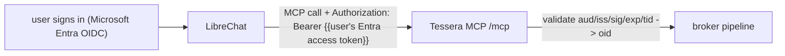

# Spec — LibreChat ↔ Tessera integration

> How the chat ([ADR 0010](../adr/0010-chat-client.md)) forwards each user's signed
> identity to the Tessera MCP server so the broker can act *as that person*
> ([ADR 0009](../adr/0009-end-user-identity-propagation.md)). This is the
> chat-facing path the broker exposes (review C1) — the chat speaks **MCP**, not
> `/v1/broker`.

## The one hard rule (review M3)

**Tessera must be a *YAML-defined* MCP server**, never added through the chat's
admin UI / database. LibreChat only resolves the OIDC-token placeholders
(`{{LIBRECHAT_OPENID_*}}`) for **YAML-defined** servers; DB/UI-created servers are
restricted to `customUserVars` and **cannot** forward the user's token. If Tessera
is added via the UI, delegation silently can't work. Keep it in `librechat.yaml`.

## What carries the identity



- **WHO (the workload):** the chat itself. It presents no SVID, so the
  *who* is enforced by **NetworkPolicy** (only LibreChat can reach the broker —
  review C2), not a client certificate.
- **FOR WHOM (the person):** the user's **Entra access token**, forwarded per call
  and **independently validated** by Tessera (signature via JWKS, `aud`, `iss`,
  `exp`, `tid`; user from `oid`/`preferred_username`).

## 1. Identity provider: Microsoft Entra (OIDC), not Google

Per [ADR 0011](../adr/0011-identity-provider-sso.md), the provider must be **OIDC**
so the forwarded token is verifiable. Configure LibreChat for Entra and enable
token reuse (env, from the [Entra setup](identity-azure-setup.md) outputs):

```bash
OPENID_REUSE_TOKENS=true
OPENID_ISSUER=https://login.microsoftonline.com/<tenant-id>/v2.0
OPENID_CLIENT_ID=<chatAppId>
OPENID_CLIENT_SECRET=<from a secret store; never commit>
# Flow B (shared audience): the scope targets the chat/system app, so the access
# token's `aud` is what Tessera validates.
OPENID_SCOPE="api://<chatAppId>/.default openid profile email offline_access"
```

## 2. Tessera as a YAML-defined MCP server

Add to `librechat.yaml` (alongside any existing MCP servers):

```yaml
mcpServers:
  tessera:
    type: streamable-http
    url: "http://tessera.default.svc.cluster.local:8080/mcp"
    timeout: 30000
    headers:
      # Forward the signed-in user's Entra access token as the subject_token.
      # The exact placeholder name varies by LibreChat version — verify against
      # your build (the OIDC token-reuse placeholders are {{LIBRECHAT_OPENID_*}}).
      Authorization: "Bearer {{LIBRECHAT_OPENID_ACCESS_TOKEN}}"
```

Tessera then exposes the read-only tools `tessera_whoami`, `tessera_list_targets`,
and `tessera_check_access`. They prove per-user delegation and report credential
**status** — they make no upstream call (the injection egress is gated in the
broker).

> **Schema caution.** Some LibreChat versions have a strict config schema that
> rejects the whole file on an unknown key. Add only keys your version supports and
> validate in a staging instance before rolling to users.

## 3. Lock cross-user sharing (review M1)

"Completely isolated users" means one user's context can never reach another's:

- **Memory** is per-user in LibreChat already — keep it private (no global memory).
- **Disable cross-user sharing/public** of agents, prompts, and MCP servers via the
  role/permission settings your version exposes, so a shared agent can't carry one
  user's delegated access to another. Audit that no path lets a non-owner invoke an
  owner-scoped MCP server.

## 4. Voice is the same consumer

The realtime (WebRTC) voice turn carries the **same** per-user identity to the
Tessera MCP server as a text turn — it is not a separate trust path. No extra
wiring beyond the above; the user is the same signed-in person either way.

## 5. Order of operations (the human gates)

1. **G1 — create the Entra app** ([identity-azure-setup.md](identity-azure-setup.md));
   set the `OPENID_*` env above; switch the chat from Google to Microsoft.
2. **G2 — verify a real token.** After one human sign-in, capture the forwarded
   access token, confirm its `aud`/`iss`/`exp`, then set the broker's
   `TESSERA_OIDC_AUDIENCE` to that `aud`. Until then Tessera **fails closed**.
3. Only then do the Tessera tools authorize delegated calls.
