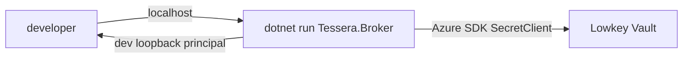
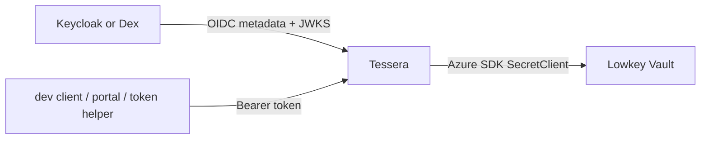

# Spec - Local Azure dev loop

> Status: **Slice 1 + 2 implemented** (Lowkey-backed Key Vault store + a one-command
> quickstart). Slice 3 (full local OIDC) remains draft. Azure stays the first-class
> production path; this is a no-Azure inner dev loop that preserves the shape of the
> production contracts closely enough to catch integration bugs early.
>
> **Run it:** `./scripts/devloop/up` → http://localhost:8080 (sign in as
> `alice@example.com` on the dev card). Stop Lowkey with `./scripts/devloop/kv-down`.
> Implemented pieces: the `TESSERA_KEYVAULT_EMULATOR=lowkey` store mode
> ([AzureKeyVaultCredentialStore](../../src/Tessera.Stores.AzureKeyVault/AzureKeyVaultCredentialStore.cs)),
> the [`scripts/devloop/`](../../scripts/devloop/) scripts, the `.dev/*.example`
> templates, [docs/examples/dev-bundles.json](../examples/dev-bundles.json), and
> [compose.dev.yaml](../../compose.dev.yaml).

## Purpose

Tessera's production story deliberately uses Microsoft Entra and Azure Key Vault:

- Entra signs the user or automation token Tessera validates.
- Azure Key Vault stores credential bundles, reached by the Azure SDK.
- Graph/Bicep provisions the production app registrations and federation.

Local development should not require an Azure subscription, live app registration,
or real vault. It should still exercise the same boundaries:

- A store call should look like a Key Vault `SecretClient` call.
- A credential bundle should be a Key Vault secret value containing Tessera's JSON
  bundle shape.
- Token validation should be able to run against a real local OIDC issuer when the
  test needs identity realism.
- A faster loop should exist for store/UI work where identity is not the subject.

Non-goals:

- Do not demote Azure Key Vault or Entra in production docs.
- Do not present local emulators as safe stores for real secrets.
- Do not require the full chat stack for broker/store development.
- Do not make production accept insecure OIDC metadata or self-signed vault TLS by
  default.

## Current Azure dependency inventory

| Area | Production dependency | Current Tessera touchpoint | Local substitute | Decision |
|---|---|---|---|---|
| Credential store data plane | Azure Key Vault Secrets | `Tessera.Stores.AzureKeyVault` uses `Azure.Security.KeyVault.Secrets.SecretClient` for `GetSecretAsync` and `SetSecretAsync` | Lowkey Vault | Use Lowkey for local KV parity because it speaks the Azure Key Vault REST API and works with Azure SDK clients. |
| Credential store auth plane | Managed Identity / Workload Identity Federation, or service-principal env through `DefaultAzureCredential` | `AzureKeyVaultCredentialStore.FromEnvironment` builds `DefaultAzureCredential` from `TESSERA_VAULT_URL` and `AZURE_*` env | Lowkey simulated Managed Identity, or a dev-only no-op credential | Prefer Lowkey simulated MI in compose. Allow a no-op credential only behind an explicit emulator flag. |
| End-user identity | Microsoft Entra OIDC access token | `Tessera.Identity.EntraTokenValidator` fetches OIDC metadata/JWKS and validates audience, issuer, lifetime, and tenant | Existing loopback `identity.mode=dev`; Keycloak or Dex for realistic local OIDC | Use `dev` mode for the fast host loop. Add a generic local OIDC profile for compose/full auth tests. |
| App-only automation identity | Entra app registration, app role, and WIF | `TesseraTokenResult` detects app-only tokens by `idtyp=app` or app id claims | Local OIDC client-credentials token, or a dev token mint helper | Add generic app-id claim mapping for local issuers; keep Entra app roles first-class for production. |
| Entra provisioning | Azure CLI + Graph Bicep | `deploy/azure/entra/main.bicep`, `automation-caller.bicep`, and `.github/workflows/deploy-entra.yml` | Static local realm/import files | No emulator needed. Local dev should ship deterministic Keycloak/Dex config that represents the outputs Bicep would provide. |
| Kubernetes secret delivery | External Secrets Operator with Azure Key Vault in homelab overlays | Not part of Tessera core; sample deploy uses direct env/Secret refs | Plain Kubernetes Secret, `.env`, or ESO fake provider | For product dev loop, skip ESO. For local-K8s tests of ESO wiring, use ESO fake provider, not Azure. |
| Voice model endpoint | Azure OpenAI Realtime in the homelab LibreChat overlay | Not part of Tessera core | Disable voice, mock realtime endpoint, or use text-only LiteLLM/local model | Out of scope for Tessera KV dev loop. Mention only for full chat-stack development. |
| Observability / Azure Monitor | Optional homelab resources | Tessera writes stdout/JSONL; no Azure SDK dependency | stdout, local files, OpenTelemetry collector later | No Azure local substitute required today. |

## Current implementation facts that shape the dev loop

The store abstraction is intentionally narrow:

- `ICredentialStore.GetBundleAsync(name)` returns a parsed `CredentialBundle`, or
  `CredentialBundle.Empty` when the secret is absent.
- `ICredentialWriter.PutBundleAsync(name, bundle)` is optional write-back for
  rotation ownership.
- The Azure implementation only needs Key Vault Secrets `get` and `set`.

Relevant files:

- [`src/Tessera.Core/Stores/ICredentialStore.cs`](../../src/Tessera.Core/Stores/ICredentialStore.cs)
- [`src/Tessera.Stores.AzureKeyVault/AzureKeyVaultCredentialStore.cs`](../../src/Tessera.Stores.AzureKeyVault/AzureKeyVaultCredentialStore.cs)
- [`src/Tessera.Stores.AzureKeyVault/BundleParser.cs`](../../src/Tessera.Stores.AzureKeyVault/BundleParser.cs)
- [`src/Tessera.Core/Resolution/CredentialResolver.cs`](../../src/Tessera.Core/Resolution/CredentialResolver.cs)

The identity abstraction is broader but already testable offline:

- Unit tests mint JWTs with a local RSA key and an in-memory OIDC configuration.
- Runtime OIDC fetch currently uses HTTPS-only metadata retrieval.
- The existing validator has Entra-specific multi-tenant `/common` issuer logic.
- Exact-issuer OIDC already behaves mostly like generic OIDC, but names and config
  are Entra-shaped.

Relevant files:

- [`src/Tessera.Identity/EntraTokenValidator.cs`](../../src/Tessera.Identity/EntraTokenValidator.cs)
- [`src/Tessera.Identity/OidcValidationOptions.cs`](../../src/Tessera.Identity/OidcValidationOptions.cs)
- [`tests/Tessera.Identity.Tests/TokenFactory.cs`](../../tests/Tessera.Identity.Tests/TokenFactory.cs)

## Local dev modes

### Mode 0 - Unit tests, no services

Use this for core policy, parser, resolver, and identity tests.

- Store: `InMemoryCredentialStore` or mocked `SecretClient`/bundle parser tests.
- Identity: local `TokenFactory` and static OIDC configuration.
- Azure: none.
- Network: none.

This mode already exists and should stay the default for most tests.

Acceptance:

- `dotnet test Tessera.slnx` runs without Azure credentials.
- No test requires `TESSERA_VAULT_URL`, `AZURE_*`, or a live OIDC discovery URL.

### Mode 1 - KV quickstart, host broker, no OIDC

This is the primary quick-start loop for store and portal health work.

Topology:



- Broker runs on the host with `dotnet run`.
- `server.host = 127.0.0.1`.
- `identity.mode = dev` so the portal/API can use the loopback dev principal.
- Lowkey Vault runs in Docker with the Key Vault API on
  `https://localhost:8443` and its metadata/MI stub mapped to
  `http://localhost:8081`.
- No Entra, no real token, no Azure credential.

Suggested Lowkey start shape:

```bash
docker run --rm --name tessera-lowkey \
  -p 8443:8443 \
  -p 8081:8080 \
  nagyesta/lowkey-vault:<version>
```

Why host broker instead of container for this mode:

- Tessera intentionally refuses `identity.mode=dev` on non-loopback binds.
- A container normally binds `0.0.0.0` so host port mapping works.
- Keeping the broker on the host preserves that safety invariant.

Required implementation:

1. Add an explicit Azure Key Vault emulator profile to `Tessera.Stores.AzureKeyVault`.
   Suggested env:

   ```bash
   TESSERA_VAULT_URL=https://localhost:8443
   TESSERA_KEYVAULT_EMULATOR=lowkey
   TESSERA_KEYVAULT_SERVICE_VERSION=7.4
   ```

2. When `TESSERA_KEYVAULT_EMULATOR=lowkey`:

   - Use `SecretClientOptions.DisableChallengeResourceVerification = true`.
   - Pin `SecretClientOptions.ServiceVersion` to `V7_4` unless overridden.
   - Allow the Lowkey self-signed certificate only in a dev-only path. Preferred:
     import/trust Lowkey's generated cert. Acceptable quickstart fallback: a
     transport with certificate validation disabled, gated by the emulator flag
     and `DOTNET_ENVIRONMENT=Development`.
   - Keep production behavior unchanged when the flag is absent.

3. Auth options for Lowkey:

   Preferred compose/host env:

   ```bash
  IDENTITY_ENDPOINT=http://localhost:8081/metadata/identity/oauth2/token
   IDENTITY_HEADER=dev
   ```

   This lets `DefaultAzureCredential` use Lowkey's simulated Managed Identity.
   If this proves brittle on developer machines, add a dev-only no-op
   `TokenCredential`, gated by the same emulator flag.

4. Add a seed command or script that writes fake bundles to Lowkey using the same
   Azure SDK path.

   Suggested fixture format:

   ```json
   {
     "health-portal-alice-session": {
       "access_token": "dev-access-token",
       "refresh_token": "dev-refresh-token",
       "cookies": { "session": "dev-cookie" },
       "extra": { "subscription_key": "dev-subscription-key" }
     }
   }
   ```

   The seeder should serialize each object as the Key Vault secret `value`, not as
   multiple Key Vault secrets.

Acceptance:

- Starting Lowkey and running the seeder creates at least one fake bundle.
- Running the broker with `identity.mode=dev` reports `storeKind=azure-key-vault`
  or a clearer `azure-key-vault(lowkey)` kind.
- `/status` self-test can resolve the fake bundle to `present` without Azure.
- A missing secret still maps to `absent`, preserving the Azure 404 behavior.
- `PutBundleAsync` writes a merged bundle and can be read back through the same
  `SecretClient`.
- The emulator flag is required for challenge-resource bypass and TLS relaxation.

### Mode 2 - Full local identity + KV compose

Use this when testing the MCP/portal auth path, not just the store.

Topology:



Recommended default: Keycloak.

Why Keycloak:

- It has a first-party container image.
- It supports realm import on startup.
- It exposes standard OIDC discovery and JWKS endpoints.
- It supports browser authorization-code flows and client-credentials flows.

Dex is lighter and useful for static users, but Keycloak is closer to a product
quickstart because it can model browser sign-in, clients, scopes, and app-only
callers in one place.

Required implementation:

1. Add generic OIDC provider handling.

   Suggested config:

   ```jsonc
   "identity": {
     "mode": "oidc",
     "oidc": {
       "provider": "generic",
       "issuer": "http://localhost:18080/realms/tessera-dev",
       "audience": "tessera-dev-api",
       "requireHttpsMetadata": false,
       "principalClaim": "preferred_username",
       "appIdClaims": ["azp", "appid", "client_id"]
     }
   }
   ```

   Production defaults:

   - `provider = "entra"` when unset.
   - `requireHttpsMetadata = true` when unset.
   - Entra `/common` template validation remains exactly as today.

2. Gate insecure local metadata.

   `requireHttpsMetadata=false` must be rejected unless one of these is true:

   - `DOTNET_ENVIRONMENT=Development`, or
   - `ASPNETCORE_ENVIRONMENT=Development`, or
   - an explicit `TESSERA_DEVLOOP_ALLOW_INSECURE_OIDC=true` flag is set.

   It should never be enabled silently by a config file in production.

3. For generic OIDC:

   - Validate exact issuer, audience, signing key, lifetime, and signed tokens.
   - Do not apply Entra `/common` issuer-template validation.
   - Do not require `tid`.
   - Map users from `oid`, `sub`, `preferred_username`, or a configured principal
     claim.
   - Map app-only callers from `azp`, `appid`, `client_id`, or a configured app id
     claim list.

4. Ship a dev realm/client import.

   The import must include:

   - public SPA/client redirect for `http://localhost:8080/auth/callback`;
   - an API audience that appears in access tokens as `aud`;
   - users `alice@example.com` and `bob@example.com` with non-secret dev passwords;
   - one confidential client for app-only/client-credentials tests;
   - token claims that make Tessera's user and app-only paths work.

Acceptance:

- A Keycloak/Dex token for `alice@example.com` can call `tessera_whoami` and returns
  the expected user.
- Wrong audience is rejected.
- Wrong issuer is rejected.
- Expired token is rejected.
- A client-credentials token maps to an automation caller and has no end user.
- The same Lowkey seeded bundle can be resolved through `tessera_check_access`.
- Setting `requireHttpsMetadata=false` without the dev gate fails startup.

### Mode 3 - Local Kubernetes smoke loop

Use this only when validating manifests.

- Use a plain Kubernetes `Secret` for Tessera store auth in local clusters, or use
  Lowkey simulated MI if the broker is also running in-cluster.
- Do not require External Secrets Operator for the main quickstart.
- If ESO behavior itself is under test, use the ESO fake provider with static
  values. Its fake provider returns configured key/value data and is designed for
  testing.
- Avoid testing ESO's Azure Key Vault provider against Lowkey unless there is a
  specific reason. That path adds TLS/auth complexity and is not part of Tessera's
  product contract.

Acceptance:

- `kubectl apply -k deploy/k8s` can be adapted with a local overlay that points at
  Lowkey or in-memory/dev settings.
- No local-Kubernetes smoke test needs Azure credentials.
- Production manifests remain Azure-first and unchanged by default.

## Fork vs build decision

Decision: **do not fork Lowkey, Keycloak, Dex, OpenBao, or ESO for the initial
dev loop, and do not build a private Key Vault clone from scratch.** Use upstream
OSS as pinned dev dependencies. Build only the Tessera-specific adapter code,
fixtures, scripts, and tests in this repository.

Rationale:

- Tessera's product surface is the broker, policy, identity validation, and
  credential-store abstraction. Maintaining a vault or IdP fork would move the
  project into infrastructure-product ownership it does not need.
- Lowkey already covers the important local KV requirement: the Azure Key Vault
  REST shape that the Azure SDK expects. Tessera needs a safe emulator mode around
  it, not ownership of the emulator.
- Keycloak/Dex already cover local OIDC. Tessera needs generic OIDC validation
  knobs, not a private IdP.
- A private from-scratch vault would be slower, less correct, and less secure than
  a known OSS test double for dev or OpenBao for real self-hosted production.

Ownership model:

| Component | Source | Pinning | Tessera owns |
|---|---|---|---|
| Lowkey Vault | upstream Docker image | exact semver tag | emulator client options, cert/auth gating, seed data contract |
| Keycloak or Dex | upstream Docker image | exact semver tag | realm/config fixtures, generic OIDC validation support |
| OpenBao | upstream Docker image, later only | exact semver tag | future `Tessera.Stores.OpenBao` provider, not Azure SDK compatibility |
| ESO fake provider | upstream ESO chart/image, local-K8s only | exact chart/app version | optional local manifests only |
| Seeder / quickstart | Tessera repo | normal repo versioning | all code, tests, fixtures, docs |

Fork criteria, if a dependency blocks the loop:

1. First try a Tessera-side wrapper/config change.
2. If that is not enough, open an upstream issue or PR.
3. Use a private fork only as a short-lived bridge when all are true:
   - the blocker prevents the agreed dev-loop acceptance tests;
   - the patch is small and upstream-shaped;
   - the fork is pinned by digest/tag and documented in this spec;
   - there is an explicit exit condition to return to upstream.

Scratch-build criteria:

- Build from scratch only for **thin Tessera glue**: a seeder, scripts, test
  fixtures, generic OIDC validator support, local config generation, or a future
  store provider.
- Do not scratch-build a Key Vault-compatible service, OIDC provider, or secret
  manager for the dev loop.

This keeps Azure first-class in production while making local development fast:
the local stack emulates contracts, not cloud ownership.

## Local KV dev-loop build contract

The first implementation slice should be KV-only. Do not start with local OIDC;
that makes the loop feel heavier than the problem being solved.

### Slice 1 - Lowkey-backed Azure SDK store

Files likely touched:

- `src/Tessera.Stores.AzureKeyVault/AzureKeyVaultCredentialStore.cs`
- `src/Tessera.Stores.AzureKeyVault/Tessera.Stores.AzureKeyVault.csproj`
- `tests/Tessera.Stores.AzureKeyVault.Tests/*`
- `docs/specs/local-azure-devloop.md`
- optional: `scripts/devloop/*` or `tools/Tessera.DevLoop/*`

Required behavior:

1. `TESSERA_VAULT_URL` remains the switch that enables the Azure Key Vault store.
2. `TESSERA_KEYVAULT_EMULATOR=lowkey` only changes client options and auth/TLS
   handling needed for the emulator.
3. Production path still uses `DefaultAzureCredential` with local interactive/dev
   credentials excluded.
4. Emulator path should prefer Lowkey simulated MI. A no-op credential is allowed
   only if explicitly selected.
5. The store still reports 404 as empty bundle and wraps other request/auth failures
   as `StoreException`.
6. The test suite proves read, missing, malformed payload, set, and merge-write.
7. Do not modify or fork Lowkey for this slice; any required adaptation belongs in
  Tessera's emulator-mode client construction.

### Slice 2 - Seeder and one-command quickstart

Add one developer-facing command. The exact implementation can be a shell wrapper,
.NET dev tool, or documented compose target, but it must produce the same outcome.

Desired command shape:

```bash
./scripts/devloop/kv-up
./scripts/devloop/seed-kv ./docs/examples/dev-bundles.json
TESSERA_KEYVAULT_EMULATOR=lowkey \
TESSERA_VAULT_URL=https://localhost:8443 \
TESSERA_IDENTITY_MODE=dev \
dotnet run --project src/Tessera.Broker -- --config .dev/tessera.json --grants .dev/grants.json
```

Required generated files should live under `.dev/` and be gitignored unless they
are static fake fixtures safe to commit.

Recommended implementation shape:

- `scripts/devloop/kv-up` starts Lowkey using the port map in this spec.
- `scripts/devloop/kv-down` stops the Lowkey container.
- `scripts/devloop/seed-kv` seeds fake bundles through a .NET helper or the Azure
  SDK path, so the wire shape stays close to production.
- `.dev/tessera.json` and `.dev/grants.json` are generated from committed example
  templates and contain only fake `example.com` principals and fake bundle names.
- `docs/examples/dev-bundles.json` may be committed only if every value is fake.

Acceptance:

- A clean clone can run the KV quickstart from documented commands.
- The quickstart does not ask for Azure login.
- The quickstart does not ask for a real Key Vault name.
- The quickstart does not write any secret value into tracked files.
- The quickstart demonstrates read and write-back against Lowkey.

### Slice 3 - Full local OIDC profile

Do this after the KV loop is pleasant.

Files likely touched:

- `src/Tessera.Identity/*`
- `src/Tessera.Core/Configuration/TesseraConfig.cs`
- `src/Tessera.Core/Configuration/ConfigLoader.cs`
- `tests/Tessera.Identity.Tests/*`
- `.dev/keycloak/*` or `deploy/local/*`

Acceptance is listed in Mode 2.

## Safety rules

- Lowkey Vault is for development and CI only. Never store real credentials in it.
- Insecure OIDC metadata and self-signed vault TLS bypasses are development-only.
- The production default must remain `provider=entra`, HTTPS metadata, normal TLS,
  and real Azure Key Vault.
- `identity.mode=dev` remains loopback-only. Do not relax this for Docker compose;
  use local OIDC when the broker must bind `0.0.0.0`.
- Fake fixture identities must use `example.com` addresses and placeholder GUIDs.
- The seeder must write fake tokens/cookies only.

## Recommended local substitutes summary

| Production thing | Local fast path | Local realistic path |
|---|---|---|
| Azure Key Vault | Lowkey Vault + fake bundles | Lowkey Vault + write-back/merge tests |
| Managed Identity / WIF | Lowkey simulated MI or explicit emulator no-op credential | Lowkey simulated MI |
| Entra OIDC user token | `identity.mode=dev` on loopback | Keycloak realm import with users and access-token audience |
| Entra app-only caller | fake token test factory | Keycloak confidential client or dev token mint helper |
| Graph Bicep provisioning | static `.dev` config outputs | Keycloak realm/client import mirrors app registration outputs |
| ESO Azure Key Vault sync | plain `.env` / K8s Secret | ESO fake provider only if testing ESO itself |
| Azure OpenAI Realtime voice | disabled | mock realtime endpoint or separate chat-stack profile |

## Open questions for implementation

1. Should emulator mode expose `Kind` as `azure-key-vault(lowkey)` so `/status`
   makes local-vs-real obvious?
2. Should the Lowkey TLS path import the generated cert into the Tessera container,
   or use a dev-only certificate callback for speed?
3. Should the dev seeder be a small .NET project so it uses the same Azure SDK
   options as the broker, or a simpler HTTP script against the Key Vault REST API?
4. Should generic OIDC be a new `GenericOidcTokenValidator`, or should the current
   `EntraTokenValidator` be renamed and parameterized?
5. Do we want a single `compose.dev.yaml` with profiles (`kv`, `identity`,
   `broker`) or separate scripts for host-first and compose-first workflows?

Resolved: initial dev loop uses pinned upstream containers, not forks. A private
fork is allowed only under the fork criteria above.

## Suggested local port map

| Service | Host port | Container/default port | Why |
|---|---:|---:|---|
| Tessera broker | `8080` | `8080` | Matches the portal callback and existing docs. |
| Lowkey Key Vault API | `8443` | `8443` | Matches Lowkey defaults and Azure SDK examples. |
| Lowkey metadata / simulated MI | `8081` | `8080` | Avoids colliding with Tessera on host `8080`. |
| Keycloak | `18080` | `8080` | Keeps the OIDC issuer stable without occupying app ports. |
