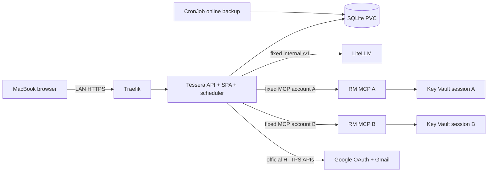

# Deployment Architecture

Tessera remains one replica because SQLite and the scheduler have a single-writer topology. `Recreate` rollout prevents two application versions from opening the RWO database during an upgrade. RM MCPs remain the sole rotating session owners; Tessera stores only fixed connector handles and never receives cookies. The browser/login workers remain internal and outside the API process.

The fixed internal transport router permits only configured RM `/mcp` URLs and configured model `/v1/` prefixes to reach private addresses. All other R2 provider traffic retains the public/loopback address guard.