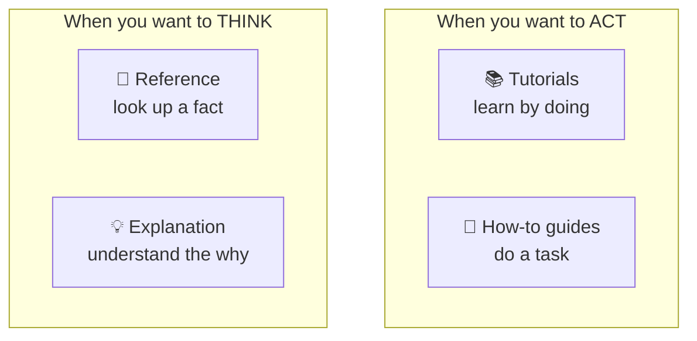
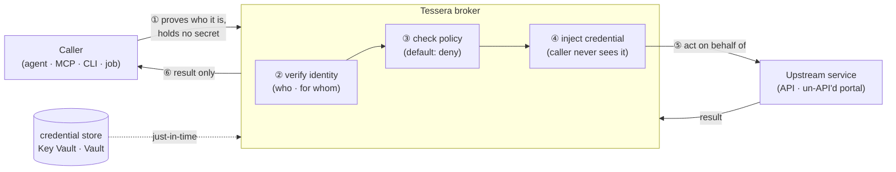

# Tessera Wiki

Welcome. This wiki explains **Tessera**, a secretless credential broker for
non-human callers (AI agents, MCP servers, scripts, jobs).

> **Tessera in one sentence.** A verified caller asks Tessera to act *as a person*
> (or *as itself*); Tessera holds the secret, checks the rules, performs the call,
> and returns only the result — so the caller never holds the password, cookie, or
> token.

If you read only one other page, read **[What Tessera is and why](explanation/what-is-tessera.md)**.

---

## How this wiki is organised

This wiki follows the **[Diátaxis](https://diataxis.fr/) framework**. It sorts
documentation into four kinds, because a reader has four different needs. Pick the
door that matches what you need **right now**:

| Door | Use it when you want to… | It is like… |
|---|---|---|
| 📚 **[Tutorials](tutorials/README.md)** | **Learn** by doing a small, complete example, step by step. | A lesson with a teacher. |
| 🔧 **[How-to guides](how-to/README.md)** | **Do** one specific task you already understand. | A recipe in a cookbook. |
| 📖 **[Reference](reference/README.md)** | **Look up** an exact fact: a config field, an API, a value. | A dictionary. |
| 💡 **[Explanation](explanation/README.md)** | **Understand** how Tessera works and why it is built this way. | A conversation about the design. |

A simple rule:

- **Learning** vs **doing a task** → tutorials / how-to guides (they help you *act*).
- **Looking up a fact** vs **understanding an idea** → reference / explanation (they help you *think*).

---

## Start here, by who you are

| You are… | Start with |
|---|---|
| **New to Tessera** | [What Tessera is and why](explanation/what-is-tessera.md), then the [first brokered call tutorial](tutorials/01-your-first-brokered-call.md). |
| **An operator** (you will run Tessera) | [Run Tessera locally](tutorials/01-your-first-brokered-call.md), then [Configuration reference](reference/configuration.md) and [Enable egress safely](how-to/enable-egress-safely.md). |
| **An integrator** (you connect a caller/MCP) | [Connect a domain MCP](how-to/connect-a-domain-mcp.md) and the [Broker API reference](reference/broker-api.md). |
| **A security reviewer** | [Security model](explanation/security-model.md), [Standards alignment](explanation/standards-alignment.md), and the [decision records](explanation/decisions.md). |
| **An architect** (where does it fit?) | [Positioning](explanation/positioning.md) and [Architecture](explanation/architecture.md). |

New to the words used here? Keep the **[Glossary](reference/glossary.md)** open in
another tab. It defines every term in plain language.

---

## The whole picture, in one diagram

The numbered steps are explained in [How a call works](explanation/how-a-call-works.md).

---

## The four doors in full

### 📚 Tutorials — learn by doing
Start here if Tessera is new to you. Each tutorial is a small, complete, guaranteed
example.
- [Your first brokered call](tutorials/01-your-first-brokered-call.md) — run the
  broker on your machine and make one real brokered read, from zero.

### 🔧 How-to guides — do one task
Short, practical recipes. Each assumes you already know the basics.
- [Connect a domain MCP](how-to/connect-a-domain-mcp.md)
- [Register a non-human caller](how-to/register-a-non-human-caller.md)
- [Add a provider recipe](how-to/add-a-provider-recipe.md)
- [Enable egress safely](how-to/enable-egress-safely.md)
- [Migrate a credential-holding MCP](how-to/migrate-a-credential-holding-mcp.md)
- [Run the admin portal](how-to/run-the-admin-portal.md)

### 📖 Reference — look up a fact
Exact, complete, and dry. Use these to check a detail.
- [Configuration (`tessera.json`)](reference/configuration.md)
- [Policy document (grants · bindings · recipes)](reference/policy-document.md)
- [Broker API (`/v1/broker`)](reference/broker-api.md)
- [MCP tool surface (`tessera_*`)](reference/mcp-tools.md)
- [Vocabulary: planes · injection · result classes · ownership](reference/vocabulary.md)
- [Command-line interface (`tessera`)](reference/cli.md)
- [Glossary](reference/glossary.md)

### 💡 Explanation — understand the why
Background and design. Read these to build a mental model.
- [What Tessera is and why](explanation/what-is-tessera.md)
- [How a call works](explanation/how-a-call-works.md)
- [Architecture](explanation/architecture.md)
- [Positioning: where Tessera fits your stack](explanation/positioning.md)
- [Identity model: who and for whom](explanation/identity-model.md)
- [Security model and threats](explanation/security-model.md)
- [Standards alignment](explanation/standards-alignment.md)
- [Credential ownership](explanation/credential-ownership.md)
- [Architecture decision records](explanation/decisions.md)

---

## A note on language

This wiki is written to be clear for **readers whose first language is not
English**. It uses short sentences, common words, and the **same term for the same
idea every time**. When a word has a precise meaning in Tessera, it is defined in
the [Glossary](reference/glossary.md) and used consistently.

---

*This wiki is part of the [Tessera repository](https://github.com/dragoshont/tessera).
The source of truth for behaviour is always the code and the
[decision records](explanation/decisions.md); where this wiki and the code disagree,
the code is correct — please report the gap.*
