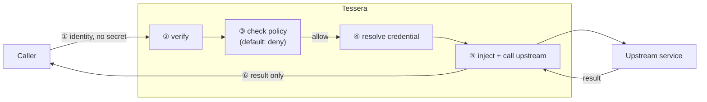

# How a call works

This page walks through one brokered call, step by step, in plain language. It is the
mental model behind everything else.

A single call passes through **six steps**. The first three decide *whether* the call
may happen. The last three *perform* it.

---

## Step ①  The caller arrives — with identity, without a secret

A caller (an agent, an MCP server, a script) sends a request to Tessera. It carries
**its own identity** but **no upstream secret**.

- A non-human caller presents an **app-only token** (or, later, a client certificate).
- When acting for a person, it also forwards that person's **signed login token**.

The request names what it wants: a **target** (which provider) and a **tool** (which
operation), plus any arguments.

## Step ②  Verify — prove, do not trust

Tessera **verifies** the identities. It does not believe a name written in a header.

- The caller's token is checked: signature, audience, expiry, tenant.
- The end-user's token (if present) is checked the same way.

If verification fails, the request is **denied** here, before any policy or secret is
touched. This is *fail-closed*: when in doubt, say no.

## Step ③  Check policy — default is deny

Tessera asks its **Policy Decision Point (PDP)**: may *this caller*, *for this
end-user*, perform *this action* on *this target*?

- The answer is **no** unless a **grant** explicitly allows it.
- A high-impact action (a write, a booking, a payment) returns **step-up**: it needs
  an explicit human confirmation before it may run.
- The **control plane** (`manage:` actions) is denied even when `use:` is granted, and
  defaults to step-up.

Only an authorised request continues. Everything is recorded in a **secret-free
audit** entry: who asked, for whom, what they wanted, and what was decided.

## Step ④  Resolve the credential — touched only when allowed

Now, and only now, Tessera fetches the right **credential** from its store
(Key Vault, Vault, or a dev store). It finds the credential through the **binding**
for the target.

The secret bytes stay **inside** Tessera. They are never logged, never audited, never
returned.

## Step ⑤  Inject and call — the caller never sees the key

Tessera builds the upstream request from the **recipe**:

- It fills the path and any allow-listed query parameters from the arguments.
- It **injects** the credential as the right header (a bearer token, an API-key
  header, or a cookie).
- It checks the destination against the **SSRF allow-list**, pins the resolved IP
  (to block a DNS-rebind to an internal address), and refuses to follow redirects.
- It sends the request and reads the response.

## Step ⑥  Return the result — only the result

Tessera returns the upstream **result** to the caller. The caller receives the answer
and nothing else — no token, no cookie, no key.

For a write, the result is a **receipt** (a summary of what changed), not a fresh copy
of data. For a read of personal data, a search returns **metadata + handles**, and full
content comes only from a later call using a handle — so a search cannot drain a whole
mailbox.

---

## Why the order matters

The order is a security property, not an accident:

1. **Verify before policy** — an unproven identity is rejected before any rule runs.
2. **Policy before the store** — the credential store is touched only for an
   *authorised* request, so a denied request never causes a secret lookup.
3. **Inject, never hand over** — the secret is added at the egress and never travels
   back to the caller.

This is the principle of **complete mediation**: every action is checked, every time,
at the broker — never trusted from the agent.

---

## Two ways a caller can ask

A caller can name the operation in two equivalent ways:

- **By name** (`op: "call"`): it gives the tool name from the recipe, for example
  `sonarr_series`.
- **By HTTP shape** (`op: "invoke"`): it gives the `method` and `path` it already
  knows, for example `GET /series`. Tessera maps that shape to the declared recipe
  tool.

Either way, the recipe is the single source of truth, and an operation that no recipe
declares is refused. See the [Broker API reference](../reference/broker-api.md).

---

## Where to go next

- See the two identities in detail: [Identity model](identity-model.md).
- See the full system: [Architecture](architecture.md).
- See it backed by the standards: [Standards alignment](standards-alignment.md).
