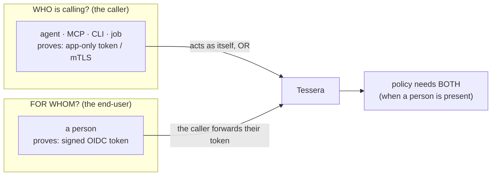

# Identity model: who and for whom

Tessera always keeps **two** identities apart. Understanding this split is the key to
understanding the whole system.

---

## The two identities

| | **Caller** (WHO) | **End-user** (FOR WHOM) |
|---|---|---|
| Who it is | A program — an agent, an MCP server, a script, a job. | A person. |
| How it proves itself | An app-only token, a client certificate (mTLS), or a SPIFFE SVID. | A signed login (OIDC) token. |
| Always present? | **Yes.** Every call has a caller. | **No.** Only present when acting for a person. |
| In Tessera's code | `CallerIdentity` | `EndUserAssertion` |
| The plain question | "Which program is calling?" | "On whose behalf?" |

A useful way to remember it:

- The **caller** is the *robot's* badge: "I am the calendar agent, here is my proof."
- The **end-user** is the *person's* badge: "and I am acting for Alice, here is her
  signed proof."

---

## Why keep them separate?

Because they answer different questions, and mixing them is dangerous.

If Tessera only knew "Alice", it could not tell *which* program is acting as Alice —
so it could not scope a grant to one trusted agent, and the audit could not say who
really performed the action. If Tessera only knew "the calendar agent", it could not
act as a *specific person* — every call would use one shared account.

Keeping both means a grant can be precise:

> *The **media agent**, acting **for Alice**, may **read series** on **Sonarr**.*

Each part of that sentence maps to one part of the model: the caller, the end-user,
the action, the target.

---

## Delegation, not impersonation

When a caller acts for a person, Tessera uses **delegation**, not **impersonation**.

- **Delegation** (what Tessera does): the caller keeps its own identity and acts
  *for* the person. The audit records "caller on behalf of end-user". This is the
  safer choice.
- **Impersonation** (what Tessera avoids): the caller would *become* the person,
  indistinguishable from them. Then the audit could not tell the agent and the person
  apart.

This matches the delegation semantics of
[RFC 8693 (OAuth Token Exchange)](https://datatracker.ietf.org/doc/html/rfc8693): the
actor retains its own identity while acting for the subject.

---

## Two modes of acting

| Mode | End-user present? | Used by | The credential |
|---|---|---|---|
| **Mode P** (per-account) | No | A pure automation acting as itself. | A `service`-owned key shared by the household/team. |
| **Mode U** (multi-user) | Yes | A multi-user assistant acting for a signed-in person. | The person's own `user`-owned login, or a shared `service` key, per the binding. |

In **Mode P**, the grant has no `onBehalfOf`; the caller acts under its own service
grant. In **Mode U**, the grant names the exact person, and the PDP independently
requires that person's token to be verified.

---

## Verification: prove, do not claim

Both identities must be **verified**, never merely **claimed**:

- A caller is verified by a cryptographic proof (a signed app-only token; later, a
  client certificate). An identity written only in a plain header is **never**
  trusted.
- An end-user, when present, is verified by a signed OIDC token (signature, audience,
  expiry, tenant all checked).

If either identity that should be present is not verified, the request is denied —
*fail-closed*. See the [security model](security-model.md).

---

## The "act-as" question (deferred)

Sometimes a service caller wants to act under a *named* person **without** forwarding
that person's token. Tessera defers this. The policy requires a present end-user to be
independently verified, so asserting an unverified person is denied by construction.
Building "act-as" would need a new mechanism where a grant authorises the caller to
act for that principal — the standard `may_act` claim from RFC 8693. Until then, a
caller acts either as itself (Mode P) or for a verified person (Mode U).

---

## Where to go next

- See how these identities flow through a call: [How a call works](how-a-call-works.md).
- See who owns the credential behind the call: [Credential ownership](credential-ownership.md).
- See the formal rules: [Security model](security-model.md).
