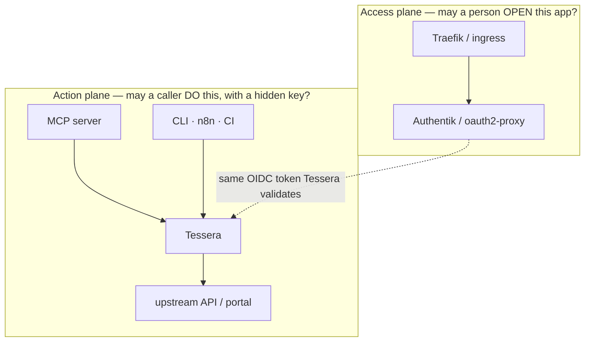

# Positioning: where Tessera fits your stack

Tessera is **one layer of a small stack**, not a replacement for your reverse proxy
or your single sign-on. It owns a narrow job and leans on the tools you already run
for everything around it.

> **Read the full visual guide** (five clean scenario diagrams + a decision guide):
> [docs/positioning.md](../../positioning.md)

---

## The two questions a stack must answer

A homelab or enterprise stack has **two different questions**, and they want
**different tools**. Do not make one tool answer both.

1. **"May this person *open* this web app?"** (browse Sonarr, Grafana, the Tessera
   portal) → an **access gateway**: Traefik + Authentik (or oauth2-proxy / Authelia /
   Pomerium).
2. **"May this caller *perform this action*, with a hidden credential?"** (read a
   mailbox by handle, approve a request, trigger a search) → **Tessera**.

The **same** login identity flows from the edge into the action plane. The person
signs in once; Tessera validates that same token and never invents identity from a
header.

---

## Who owns what

| Layer | Owns | Does **not** own |
|---|---|---|
| **Traefik** | TLS, routing, calling ForwardAuth. | Login state, action policy. |
| **Authentik** (or equivalent) | Human login, MFA, browser session, "may open this app". | Provider keys, action execution. |
| **MCP servers** | Domain tool ergonomics; they forward the person's token and hold **no** provider secret. | The credential, the decision, the audit. |
| **Tessera** | Provider connections, hidden credentials, action-level authorisation, rotation, audit, egress. | First-time SSO, an app catalogue, MFA, proxying every request. |

---

## The five scenarios

The full guide draws each as a clean diagram. In short:

1. **An assistant acts for a person** — an MCP forwards a person's token; Tessera
   injects that person's credential.
2. **An automation acts as itself** — a job uses its own workload identity; no person
   involved.
3. **The custody shift** — before: the agent holds the key; after: Tessera holds it.
   This is the invariant under everything.
4. **Two planes in one stack** — the access gateway and the action broker, side by
   side (the diagram above).
5. **A domain MCP egresses through Tessera** — migrating a key-holding MCP, one
   service at a time, direct-first.

See them all: [docs/positioning.md](../../positioning.md).

---

## Where to go next

- The decision behind this boundary: [ADR 0018](../../adr/0018-access-gateway-and-action-broker.md).
- Connect your first caller: [Connect a domain MCP](../how-to/connect-a-domain-mcp.md).
- Why this shape is correct: [Standards alignment](standards-alignment.md).
