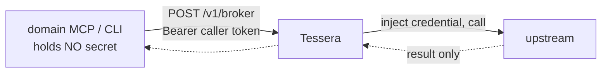

# Connect a domain MCP

This task wires a non-human caller (a domain MCP, a CLI, or a workflow) to Tessera's
caller plane at `/v1/broker`, so it can perform a brokered call while holding **no**
upstream secret.

> The full, detailed runbook — request shapes, recipe/binding/grant authoring, both
> fail-closed gates, copy-ready `curl` examples — is here:
>
> **[docs/connect-a-domain-mcp.md](../../connect-a-domain-mcp.md)**

This page is a short map of that runbook.

---

## The shape

## The steps (summary)

1. **Register the caller identity** — an app-only token whose `aud` is Tessera. See
   [Register a non-human caller](register-a-non-human-caller.md).
2. **Author the policy** — a recipe (the provider + its tools), a binding (the
   credential, `owner: service`), and a **caller-scoped** grant. See the
   [Policy document reference](../reference/policy-document.md).
3. **Enable egress** — flip `egress.enabled`, add the host to the SSRF allow-list. See
   [Enable egress safely](enable-egress-safely.md).
4. **Call `/v1/broker`** — `list-tools` to discover, then `call` (by name) or `invoke`
   (by `method` + `path`). See the [Broker API reference](../reference/broker-api.md).

## What does **not** go through this plane

- **SSH-backed / shell tools** (a private key for arbitrary commands) — a different
  credential class and an explicit non-goal. They keep their own credential.
- **A static, credential-free MCP** (a baked-in read-only corpus, no upstream call) —
  it has nothing to broker.

---

## Where to go next

- The full runbook: [docs/connect-a-domain-mcp.md](../../connect-a-domain-mcp.md).
- The decision behind it: [ADR 0021](../../adr/0021-caller-authentication-plane.md).
- Migrate an MCP that already holds keys: [Migrate a credential-holding MCP](migrate-a-credential-holding-mcp.md).
