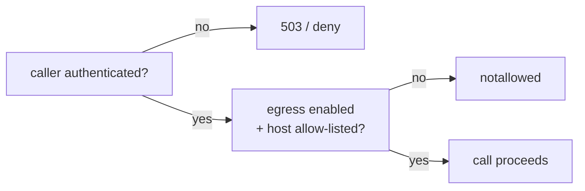

# Enable egress safely

This task turns on Tessera's outbound calls (egress). Egress is **off by default** —
deploying the broker opens no path to any upstream. Turning it on is a deliberate
operator action. Do it carefully.

> Field reference: [Configuration → `egress`](../reference/configuration.md#egress).
> Why it is shaped this way: [Security model](../explanation/security-model.md).

---

## The two gates

A call reaches an upstream only when **both** are true. Keep this in mind — enabling one
without the other is safe by design.

1. **A caller authenticator is configured** (`identity.mode = oidc` with an audience).
   Without it, `/v1/broker` refuses every call.
2. **`egress.enabled = true`** with a non-empty **SSRF allow-list**. Without the
   allow-list, the broker refuses to start.



---

## Step 1 — List exactly the hosts you need

The SSRF allow-list is an *exact host* allow-list. List **only** the upstream hosts the
recipes use — nothing more.

```json
"egress": {
  "enabled": true,
  "allowedHosts": [
    "api.provider-a.example",
    "api.provider-b.example"
  ]
}
```

An empty `allowedHosts` with `enabled: true` is rejected by validation.

## Step 2 — HTTPS by default; opt in to HTTP only for internal hosts

By default only `https://` is allowed. If a recipe points at an internal service that
does not speak TLS (for example a cluster-internal address), opt in **explicitly**:

```json
"egress": {
  "enabled": true,
  "allowPlainHttp": true,
  "allowedHosts": ["media-service.internal"]
}
```

`allowPlainHttp` relaxes only the **scheme**, and only for hosts already on the
allow-list. It never widens *which* hosts may be reached.

## Step 3 — Understand the connect-time guard (it is automatic)

You do not configure this, but you should know it is there. When the broker connects, it:

- resolves the host **once** and **pins** the connection to that IP (so a DNS rebind
  cannot swap in an internal address between the check and the connect);
- **blocks** link-local / cloud-metadata (`169.254.169.254`), loopback, multicast, and
  broadcast addresses;
- **allows** private ranges (`10/8`, `172.16/12`, `192.168/16`, `fc00::/7`) — an
  internal service is legitimate, and the host allow-list still gates *which* host;
- refuses to follow redirects, uses no proxy, and sends no ambient cookies.

## Step 4 — Validate before you deploy

```bash
tessera validate --config tessera.json --grants grants.json
```

Confirm it prints `OK — configuration is valid and fail-closed.` Then deploy.

## Step 5 — Turn it on for one provider first

Do not enable everything at once. Add **one** host, confirm one real call works and
appears in the audit, then widen the allow-list. This keeps the blast radius small while
you verify.

---

## A safe rollback

To close the egress path again, set `egress.enabled = false`. The recipes and grants can
stay; they are inert without egress. The broker then makes no upstream call.

---

## Where to go next

- The fields in detail: [Configuration → `egress`](../reference/configuration.md#egress).
- Why two gates: [Security model](../explanation/security-model.md).
- Migrate a key-holding MCP onto this path: [Migrate a credential-holding MCP](migrate-a-credential-holding-mcp.md).
