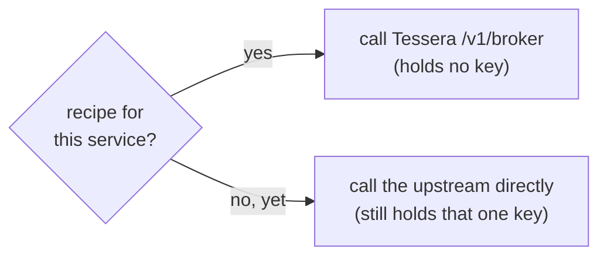

# Migrate a credential-holding MCP

This task moves an MCP server that currently **holds** upstream API keys onto Tessera,
so it holds **no** key and brokers each call instead. You migrate **one service at a
time** — nothing changes until you opt a service in.

> The full design (the impedance, the use-case scoping, what fits and what does not) is
> the cutover specification:
>
> **[docs/specs/caller-plane-and-mcp-cutover.md](../../specs/caller-plane-and-mcp-cutover.md)**

---

## The principle: direct-first, recipe-later

The MCP keeps a per-service switch:

- **No recipe → direct.** The service keeps working exactly as before.
- **Recipe → Tessera.** The MCP holds no key for it; Tessera authorises and injects.

A service Tessera has no recipe for is **never** blindly proxied — it stays direct. This
is the deliberate boundary (no "forward any URL" pipe).

---

## The steps (summary)

1. **Make the MCP able to broker** — add a Tessera egress client that presents the same
   call interface the tool bodies already use, plus a per-service switch (direct vs
   broker). The switch is off by default.
2. **Register the MCP as a caller** — give it its own app-only identity. See
   [Register a non-human caller](register-a-non-human-caller.md).
3. **Author recipes + grants + bindings** for the services you will migrate. Use
   `injection: apikey` for the API-key class. See [Add a provider recipe](add-a-provider-recipe.md).
4. **Move the keys into Tessera's store**, in bundle shape (`{"access_token": "…"}`).
5. **[Enable egress safely](enable-egress-safely.md)** for those hosts.
6. **Migrate one service first** (for example only `service-a`), validate, then widen.

---

## What fits, and what stays direct

| Class | Fits Tessera? | Notes |
|---|---|---|
| API-key / bearer / cookie over HTTP | **Yes** | The main target — the *arr / portal class. |
| Device-paired (HomeKit-style cert) | **No** | Cert pinning breaks the egress model — stays native. |
| SSH-backed / shell tools | **No** | Arbitrary shell is an explicit non-goal — keeps its own credential. |
| A static, credential-free MCP | **No** | Nothing to broker. |

> **Be honest about scope.** Brokering closes a real custody gap for the
> **HTTP-injectable** providers. It is *orthogonal* to ops/log-hunting tools, which are
> SSH-backed and stay direct by design.

---

## A safe rollback

- **One service:** remove it from the MCP's brokered list → it returns to direct (it
  still has its key). No Tessera change needed.
- **All:** turn the MCP's broker switch off → every service direct again. Then
  `egress.enabled = false` on Tessera to re-close the path.

---

## Where to go next

- The full design + scoping: [cutover spec](../../specs/caller-plane-and-mcp-cutover.md).
- Write the recipes: [Add a provider recipe](add-a-provider-recipe.md).
- The decision behind brokered MCP egress: [ADR 0015](../../adr/0015-mcp-egress-through-tessera.md).
