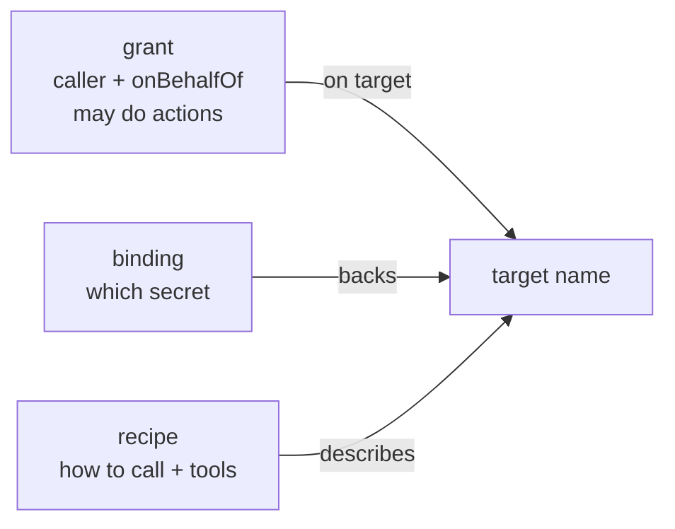

# Policy document reference (grants · bindings · recipes)

The policy document (by default `grants.json`, set by `policy.document`) holds the
authorisation rules. It has three top-level arrays:

```json
{
  "grants":   [ /* who may do what */ ],
  "bindings": [ /* which stored secret backs each target */ ],
  "recipes":  [ /* how to reach each provider + its tools */ ]
}
```

> Source of truth: `src/Tessera.Core/Configuration/LoadedPolicy.cs` plus
> `Grant.cs`, `TargetBinding.cs`, `Recipe.cs`, `RecipeTool.cs`. A missing file yields
> an **empty** policy, so every request is denied (fail-closed).

The three relate by the **target name**: a grant, a binding, and a recipe all refer to
the same `target`.



---

## `grants` — who may do what

One grant is one authorisation rule. With **no** matching grant, a request is denied.

```json
{
  "caller": "media-mcp",
  "onBehalfOf": "alice@example.com",
  "target": "sonarr",
  "actions": ["read:series", "read:calendar", "use:search"],
  "stepUpActions": ["use:search"]
}
```

| Field | Type | Required | Meaning |
|---|---|---|---|
| `caller` | string | yes | The caller id this grant applies to (an app id, a SPIFFE id, a cert subject). |
| `target` | string | yes | The target this grant applies to. |
| `actions` | string[] | yes | The allowed action globs, e.g. `read:*` or `use:search`. |
| `onBehalfOf` | string | no | The exact delegated person (their `oid` or `preferred_username`). **Omit** for pure automation (Mode P). |
| `stepUpActions` | string[] | no | Action globs that require a human step-up before they run. |
| `manageStepUpExempt` | string[] | no | `manage:` action globs this **specific** grant exempts from the default manage-plane step-up — a fine-grained escape hatch for one low-risk control action. |

Rules to know:

- **Delegation must line up.** A grant with `onBehalfOf` matches **only** a request
  carrying that exact verified person. A grant **without** `onBehalfOf` matches **only**
  pure automation (no person). A person is never silently added or dropped.
- **The control plane is default-deny.** A `manage:` action is authorised **only** by a
  grant pattern that is itself manage-scoped. A broad `*` or `use:*` never reaches
  `manage:`.
- **Manage defaults to step-up.** Even when granted, a `manage:` action steps up unless
  `policy.manageRequiresStepUp` is false or the action is in `manageStepUpExempt`.

---

## `bindings` — which secret backs a target

A binding links a target (and optionally a person) to the **stored secret** that holds
its credential bundle.

```json
{ "target": "sonarr", "credential": "tessera-sonarr", "owner": "service" }
```

| Field | Type | Required | Meaning |
|---|---|---|---|
| `target` | string | yes | The target this binding backs. |
| `credential` | string | yes | The **store secret name** holding the bundle (for example a Key Vault secret name). |
| `onBehalfOf` | string | no | The exact person this binding is for. Omit for an automation / shared binding. |
| `owner` | string | no | Whose credential it is: `service` (default), `user`, or `dependent`. See [credential ownership](../explanation/credential-ownership.md). |
| `guardian` | string | no | For `owner: dependent`: the guardian who seeded it. |

The **service fallback**: when a delegated request has no per-person binding, the
resolver falls back to a `service`-owned, person-less binding for the same target. This
is how a shared household key serves any granted member. The fallback never applies to
a personal binding, and never to a request with no person.

---

## `recipes` — how to reach a provider, and its tools

A recipe describes one provider: where it lives, how to inject its credential, and the
operations (tools) it offers.

```json
{
  "target": "sonarr",
  "egress": "http",
  "injection": "apikey",
  "upstreamBaseUrl": "http://sonarr.internal:8989/api/v3",
  "actions": ["read:series", "use:search"],
  "tools": [
    { "name": "sonarr_series", "method": "GET",  "path": "series",  "action": "read:series" },
    { "name": "sonarr_search", "method": "POST", "path": "command", "action": "use:search", "stepUp": true }
  ]
}
```

| Field | Type | Default | Meaning |
|---|---|---|---|
| `target` | string | — | The target name (matches grants + bindings). |
| `driver` | string | `"browser"` | The harvest driver for un-API'd providers. |
| `egress` | string | `"none"` | `http` (the broker injects + forwards) or `none` (status only, no upstream call). |
| `upstreamBaseUrl` | string | `null` | The allow-listed base URL for HTTP egress. The tool's `path` is appended to it. |
| `injection` | string | `null` | How to inject the credential: `bearer`, `apikey`, `cookies`, or omitted (none). See [vocabulary](vocabulary.md#injection-kinds). |
| `injectionHeader` | string | `null` | For `injection: apikey`: the header name (default `X-Api-Key`). |
| `actions` | string[] | `[]` | The action verbs this recipe exposes (drives the tool surface). |
| `tools` | object[] | `[]` | The callable operations (below). |
| `extraHeaders` | object | `null` | Static non-secret headers on every call. Values may use `{extra:key}` (from the bundle's `extra`) or `{env:NAME}` (from the process env). |
| `cookieMap` | object | `null` | For `injection: cookies`: cookie name → bundle source (`access_token` / `refresh_token` / `cookie:<name>`). |
| `description` | string | `null` | A human-readable description. |
| `rotation` | object | `null` | Who keeps this session warm: `{ "owner": "none\|external\|tessera", "detail": "…" }`. |
| `refreshSpec` | object | `null` | How Tessera rotates this session when it owns rotation (Mode U). |

### `recipes[].tools` — one operation each

```json
{ "name": "sonarr_missing", "method": "GET", "path": "wanted/missing",
  "action": "read:missing", "query": ["pageSize", "sortKey"], "resultClass": "metadata" }
```

| Field | Type | Default | Meaning |
|---|---|---|---|
| `name` | string | — | The tool name (provider-prefixed by convention). |
| `method` | string | — | The HTTP method (`GET`, `POST`, …). |
| `path` | string | — | The path appended to the recipe base URL. May contain `{placeholder}` segments filled from the args; a `{handle}` segment is filled from a result handle. |
| `action` | string | — | The policy action verb this tool maps to (its plane is the text before the `:`). |
| `stepUp` | bool | `false` | True for a write/booking tool: the call runs only after an explicit confirmation. |
| `description` | string | `null` | What the tool does (shown to the agent). |
| `resultClass` | string | `null` | The output class: `metadata`, `preview`, `fullBody`, `attachment`, or `receipt`. A `fullBody`/`attachment` tool **must** be called by a handle. See [result classes](vocabulary.md#result-classes). |
| `query` | string[] | `null` | The **allow-list** of query-parameter names this tool may forward from the args. Only listed names are sent (URL-encoded); an agent cannot smuggle an arbitrary parameter. |

---

## A complete small example

```json
{
  "grants": [
    { "caller": "media-mcp", "target": "sonarr", "actions": ["read:*", "use:search"], "stepUpActions": ["use:search"] }
  ],
  "bindings": [
    { "target": "sonarr", "credential": "tessera-sonarr", "owner": "service" }
  ],
  "recipes": [
    {
      "target": "sonarr", "egress": "http", "injection": "apikey",
      "upstreamBaseUrl": "http://sonarr.internal:8989/api/v3",
      "tools": [
        { "name": "sonarr_series",  "method": "GET",  "path": "series",         "action": "read:series" },
        { "name": "sonarr_missing", "method": "GET",  "path": "wanted/missing", "action": "read:missing", "query": ["pageSize", "sortKey"] },
        { "name": "sonarr_search",  "method": "POST", "path": "command",        "action": "use:search", "stepUp": true }
      ]
    }
  ]
}
```

This is a Mode P (automation) policy: the `media-mcp` caller may read everything and
trigger a search (with confirmation), using a shared service key.

---

## Where to go next

- The vocabulary used here (planes, injection, result classes): [Vocabulary](vocabulary.md).
- Write one for a new provider: [Add a provider recipe](../how-to/add-a-provider-recipe.md).
- Validate the file: [CLI reference](cli.md).
